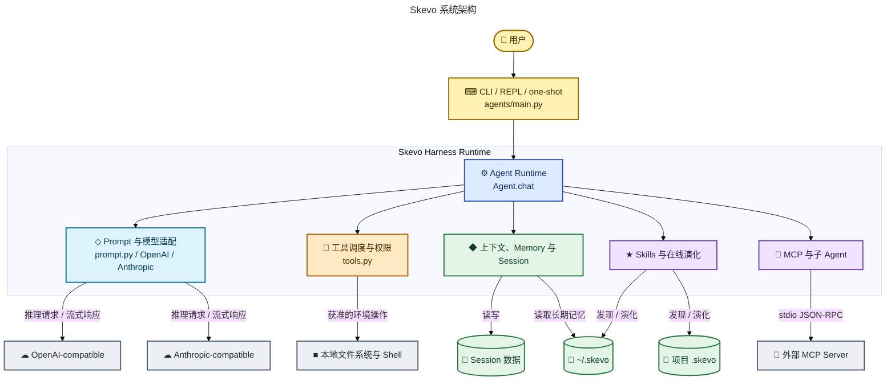
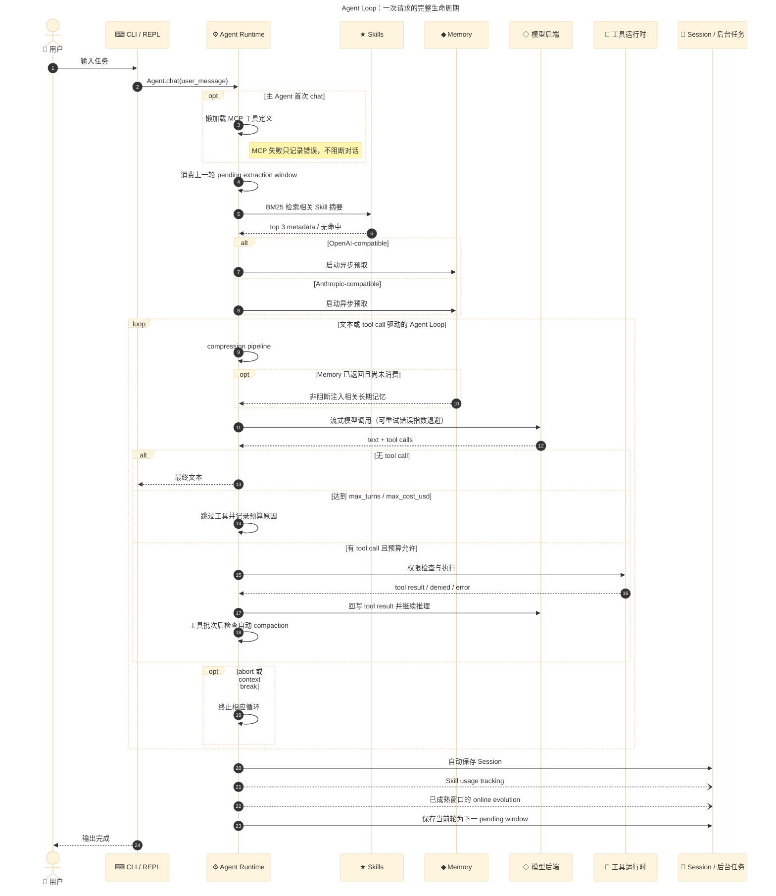

```mermaid
---
title: 上下文、长期记忆与会话生命周期
config:
  theme: base
  look: classic
  layout: elk
  elk:
    mergeEdges: true
    nodePlacementStrategy: SIMPLE
  flowchart:
    curve: basis
---
%% Purpose: 展示模型上下文的组装、运行中缩减、structured folding，以及 Session 的持久化与恢复。
%% Audience: maintainer
%% Sources: agents/prompt.py, agents/memory.py, agents/agent.py, agents/session_memory.py, agents/session.py, agents/main.py
%% Anchors: build_system_prompt, start_memory_prefetch, Agent.chat, Agent._run_compression_pipeline, Agent.compact, Agent._execute_compact_context_tool, Agent._check_and_compact, Agent._compact_conversation, Agent._auto_save, get_latest_session_id, load_session, Agent.restore_session
%% Out of scope: Skill 执行、权限决策、模型协议请求字段和长期 Memory 写入策略。

flowchart TB
    accTitle: 上下文、长期记忆与会话生命周期
    accDescr: 分三个阶段展示首轮模型与 Memory 预取的真实并发边界、工具结果缩减与 structured folding 的持久化顺序，以及 Session best-effort 保存和 resume 的全局选择、backend、旧 system prompt 与状态恢复风险

    subgraph ASSEMBLY["阶段 1 · 上下文组装"]
        direction TB
        BASE["系统模板、运行环境与项目指令<br/>cwd / date / platform / shell / Git<br/>CLAUDE.md + includes / .skevo/rules"]
        CATALOG["静态目录信息<br/>Memory index / Skill 与 Agent 描述<br/>deferred tool names"]
        SYSTEM["build_system_prompt<br/>+ 可选 Plan prompt<br/>+ Runtime Fold Guidance"]
        CURRENT["① 追加本轮 user message<br/>当前历史 + retrieved_skills"]
        SKILL_CONTEXT["★ retrieved_skills 摘要<br/>追加到本轮 user message"]
        LONG_MEMORY[("跨 Session 长期 Memory<br/>~/.skevo/projects/&lt;hash&gt;/memory/*.md")]
        PREFETCH{"主 Agent 且有 side query？<br/>多词输入 / 已注入 &lt; 60 KiB / 存在 Memory？"}
        PREFETCH_TASK["② create_task 启动 prefetch<br/>异步召回最多 5 条；与首轮 API 并发"]
        MODEL["◇ ③ 首轮模型 API<br/>create_task 后至 settled 检查前无 await<br/>不等待、首轮不可能注入 Memory 正文"]
        FIRST_FINAL["首轮直接 final / 无 tool call<br/>召回结果不进入本次 chat"]

        BASE --> SYSTEM
        CATALOG --> SYSTEM
        LONG_MEMORY -->|MEMORY.md 索引| CATALOG
        SYSTEM --> MODEL
        SKILL_CONTEXT --> CURRENT
        CURRENT --> PREFETCH
        PREFETCH -->|不满足：不创建 task| MODEL
        PREFETCH -->|条件满足| PREFETCH_TASK
        LONG_MEMORY -.->|后台扫描与读取| PREFETCH_TASK
        PREFETCH_TASK -->|create_task 返回；无 await| MODEL
        MODEL -->|final answer| FIRST_FINAL
    end

    subgraph REDUCTION["阶段 2 · 运行中缩减与 structured folding"]
        direction TB
        TOOL_RESULT["工具执行结果"]
        LARGE{"UTF-8 结果 &gt; 30 KiB？"}
        LARGE_STORE[("~/.skevo/tool-results<br/>保存全文；上下文仅保留路径与前 200 行")]
        NEXT_MESSAGES["写入当前 backend messages<br/>供下一次模型调用"]
        NEXT_ITERATION["下一迭代汇合<br/>所有 chat 内路径从此回到 loop 顶部"]
        PIPELINE["每次模型调用前<br/>_run_compression_pipeline"]
        BUDGET["① 单结果字符预算<br/>利用率 ≥50%：30k chars<br/>利用率 &gt;70%：15k chars"]
        SNIP["② stale-result snipping<br/>利用率 ≥60%，保留近 3 条<br/>OpenAI：全部符合条件的历史 role=tool<br/>Anthropic：read_file / grep_search<br/>list_files / run_shell"]
        MICRO["③ idle microcompact<br/>距上次 API 调用 ≥5 min<br/>清旧结果并保留近 3 条"]
        MEMORY_CHECK{"仅进入下一轮时检查上阶段 task<br/>prefetch settled + unconsumed<br/>且成功返回非空结果？"}
        MEMORY_INJECT["追加到最近 user message<br/>标记 consumed；最多一次"]
        MEMORY_SKIP["未完成 / 失败 / 无结果<br/>不等待；继续本轮"]
        MANUAL["REPL /compact（chat 外）<br/>Agent.compact → trigger=manual"]
        TOOL_FOLD["模型调用 compact_context<br/>执行中 trigger=tool"]
        AUTO{"工具批次结束后 auto check<br/>last input &gt; 70% effective window？"}
        FOLD_GATE{"对应 messages ≥ 4<br/>且 transcript 非空？"}
        NO_FOLD_KIND{"未执行 folding 的 trigger？"}
        MANUAL_NO_FOLD["REPL /compact 返回<br/>Nothing to compact"]
        TRANSCRIPT["OpenAI / Anthropic → transcript<br/>普通 message content 按 12k clip<br/>总 transcript 按 80k clip<br/>OpenAI tool_call.arguments 不单独 12k clip"]
        SIDE_QUERY{"side query 可用<br/>且返回 JSON 可解析？"}
        FALLBACK["⚠ fallback_folded_memory<br/>保留最多 6k transcript 摘要"]
        FOLDED["folded session state<br/>episode / working / tool memory"]
        APPEND_FOLD["追加内存列表<br/>_folded_session_memories"]
        SAVE_FOLD["尝试 save_folded_session_memory<br/>项目 .skevo/sessions/<br/>写 JSONL + latest artifacts"]
        FOLD_SAVE_FAIL["⚠ artifacts 写入失败<br/>异常吞掉，不阻断 folding"]
        REPLACE["替换当前原始历史<br/>OpenAI：system + folded user<br/>Anthropic：单条 folded user"]
        FOLD_KIND{"本次 trigger 来源？"}
        MANUAL_DONE["REPL /compact 返回<br/>不产生 tool result / context break"]
        TOOL_BREAK["Anthropic / OpenAI 共同行为<br/>_context_cleared = True<br/>工具结果写为新 user message<br/>停止剩余工具 / context break"]
        NEXT_MODEL["◇ 后续模型 API"]
        NEXT_TOOL_BATCH["后续模型返回 tool call<br/>进入对应工具分支"]
        CHAT_END["主 Agent chat 正常收尾"]

        TOOL_RESULT --> LARGE
        LARGE -->|是：写入全文| LARGE_STORE
        LARGE -->|否：保留原结果| NEXT_MESSAGES
        LARGE_STORE -->|引用 + preview| NEXT_MESSAGES
        NEXT_MESSAGES --> AUTO
        AUTO -->|否| NEXT_ITERATION
        AUTO -->|是：trigger=auto| FOLD_GATE
        NEXT_ITERATION --> PIPELINE --> BUDGET --> SNIP --> MICRO --> MEMORY_CHECK
        MEMORY_CHECK -->|是| MEMORY_INJECT --> NEXT_MODEL
        MEMORY_CHECK -->|否| MEMORY_SKIP --> NEXT_MODEL
        MANUAL -->|trigger=manual| FOLD_GATE
        TOOL_FOLD -->|trigger=tool| FOLD_GATE
        FOLD_GATE -->|否| NO_FOLD_KIND
        NO_FOLD_KIND -->|manual| MANUAL_NO_FOLD
        NO_FOLD_KIND -->|tool：产生结果| TOOL_RESULT
        NO_FOLD_KIND -->|auto| NEXT_ITERATION
        FOLD_GATE -->|是| TRANSCRIPT --> SIDE_QUERY
        SIDE_QUERY -->|是| FOLDED
        SIDE_QUERY -->|否 / 异常| FALLBACK --> FOLDED
        FOLDED --> APPEND_FOLD --> SAVE_FOLD
        SAVE_FOLD -->|save 返回| REPLACE
        SAVE_FOLD -.->|异常吞掉| FOLD_SAVE_FAIL -.->|仍继续| REPLACE
        REPLACE --> FOLD_KIND
        FOLD_KIND -->|manual| MANUAL_DONE
        FOLD_KIND -->|tool| TOOL_BREAK --> NEXT_ITERATION
        FOLD_KIND -->|auto| NEXT_ITERATION
    end

    subgraph PERSISTENCE["阶段 3 · 持久化与恢复"]
        direction TB
        AUTOSAVE["尝试 _auto_save<br/>best-effort"]
        SESSION[("用户级全局 Session JSON<br/>~/.skevo/sessions/&lt;session_id&gt;.json<br/>messages + folded list + metadata")]
        SAVE_FAIL["⚠ Session JSON 写入失败<br/>异常忽略"]
        MANUAL_BOUNDARY["⚠ /compact 后若无正常 chat 收尾<br/>folded list 不进入 Session JSON<br/>artifacts 已尝试保存"]
        NEW_AGENT["当前 CLI 先创建新 Agent<br/>采用当前 backend / prompt / metadata"]
        SELECT["--resume：get_latest_session_id<br/>仅按 startTime 取用户级全局 latest<br/>不按 cwd / project / backend 筛选"]
        RESTORE["load_session → restore_session<br/>只传两种 backend messages<br/>不校验或转换 backend"]
        BACKEND{"保存 backend = 当前 backend？"}
        RESTORED["同 backend：恢复活动 messages<br/>folded user message 可随历史恢复"]
        BACKEND_GAP["⚠ backend 不匹配<br/>历史进入非活动消息列表<br/>当前模型看不到"]
        OPENAI_STALE["⚠ 同 backend OpenAI<br/>保存的旧 system message 覆盖新 prompt<br/>恢复后首轮不 refresh：日期 / cwd / Git /<br/>rules / Memory index 等可能过期"]
        RESUME_GAP["⚠ 其余恢复缺口<br/>不读取 artifacts；不恢复 folded list<br/>id / model / cwd / startTime 等<br/>仍为新 Agent 当前值"]

        CHAT_END --> AUTOSAVE
        AUTOSAVE -->|成功写入| SESSION
        AUTOSAVE -.->|异常忽略| SAVE_FAIL
        SESSION --> SELECT -->|latest by startTime| RESTORE
        NEW_AGENT --> RESTORE --> BACKEND
        BACKEND -->|是| RESTORED
        BACKEND -->|否| BACKEND_GAP
        RESTORE -->|同 backend OpenAI| OPENAI_STALE
        SESSION -.->|folded list / metadata 未传入| RESUME_GAP
    end

    MODEL -->|普通 tool call 执行后| TOOL_RESULT
    MODEL -->|compact_context tool| TOOL_FOLD
    NEXT_MODEL -->|final answer / 无 tool call| CHAT_END
    NEXT_MODEL -->|tool call| NEXT_TOOL_BATCH
    NEXT_TOOL_BATCH -->|普通工具| TOOL_RESULT
    NEXT_TOOL_BATCH -->|compact_context| TOOL_FOLD
    FIRST_FINAL --> CHAT_END
    MANUAL_DONE -.->|若之后无正常 chat 收尾| MANUAL_BOUNDARY
    MANUAL_DONE -.->|后续主 Agent chat 正常收尾时| CHAT_END

    classDef model fill:#DDF4FF,stroke:#0B6B8A,stroke-width:2px,color:#073B4C
    classDef runtime fill:#DCEAFF,stroke:#2855B5,stroke-width:2px,color:#102A5C
    classDef state fill:#E2F5E7,stroke:#26733D,stroke-width:2px,color:#123D20
    classDef control fill:#FFE8C2,stroke:#A85D00,stroke-width:2px,color:#4A2900
    classDef extension fill:#EFE3FF,stroke:#7040A8,stroke-width:2px,color:#32184F
    classDef error fill:#FFE0E0,stroke:#B42318,stroke-width:2px,color:#5A0B0B
    classDef external fill:#ECEFF3,stroke:#53606F,stroke-width:2px,color:#202833

    class MODEL,NEXT_MODEL model
    class SYSTEM,CURRENT,NEXT_MESSAGES,NEXT_ITERATION,PIPELINE,BUDGET,SNIP,MICRO,TRANSCRIPT,REPLACE,MANUAL_DONE,TOOL_BREAK,NEXT_TOOL_BATCH,RESTORED runtime
    class CATALOG,LONG_MEMORY,PREFETCH_TASK,TOOL_RESULT,LARGE_STORE,MEMORY_INJECT,FOLDED,APPEND_FOLD,SESSION state
    class PREFETCH,LARGE,MEMORY_CHECK,MANUAL,TOOL_FOLD,AUTO,FOLD_GATE,NO_FOLD_KIND,SIDE_QUERY,SAVE_FOLD,FOLD_KIND,AUTOSAVE,BACKEND control
    class SKILL_CONTEXT extension
    class FALLBACK,FOLD_SAVE_FAIL,SAVE_FAIL,MANUAL_BOUNDARY,BACKEND_GAP,OPENAI_STALE,RESUME_GAP error
    class BASE,FIRST_FINAL,MEMORY_SKIP,MANUAL_NO_FOLD,CHAT_END,NEW_AGENT,SELECT,RESTORE external

    style ASSEMBLY fill:#F5FAFF,stroke:#2855B5,stroke-width:2px,color:#102A5C
    style REDUCTION fill:#FFF9F0,stroke:#A85D00,stroke-width:2px,color:#4A2900
    style PERSISTENCE fill:#F4FBF5,stroke:#26733D,stroke-width:2px,color:#123D20
```

```mermaid
---
title: Skill 发现、检索、调用与执行
config:
  theme: base
  look: classic
  layout: elk
  flowchart:
    curve: basis
---
%% Purpose: 区分 Skill 的磁盘发现与缓存、自动检索、显式 REPL 调用，以及 inline/fork 的真实执行边界。
%% Audience: both
%% Sources: agents/skills.py, agents/main.py, agents/agent.py, agents/skill_evolution.py
%% Anchors: discover_skills, retrieve_relevant_skills, format_retrieved_skill_context, execute_skill, Agent._execute_skill_tool
%% Verified: 2026-08-20 against the current Python implementation.
%% Out of scope: 在线 add/merge/discard、replay/champion 评测、MCP 初始化和通用子 Agent 生命周期（见图 09）。

flowchart TD
    accTitle: Skill 发现、检索、调用与执行
    accDescr: 自上而下展示 Skill 首次发现与缓存、主 Agent 的自动 BM25 检索和 REPL 显式调用两条入口，以及真正调用后的 inline 或 fork 执行；检索摘要只帮助模型判断，不会自动激活 Skill

    subgraph DISCOVERY["A · 发现、解析与进程内缓存"]
        direction TB
        ROOTS["💾 Skill 根目录<br/>用户级 ~/.skevo/skills 先加载<br/>项目级 .skevo/skills 后加载"]
        CACHE["首次 discover：扫描目录型 SKILL.md<br/>frontmatter + 正文 → SkillDefinition<br/>解析失败静默忽略；用户级同名优先<br/>结果写入进程内 cache，后续复用"]
        REFRESH["重启，或 create / evolve / prune<br/>成功后显式 reset"]

        ROOTS --> CACHE
        REFRESH -->|cache = None；下次 discover 调用重扫| CACHE
    end

    subgraph ENTRIES["B · 两类入口：retrieval 不等于 invocation"]
        direction TB

        subgraph AUTO["B1 · 主 Agent 自动检索"]
            direction TB
            REQUEST["👤 普通用户请求<br/>仅主 Agent 执行 retrieval"]
            RETRIEVE["tokenize：ASCII / 中文词元与 bigram，过滤 stop tokens<br/>BM25：metadata ×3 + body 前 2500 chars<br/>score ≥ 0.08；最多 top 3"]
            HITS{"有命中?"}
            AUGMENT["摘要 name / score / source / description / when-to-use<br/>追加 &lt;retrieved_skills&gt; 到本轮 user message"]
            MODEL{"◇ 模型是否调用 skill tool?<br/>tool 路径不检查 user_invocable"}

            REQUEST --> RETRIEVE --> HITS
            HITS -->|是| AUGMENT --> MODEL
            HITS -->|无命中或异常：原消息| MODEL
        end

        subgraph SLASH["B2 · REPL 显式 /&lt;skill-name&gt; args"]
            direction TB
            SLASH_INPUT["👤 /&lt;name&gt; args"]
            LOOKUP{"get_skill_by_name<br/>存在且 user_invocable?"}
            FALLBACK["否：按普通文本进入 Agent.chat<br/>不返回 Unknown；随后执行 B1 retrieval"]
            SLASH_MODE{"context?"}
            INLINE_DIRECT["inline：REPL 直接 execute_skill"]
            FORK_REQUEST["fork：调用当前 Agent.chat<br/>先执行 B1 retrieval，再请求模型调用 skill tool<br/>模型仍可能不调用"]

            SLASH_INPUT --> LOOKUP
            LOOKUP -->|否| FALLBACK
            LOOKUP -->|是| SLASH_MODE
            SLASH_MODE -->|inline| INLINE_DIRECT
            SLASH_MODE -->|fork| FORK_REQUEST
        end

        NO_INVOCATION["没有 Skill invocation；继续普通 Agent Loop"]
        SKILL_TOOL["模型发出公共 skill tool call"]

        MODEL -->|忽略| NO_INVOCATION
        MODEL -->|调用| SKILL_TOOL
        FORK_REQUEST -->|未调用| NO_INVOCATION
        FORK_REQUEST -->|调用| SKILL_TOOL

        %% 仅约束纵向排版，不表示运行时关系。
        AUTO ~~~ SLASH
    end

    subgraph EXECUTION["C · 真正调用与执行"]
        direction TB
        EXECUTE{"execute_skill<br/>同步按 name 查找<br/>Skill 存在？"}
        UNKNOWN["❌ tool result：Unknown skill: &lt;name&gt;"]
        PREPARE["先写 invocation stats 到 usage.jsonl<br/>再替换 $ARGUMENTS / ${ARGUMENTS}<br/>与 ${CLAUDE_SKILL_DIR}"]
        MODE{"context mode"}

        INLINE_TOOL["inline / skill tool：activated + 完整 Prompt<br/>作为 tool result 回当前循环"]
        INLINE_REPL["inline / REPL direct：以完整 Prompt 开新 chat<br/>仍执行主 Agent retrieval"]

        subgraph FORK_PATH["fork · Skill 特有边界；通用子 Agent 生命周期见图 09"]
            direction TB
            SELECT_TOOLS["选择父 Agent 当前工具<br/>allowed_tools 为真：按 name 过滤<br/>未配置或 []：继承但移除 agent"]
            FORK_AGENT["新 Agent：base system = Skill Prompt；新 history；is_sub_agent<br/>父为 plan：追加自己的 Plan prompt + 专属 plan path<br/>否则 bypassPermissions"]
            RUN_ONCE["run_once(args 或默认任务)<br/>无 retrieval / MCP lazy init / usage tracking / Session auto-save"]
            FORK_OK["成功：返回文本或 no output<br/>token 增量计入父 Agent"]
            FORK_ERROR["❌ run_once 异常 → Skill fork error<br/>异常前子 Agent 已消耗 token 当前不回计父 Agent"]
            FORK_NOTE["⚠ 工具边界：过滤为空会因 custom_tools or defaults 回退默认 tools；<br/>父 MCP schema 即使入选，子 Agent 也没有对应连接"]

            SELECT_TOOLS --> FORK_AGENT --> RUN_ONCE
            RUN_ONCE -->|成功| FORK_OK
            RUN_ONCE -->|异常| FORK_ERROR

            %% 仅让工具风险说明靠近选择节点并纵向收窄，不表示运行时关系。
            SELECT_TOOLS ~~~ FORK_NOTE
            FORK_NOTE ~~~ FORK_AGENT
        end

        CURRENT_LOOP["↩ 当前 Agent Loop"]

        EXECUTE -->|否| UNKNOWN --> CURRENT_LOOP
        EXECUTE -->|是| PREPARE --> MODE
        MODE -->|inline；skill tool| INLINE_TOOL --> CURRENT_LOOP
        MODE -->|inline；REPL direct| INLINE_REPL --> CURRENT_LOOP
        MODE -->|fork；仅 tool 路径| SELECT_TOOLS
        FORK_OK --> CURRENT_LOOP
        FORK_ERROR --> CURRENT_LOOP

        %% 仅约束 fork 区域位于 inline 结果之后，不表示运行时关系。
        INLINE_REPL ~~~ SELECT_TOOLS
    end

    CACHE -->|同步候选 Skill 集| RETRIEVE
    CACHE -->|同步 name 查找| LOOKUP
    CACHE -->|同步 name 查找| EXECUTE
    SKILL_TOOL -->|经 Agent._execute_skill_tool| EXECUTE
    INLINE_DIRECT -->|REPL direct| EXECUTE

    classDef actor fill:#FFF2B2,stroke:#9A6700,stroke-width:2px,color:#3B2A00
    classDef runtime fill:#DCEAFF,stroke:#2855B5,stroke-width:2px,color:#102A5C
    classDef model fill:#DDF4FF,stroke:#0B6B8A,stroke-width:2px,color:#073B4C
    classDef control fill:#FFE8C2,stroke:#A85D00,stroke-width:2px,color:#4A2900
    classDef extension fill:#EFE3FF,stroke:#7040A8,stroke-width:2px,color:#32184F
    classDef state fill:#E2F5E7,stroke:#26733D,stroke-width:2px,color:#123D20
    classDef note fill:#FFF4CC,stroke:#A15C00,stroke-width:2px,color:#3A2600
    classDef error fill:#FFE0E0,stroke:#B42318,stroke-width:2px,color:#5A0B0B

    class REQUEST,SLASH_INPUT actor
    class RETRIEVE,AUGMENT,INLINE_DIRECT,FORK_REQUEST,SKILL_TOOL,PREPARE,INLINE_TOOL,INLINE_REPL,SELECT_TOOLS,RUN_ONCE,CURRENT_LOOP runtime
    class MODEL model
    class HITS,LOOKUP,SLASH_MODE,EXECUTE,MODE control
    class ROOTS,CACHE,REFRESH state
    class FORK_AGENT,FORK_OK extension
    class FALLBACK,NO_INVOCATION,FORK_NOTE note
    class UNKNOWN,FORK_ERROR error

    style DISCOVERY fill:#F4FBF5,stroke:#26733D,stroke-width:2px,color:#123D20
    style ENTRIES fill:#F5FAFF,stroke:#2855B5,stroke-width:2px,color:#102A5C
    style AUTO fill:#F7FCFF,stroke:#0B6B8A,stroke-width:2px,color:#073B4C
    style SLASH fill:#FFF9F0,stroke:#A85D00,stroke-width:2px,color:#4A2900
    style EXECUTION fill:#FAF7FF,stroke:#7040A8,stroke-width:2px,color:#32184F
    style FORK_PATH fill:#FFFDF5,stroke:#A15C00,stroke-width:2px,color:#3A2600
```

```mermaid
---
title: 在线 Skill 演化闭环
config:
  theme: base
  look: classic
  layout: elk
  elk:
    mergeEdges: true
    nodePlacementStrategy: SIMPLE
  flowchart:
    curve: basis
---
%% Purpose: 展示主 Agent 跨回合 pending window、后台与 /extract_now 入口、候选维护、写入及 provenance 的真实边界。
%% Audience: both
%% Sources: agents/agent.py, agents/online_skill_evolution.py, agents/skills.py, agents/skill_evolution.py, agents/main.py
%% Anchors: Agent.chat, Agent._set_pending_skill_extraction_window, Agent._pop_pending_skill_extraction_window, Agent.clear_history, Agent.extract_now, extract_online_skill_candidate, maintain_online_skill_candidate, online_ingest, record_online_skill_provenance
%% Verified: 2026-08-20 against the current Python implementation.
%% Out of scope: retrieved Skill usage judging/pruning、replay 评测与 Champion promotion。

flowchart TD
    accTitle: 在线 Skill 演化闭环
    accDescr: 自上而下展示主 Agent 如何在本轮成功回复后建立 pending window，在下一轮开始时消费并追加非空用户反馈，再于下一轮成功结束后异步提取候选，或由 clear 命令清空消息与窗口；也展示 extract_now 的即时路径、Manager 规则修正、写权限、add 与 merge 不同的版本审计顺序，以及并非所有早退和写入异常都能形成 provenance 的实现边界

    subgraph WINDOW["A · 跨回合 pending window 生命周期"]
        direction TB
        CHAT_START["👤 主 Agent 收到第 N+1 轮输入"]
        CLEAR_CMD["👤 /clear"]
        CLEAR_DONE(["clear_history<br/>清空两种 backend 消息历史<br/>与 pending 单槽"])
        POP{"存在第 N 轮 pending window?"}
        CONSUME["立即取出并清空单槽 pending<br/>仅当 N+1 原始 user input.strip() 非空时<br/>才追加为 feedback；messages 最多 10 条"]
        CURRENT_TURN["执行第 N+1 轮 Agent.chat"]
        TURN_OK{"本轮未 aborted?"}
        OLD_READY{"已消费的旧窗口存在?"}
        READY["上一窗口成熟<br/>等待后台调度"]
        SCHEDULE_GATE{"调度时 permission_mode = plan?"}
        CLOSED["关闭演化协程并返回<br/>不产生 provenance"]
        TASK_STARTED["create_task 后 scheduler 立即返回"]
        LOST["⚠ 若已取出旧窗口则该窗口丢失<br/>不调度，也不建立新窗口"]
        NEW_WINDOW{"原始 user input 与<br/>assistant 输出都非空?"}
        SET_PENDING["保存新的单槽 pending<br/>最近 user/assistant 消息最多 8 条<br/>latest pair + session_id + 本轮 top reference"]
        NO_PENDING["不保存本轮窗口<br/>下一轮无该窗口可消费"]

        CHAT_START --> POP
        CLEAR_CMD --> CLEAR_DONE
        POP -->|否| CURRENT_TURN
        POP -->|是：先消费| CONSUME --> CURRENT_TURN
        CURRENT_TURN --> TURN_OK
        TURN_OK -->|否| LOST
        TURN_OK -->|是| OLD_READY
        OLD_READY -->|是| READY --> SCHEDULE_GATE
        OLD_READY -->|否| NEW_WINDOW
        SCHEDULE_GATE -->|是| CLOSED --> NEW_WINDOW
        SCHEDULE_GATE -->|否| TASK_STARTED --> NEW_WINDOW
        NEW_WINDOW -->|是| SET_PENDING
        NEW_WINDOW -->|否| NO_PENDING
    end

    subgraph ENTRY["B · 后台与即时入口；共同进入运行 gate"]
        direction TB
        BACKGROUND["后台执行 _run_online_skill_evolution<br/>不阻断第 N+1 轮 chat 收尾"]
        EXTRACT_NOW["/extract_now [hint]<br/>复制当前 pending，await 即时执行<br/>正常返回后清空该 pending"]
        HAS_MANUAL{"当前有 pending?"}
        MANUAL_NONE["❌ 返回 no pending 错误"]
        RUN_GATE{"auto evolution 开启、非 Plan Mode、<br/>messages 非空，且 side query / import 可用?"}
        SILENT_RETURN["⚠ ingest 前直接返回<br/>不写 provenance<br/>extract_now 仍报告 ok 并清空窗口"]

        EXTRACT_NOW --> HAS_MANUAL
        HAS_MANUAL -->|否| MANUAL_NONE
        HAS_MANUAL -->|是：带可选 hint| RUN_GATE
        BACKGROUND --> RUN_GATE
        RUN_GATE -->|否| SILENT_RETURN
    end

    subgraph INGEST["C · Extractor、参考集与 Manager 规则修正"]
        direction TB
        EXTRACTOR["◇ Extractor side query<br/>user 为主要证据；assistant 仅作上下文<br/>retrieved reference 仅作 identity context"]
        CANDIDATE{"首个 candidate 可被校验?<br/>必需 name / description / instructions<br/>最多保留 1 个；tags 最多 8 个"}
        NONE["none"]
        REFERENCES["现有参考集<br/>discover 当前缓存 Skills；exact identity 比较<br/>name / description / when-to-use<br/>candidate BM25：limit 8，min score 0.03<br/>另带上一轮 top retrieved reference"]
        MANAGER["◇ Manager side query<br/>接收 candidate、similar hits、reference<br/>及前 80 个现有 Skill 内容摘要"]
        FIX_RULES["确定性规则修正<br/>exact identity 强制 merge<br/>Manager add 且 top score ≥ 0.55 → merge<br/>merge 缺 target 时尝试 top reference<br/>非法 action → discard"]
        ACTION{"最终 action?"}
        DISCARD["discard"]
        INGEST_FAILED["failed<br/>Extractor / Manager 抛异常"]
        RUN_GATE -->|是| EXTRACTOR
        EXTRACTOR --> CANDIDATE
        EXTRACTOR -->|调用或解析抛异常| INGEST_FAILED
        CANDIDATE -->|否| NONE
        CANDIDATE -->|是| REFERENCES --> MANAGER --> FIX_RULES --> ACTION
        MANAGER -->|调用或解析抛异常| INGEST_FAILED
        ACTION -->|discard| DISCARD
    end

    subgraph WRITE["D · 写入权限、版本与审计顺序"]
        direction TB
        CONFIRM{"add / merge 写入获准?"}
        POLICY["写门禁基于执行时 permission_mode<br/>后台：仅 bypassPermissions / acceptEdits 自动允许<br/>extract_now：上述模式允许；default 可调用 confirm_fn<br/>dontAsk 拒绝；Plan Mode 已在运行 gate 返回"]
        DENIED["❌ add_denied / merge_denied"]
        WRITE_KIND{"add 或 merge?"}
        ADD["add：create_skill<br/>SKEVO_AUTO_SKILL_TARGET，默认 project<br/>创建 inline、user-invocable=false 的 SKILL.md<br/>frontmatter version = 0.1.0"]
        MERGE["merge：evolve_skill target=active<br/>先写旧内容 snapshot<br/>再 patch +1、last-evolved、evolution-count<br/>写回现有 SKILL.md"]
        USAGE["写 usage.jsonl（lifecycle stats 来源）<br/>add → create event；merge → evolve event<br/>成功后 reset discovery cache"]
        NORMAL_ERROR["❌ 正常错误返回仍保留<br/>action = add / merge，ok = false<br/>例如同名已存在或 merge target 缺失"]
        FAILED["failed<br/>create / evolve / usage 抛异常"]
        PROVENANCE["💾 online provenance 尝试<br/>先追加 online_provenance.jsonl<br/>再按非空 skill 更新 index；merge 成功结果<br/>含 version 并进入 timeline，add 结果不含 version"]
        REFRESH["成功 add / merge 后调用 prompt refresh<br/>默认主 Agent 重建 runtime system prompt<br/>custom system prompt 时为 no-op"]
        AUDIT_GAP["⚠ provenance 写入本身未捕获<br/>log append 失败：无 log/index；index 失败：仅有 log<br/>后台 done callback 吞异常；写成功后不再 refresh<br/>extract_now 会抛出且 pending 不执行后续清空"]

        ACTION -->|add / merge| CONFIRM
        POLICY --> CONFIRM
        CONFIRM -->|否| DENIED
        CONFIRM -->|是| WRITE_KIND
        WRITE_KIND -->|add| ADD
        WRITE_KIND -->|merge| MERGE
        ADD -->|成功| USAGE
        MERGE -->|成功| USAGE
        ADD -->|校验错误，未抛异常| NORMAL_ERROR
        MERGE -->|校验错误，未抛异常| NORMAL_ERROR
        ADD -->|抛异常| FAILED
        MERGE -->|抛异常| FAILED
        USAGE -->|event 写入抛异常| FAILED
        USAGE -->|ok = true| PROVENANCE
        NORMAL_ERROR --> PROVENANCE
        NONE --> PROVENANCE
        DISCARD --> PROVENANCE
        DENIED --> PROVENANCE
        INGEST_FAILED --> PROVENANCE
        FAILED --> PROVENANCE
        PROVENANCE -->|ok 且 add / merge| REFRESH
        PROVENANCE -->|写 log / index 抛异常| AUDIT_GAP
    end

    TASK_STARTED -.->|真正异步；仅主 Agent| BACKGROUND
    SET_PENDING -->|用户可在下一次 chat 前手动提取| EXTRACT_NOW

    classDef actor fill:#FFF2B2,stroke:#9A6700,stroke-width:2px,color:#3B2A00
    classDef runtime fill:#DCEAFF,stroke:#2855B5,stroke-width:2px,color:#102A5C
    classDef model fill:#DDF4FF,stroke:#0B6B8A,stroke-width:2px,color:#073B4C
    classDef state fill:#E2F5E7,stroke:#26733D,stroke-width:2px,color:#123D20
    classDef control fill:#FFE8C2,stroke:#A85D00,stroke-width:2px,color:#4A2900
    classDef extension fill:#EFE3FF,stroke:#7040A8,stroke-width:2px,color:#32184F
    classDef note fill:#FFF4CC,stroke:#A15C00,stroke-width:2px,color:#3A2600
    classDef error fill:#FFE0E0,stroke:#B42318,stroke-width:2px,color:#5A0B0B

    class CHAT_START,CLEAR_CMD actor
    class CONSUME,CURRENT_TURN,READY,CLOSED,TASK_STARTED,SET_PENDING,BACKGROUND,EXTRACT_NOW,ADD,MERGE,USAGE,REFRESH runtime
    class EXTRACTOR,MANAGER model
    class CLEAR_DONE,REFERENCES,PROVENANCE state
    class POP,TURN_OK,OLD_READY,NEW_WINDOW,SCHEDULE_GATE,HAS_MANUAL,RUN_GATE,CANDIDATE,ACTION,CONFIRM,WRITE_KIND control
    class NONE,DISCARD,FIX_RULES extension
    class POLICY,SILENT_RETURN,NO_PENDING note
    class LOST,MANUAL_NONE,INGEST_FAILED,FAILED,DENIED,NORMAL_ERROR,AUDIT_GAP error

    style WINDOW fill:#F5FAFF,stroke:#2855B5,stroke-width:2px,color:#102A5C
    style ENTRY fill:#FFF9F0,stroke:#A85D00,stroke-width:2px,color:#4A2900
    style INGEST fill:#FAF7FF,stroke:#7040A8,stroke-width:2px,color:#32184F
    style WRITE fill:#F4FBF5,stroke:#26733D,stroke-width:2px,color:#123D20
```

```mermaid
---
title: Skill 评测、候选比较与 Champion 晋升
config:
  theme: base
  look: classic
  layout: elk
  elk:
    mergeEdges: true
    nodePlacementStrategy: NETWORK_SIMPLEX
  flowchart:
    curve: linear
    nodeSpacing: 24
    rankSpacing: 32
    wrappingWidth: 150
---
%% Purpose: 展示在线 Skill 数据如何形成 replay、进入独立的 lifecycle status gate 与 Champion promotion gate，并按真实顺序持久化评测产物。
%% Audience: maintainer
%% Sources: agents/online_skill_eval.py, agents/skill_evolution.py, agents/main.py, agents/agent.py
%% Anchors: _lineage_id_for_skill, _build_replay_pool, _assign_replay_splits, _compile_eval_rules, _build_candidate_eval_bundle_async, _skill_status, _promotion_decision, _persist_eval_artifacts, _set_champion, format_online_skill_eval_async
%% Verified: 2026-08-20 against the current Python implementation.
%% Symbols: 👤 entry；💾 persistent state；◇ model side query；⚙ evaluation；★ promoted；❌ rejected；⚠ failure boundary。
%% Out of scope: 在线候选提取与 add / merge、Skill 运行时调用、usage judgment 如何产生。

flowchart TB
    accTitle: Skill 评测、候选比较与 Champion 晋升
    accDescr: 五个阶段依次展示评测入口与稳定 lineage、replay 去重冻结与分片、当前 active 基线规则和 lifecycle 状态、可选 variants 的 mutate dev 选择与 promotion test 隔离，以及仅在 write artifacts 开启后执行的 dev pre-gate、promotion candidate 选择、Champion gate 和非事务产物写入；所有写入异常汇入同一个向上抛出的失败终点

    subgraph ENTRY_LINEAGE["A · 入口、输入与稳定 lineage"]
        direction LR
        ENTRY["👤 /skill-eval 或 Python API<br/>REPL 写入默认开启，当前无 dry-run CLI<br/>API 可传 side_query = None<br/>或 write_artifacts = False"]
        INPUTS["输入来源<br/>provenance log / index<br/>usage / lifecycle stats<br/>active Skill snapshots"]
        SKILL_SET["Skill 名并集仅来自<br/>active snapshots + provenance index keys<br/>+ usage keys + lifecycle keys<br/>原始 log 只供 aggregate / replay rows<br/>log-only Skill 不会仅凭 log 进入评测"]
        LINEAGE["稳定 lineage ID<br/>仅对去首尾空白的 Skill name 做 SHA-1<br/>skill-&lt;16 hex&gt;"]

        ENTRY --> INPUTS --> SKILL_SET --> LINEAGE
    end

    subgraph REPLAY["B · replay pool、冻结与稳定 split"]
        direction LR
        POOL["构建 replay pool<br/>仅取非空 user / assistant messages 且必须有 user<br/>ID = hash(skill + messages + latest user)<br/>log 与 index source 按 ID 去重"]
        FREEZE{"write_artifacts?"}
        FROZEN["💾 合并既有 replay_pool.jsonl<br/>同 ID 更新，全量重排并重新 split<br/>成功后覆写 frozen dataset"]
        EPHEMERAL["仅对当前来源内存分片<br/>不读取或写入 frozen dataset"]
        SPLIT["split 默认规则<br/>&lt; 2 条：全部 mutate_dev，无 test<br/>≥ 2 条：hash 约 75 / 25<br/>并强制 dev / test 各至少 1 条"]

        LINEAGE --> POOL --> FREEZE
        FREEZE -->|是| FROZEN
        FREEZE -->|否| EPHEMERAL
        FROZEN -->|写成功| SPLIT
        EPHEMERAL --> SPLIT
    end

    subgraph BASELINE["C · current_active 规则评测与 lifecycle status"]
        direction LR
        RULES["编译最多 8 条规则<br/>始终含 hard non-empty；再按 Skill 文本加入<br/>引用 / 段数 / JSON 等 programmatic rules<br/>有 side_query 才加入 LLM binary rules"]
        CURRENT["⚙ current_active 基线<br/>在全部 replay 的历史 latest assistant 上判定<br/>LLM judge 异常按 fail 记录"]
        STATUS{"lifecycle gate<br/>默认值；Python API 可覆盖<br/>replay ≥ 2，test ≥ 1，retrieved ≥ 5<br/>pass ≥ .80，relevance ≥ .35，used ≥ .20"}
        STATUS_MAP["固定判定顺序<br/>pruned → unobserved → incubating<br/>数量 gate 通过后：test hard failures &gt; 0<br/>或任一 hard failure &gt; 0，或 pass / relevance / used<br/>未达阈值 → watch；否则 healthy"]

        SKILL_SET --> RULES
        SPLIT --> CURRENT
        RULES --> CURRENT --> STATUS --> STATUS_MAP
        INPUTS -->|usage 与 pruned 信号| STATUS
    end

    subgraph VARIANT_EVAL["D · variants、mutate_dev 选择与 promotion_test 隔离"]
        direction LR
        SIDE_GATE{"side_query 可用<br/>且 replay 非空?"}
        EMPTY_BUNDLE["candidate_bundle = {}<br/>无 variants、dev winner 或 test summary"]
        VARIANTS["◇ 生成候选<br/>失败规则 → heuristic guards<br/>无失败 → 最多 2 条 non-programmatic rules<br/>有真实失败才尝试 LLM mutation<br/>失败 mutation 忽略；按 instructions 去重，最多 4 个"]
        DEV["⚙ 仅在 mutate_dev 生成并评估全部 variants<br/>生成异常转 candidate_response_failed 文本<br/>按 average score 降序、hard failures 升序"]
        WINNER{"产生 dev winner?"}
        TEST_GATE{"存在 promotion_test?"}
        TEST["⚙ 仅对 dev winner<br/>在 promotion_test 重新生成与评估"]
        BUNDLE["输出 candidate_bundle<br/>best_dev_summary 始终来自 dev<br/>best_test_summary 仅在有 test 时存在<br/>此阶段尚未选择 promotion candidate"]

        STATUS_MAP --> SIDE_GATE
        SIDE_GATE -->|否| EMPTY_BUNDLE
        SIDE_GATE -->|是| VARIANTS --> DEV --> WINNER
        WINNER -->|否| EMPTY_BUNDLE
        WINNER -->|是| TEST_GATE
        TEST_GATE -->|否| BUNDLE
        TEST_GATE -->|是| TEST --> BUNDLE
    end

    subgraph ARTIFACTS["E · artifacts、promotion candidate、Champion 与 report"]
        direction TB
        PERSIST{"write_artifacts?"}
        NO_ARTIFACTS["跳过 _persist_eval_artifacts<br/>不写 eval / run，不执行 dev pre-gate<br/>不读取或修改 Champion；artifacts = {}"]
        RUN_FILES["💾 按序写成功<br/>eval_spec.json → outputs.jsonl → judgments.jsonl<br/>包含 current_active 与可用 variant 结果"]
        DEV_PRE{"bundle 同时有 best variant 与 test summary<br/>且 best_dev score ≥ current 全 replay score + .01<br/>且 hard failures 不增加?"}
        CANDIDATE["仅在此选择 promotion candidate<br/>dev pre-gate 失败：current snapshot + 全 replay summary<br/>通过：winner snapshot + promotion_test summary"]
        LOAD_CHAMPION["读取 lineage Champion<br/>随后调用 _promotion_decision"]
        CHAMP_GATE{"lifecycle status?"}
        NON_HEALTHY["非 healthy 结果<br/>unobserved / incubating / pruned：保留原 status<br/>watch：rejected"]
        HAS_CHAMPION{"healthy 且已有<br/>Champion summary?"}
        BEAT{"candidate score ≥ Champion + .01<br/>且 hard failures 不增加?"}
        REJECT["❌ rejected"]
        PROMOTE["★ active_champion"]
        CHAMPION_FILES["💾 仅晋升时按序写成功<br/>champions.json registry → champion.json<br/>→ 独立 champion SKILL.md<br/>不会覆盖 active Skill"]
        RUN_SUMMARY["💾 所有 status 均写成功<br/>run summary.json"]
        REPORT_GATE{"write_report?"}
        REPORT["💾 全部 Skills 完成后写成功<br/>online_eval_report.json"]
        RETURN["返回 report / 格式化终端输出"]
        WRITE_FAILURE(["⚠ 写入异常向上抛出<br/>写入非事务且无统一保护<br/>可能留下部分产物"])

        EMPTY_BUNDLE --> PERSIST
        BUNDLE --> PERSIST
        PERSIST -->|否| NO_ARTIFACTS --> REPORT_GATE
        PERSIST -->|是| RUN_FILES
        RUN_FILES -->|写成功| DEV_PRE
        DEV_PRE -->|否：current / 全 replay| CANDIDATE
        DEV_PRE -->|是：winner / test| CANDIDATE
        CANDIDATE --> LOAD_CHAMPION
        LOAD_CHAMPION --> CHAMP_GATE
        CHAMP_GATE -->|非 healthy| NON_HEALTHY
        NON_HEALTHY --> RUN_SUMMARY
        CHAMP_GATE -->|healthy| HAS_CHAMPION
        HAS_CHAMPION -->|否：首个 healthy，不比分| PROMOTE
        HAS_CHAMPION -->|是| BEAT
        BEAT -->|否| REJECT --> RUN_SUMMARY
        BEAT -->|是| PROMOTE
        PROMOTE --> CHAMPION_FILES
        CHAMPION_FILES -->|写成功| RUN_SUMMARY
        RUN_SUMMARY -->|写成功| REPORT_GATE
        REPORT_GATE -->|否| RETURN
        REPORT_GATE -->|是| REPORT -->|写成功| RETURN

        RUN_FILES -->|写入异常| WRITE_FAILURE
        CHAMPION_FILES -->|写入异常| WRITE_FAILURE
        RUN_SUMMARY -->|写入异常| WRITE_FAILURE
        REPORT -->|写入异常| WRITE_FAILURE
    end

    FROZEN -->|写入异常| WRITE_FAILURE

    classDef actor fill:#FFF2B2,stroke:#9A6700,stroke-width:2px,color:#3B2A00
    classDef runtime fill:#DCEAFF,stroke:#2855B5,stroke-width:2px,color:#102A5C
    classDef model fill:#DDF4FF,stroke:#0B6B8A,stroke-width:2px,color:#073B4C
    classDef state fill:#E2F5E7,stroke:#26733D,stroke-width:2px,color:#123D20
    classDef control fill:#FFE8C2,stroke:#A85D00,stroke-width:2px,color:#4A2900
    classDef extension fill:#EFE3FF,stroke:#7040A8,stroke-width:2px,color:#32184F
    classDef note fill:#FFF4CC,stroke:#A15C00,stroke-width:2px,color:#3A2600
    classDef error fill:#FFE0E0,stroke:#B42318,stroke-width:2px,color:#5A0B0B

    class ENTRY actor
    class INPUTS,SKILL_SET,LINEAGE,POOL,EPHEMERAL,SPLIT,CURRENT,EMPTY_BUNDLE,DEV,BUNDLE,NO_ARTIFACTS,CANDIDATE,LOAD_CHAMPION,RETURN runtime
    class VARIANTS model
    class FROZEN,RUN_FILES,CHAMPION_FILES,RUN_SUMMARY,REPORT state
    class FREEZE,STATUS,SIDE_GATE,WINNER,TEST_GATE,PERSIST,DEV_PRE,CHAMP_GATE,HAS_CHAMPION,BEAT,REPORT_GATE control
    class RULES,STATUS_MAP,TEST,PROMOTE extension
    class NON_HEALTHY note
    class REJECT,WRITE_FAILURE error

    style ENTRY_LINEAGE fill:#F5FAFF,stroke:#2855B5,stroke-width:2px,color:#102A5C
    style REPLAY fill:#F4FBF5,stroke:#26733D,stroke-width:2px,color:#123D20
    style BASELINE fill:#FFF9F0,stroke:#A85D00,stroke-width:2px,color:#4A2900
    style VARIANT_EVAL fill:#FAF7FF,stroke:#7040A8,stroke-width:2px,color:#32184F
    style ARTIFACTS fill:#FFFDF5,stroke:#A15C00,stroke-width:2px,color:#3A2600
```

```mermaid
---
title: MCP 进程边界与子 Agent 上下文边界
config:
  theme: base
  themeVariables:
    fontSize: 17px
  look: classic
  layout: elk
  elk:
    mergeEdges: true
    nodePlacementStrategy: SIMPLE
    cycleBreakingStrategy: GREEDY
    considerModelOrder: NODES_AND_EDGES
  flowchart:
    curve: linear
    nodeSpacing: 16
    rankSpacing: 28
    wrappingWidth: 135
---
%% Purpose: 展示共享的主 Agent Runtime 如何跨越 MCP OS 子进程边界，并在同一 Skevo 进程内创建独立的子 Agent 上下文。
%% Audience: maintainer
%% Sources: agents/mcp_client.py, agents/subagent.py, agents/agent.py
%% Anchors: McpConnection.connect, McpConnection.initialize, McpConnection.list_tools, McpConnection.call_tool, McpConnection.close, McpManager.load_and_connect, McpManager.get_tool_definitions, McpManager.call_tool, McpManager.disconnect_all, get_sub_agent_config, Agent.chat, Agent.run_once, Agent._execute_agent_tool, Agent._execute_skill_tool
%% Verified: 2026-08-20 against the current Python implementation.
%% Symbols: 🔌 MCP；◎ 子 Agent；⚙ Runtime；💾 configuration / definition；❌ error；⚠ implementation risk。
%% Out of scope: 通用权限决策树、Skill inline 执行、模型后端流式协议细节。

flowchart TB
    accTitle: MCP 进程边界与子 Agent 上下文边界
    accDescr: 中央主 Agent Runtime 共享两条扩展路径。MCP 路径从三级配置覆盖和首次主 chat 的一次性懒加载开始，由主进程内的 McpManager 启动每个独立 stdio OS 子进程，完成 JSON-RPC 握手、工具发现与调用；子 Agent 路径则在同一 Skevo 进程中创建具有独立 prompt、messages 和 Agent Loop 的新 Agent，并区分通用 agent 工具与 Skill fork 的工具选择、权限、隔离、结果和风险。

    RUNTIME["⚙ 主 Agent Runtime<br/>共享模型循环、权限入口与工具调度"]

    subgraph MCP_LANE["A · MCP：主进程 Client ↔ 外部 OS 子进程"]
        direction TB

        subgraph MCP_CLIENT["Skevo 主进程：McpManager / McpConnection Client"]
            direction TB
            CONFIG["💾 配置覆盖（后者同名覆盖）<br/>~/.skevo/settings.json<br/>→ &lt;cwd&gt;/.skevo/settings.json<br/>→ &lt;cwd&gt;/.mcp.json<br/>无效配置或读取 / JSON 错误静默跳过"]
            LAZY["仅主 Agent 首次 chat<br/>先置 _mcp_initialized = True<br/>再 await MCP lazy load"]
            MANAGER["🔌 主进程内 McpManager<br/>先置 _connected = True<br/>再按 server 顺序连接"]
            HANDSHAKE["McpConnection 握手<br/>向 PROCESS stdin 发 initialize<br/>protocolVersion 2024-11-05<br/>→ notifications/initialized<br/>→ tools/list<br/>initialize / list 各最多 15 s<br/>response 同由 reader 按 id 唤醒"]
            READER["stdout 后台 reader task<br/>持续读取 PROCESS stdout<br/>解析 JSON-RPC response id"]
            CALL["向 PROCESS stdin 发 tools/call<br/>await pending Future<br/>{name, arguments}"]
            DEFINITIONS["💾 握手成功后生成 definitions<br/>mcp__server__tool<br/>追加当前主 Agent self.tools"]
            INIT_FAIL["❌ 单 server 启动 / 初始化 / 发现失败<br/>关闭该 connection；继续其他 server<br/>不阻断主 chat"]
            MCP_DISPATCH["🔌 MCP 调用路由<br/>解析 mcp__server__tool<br/>查找已登记 connection"]
            MCP_RETURN["返回主 Runtime 的 tool result<br/>content text blocks 拼接；否则 JSON"]
            MCP_RISK["⚠ manager / transport 风险<br/>1. load 前置 _connected = True；失败后续 chat 不重试<br/>成功 server 持续到 disconnect_all / 宿主退出；前者逐 connection close<br/>清空 _connections / _tools 并置 _connected = False<br/>但不重置 Agent._mcp_initialized，且 Agent 未自动调用<br/>2. 未连接 / JSON-RPC error / write 或 drain 异常向上抛<br/>Anthropic 转 tool error；OpenAI 可能终止 loop<br/>3. stdout EOF 直接 break，不 fail pending Future<br/>4. _send_request 先 write / drain，后登记 Future<br/>极快 response 可能在登记前被丢弃<br/>5. 运行期 tools/call 无 timeout<br/>EOF / 登记竞态可导致永久等待"]

            CONFIG --> MANAGER
            LAZY --> MANAGER
            MANAGER -->|启动成功后进入握手| HANDSHAKE
            MANAGER -.->|McpConnection.connect create_task| READER
            HANDSHAKE -->|tools list| DEFINITIONS
            HANDSHAKE -->|异常 / timeout| INIT_FAIL
            MCP_DISPATCH -->|已连接 server| CALL
            READER -.->|按 id 完成 pending Future| CALL
            CALL -->|content / result| MCP_RETURN

            %% Layout-only invisible links：收窄主进程 Client，不表达握手、reader 和 dispatch 的时序。
            CONFIG ~~~ LAZY
            HANDSHAKE ~~~ READER
            DEFINITIONS ~~~ MCP_DISPATCH
        end

        subgraph MCP_PROCESS["每个 MCP Server：独立 OS 子进程边界"]
            direction TB
            PROCESS["stdio MCP Server 子进程<br/>stdin 接收 initialize / tools/list / tools/call<br/>stdout 返回 JSON-RPC response<br/>stderr 独立管道"]
        end

        MANAGER -->|create_subprocess_exec<br/>跨边界 stdio JSON-RPC| PROCESS
        MANAGER -->|server 启动异常| INIT_FAIL
    end

    subgraph SUB_LANE["B · 子 Agent：同一 Skevo 进程、独立上下文"]
        direction TB

        ENTRY{"派生入口"}
        TYPE_CONFIG["agent tool：get_sub_agent_config<br/>project custom > user custom<br/>custom 可覆盖同名内置类型<br/>未知 type 回落 general"]
        AGENT_TOOLS["agent tool 的 tools<br/>explore / plan：3 个只读工具<br/>general / custom 无白名单：全局 built-ins - agent<br/>custom 白名单：仅过滤全局 built-ins"]
        SKILL_CONFIG["Skill fork<br/>Skill prompt 成为 base system<br/>args 或默认任务成为新 user message"]
        SKILL_TOOLS["Skill fork 的 tools：从父 self.tools 选择<br/>有真值 allowlist：按名称过滤<br/>无 allowlist：父 tools - agent<br/>因此可能选入 MCP definitions"]

        CHILD["◎ 同进程内新 Agent 实例<br/>独立 system prompt / messages / session id / Agent Loop<br/>model 名称沿用父 Agent"]
        PERMISSION["权限初始化<br/>父 mode = plan → 子 mode = plan<br/>并生成专属 plan path / prompt<br/>否则一律 bypassPermissions"]
        ISOLATION["is_sub_agent = True 禁用主生命周期<br/>无 Skill 检索 / pending window / Memory prefetch<br/>无 MCP lazy load / usage tracking / 在线演化<br/>无 Session auto-save"]
        AWAIT["父 Agent await run_once<br/>agent / skill 不是 concurrency-safe tools<br/>不在后台；Anthropic 逐项执行<br/>OpenAI 同批语义见风险 4"]
        CHILD_RESULT["成功：返回最终文本或空输出占位<br/>父 Agent 累加 input / output token 增量"]
        CHILD_FAIL["❌ run_once 异常转为错误文本<br/>Sub-agent error / Skill fork error<br/>异常前已消耗 token 不回计父 Agent"]

        SUB_RISK["⚠ 当前实现边界风险<br/>1. 白名单过滤为空时<br/>custom_tools or tool_definitions 回退全部默认 tools<br/>并重新包含 agent，递归派生保护失效<br/>2. 仅 Skill fork 可选入父 MCP definition<br/>子 McpManager 未连接；definition ≠ connection<br/>3. OpenAI 仅复制 api_base；Anthropic 不复制 custom base<br/>两者均不显式复制 api_key，仍依赖 SDK 环境变量<br/>4. OpenAI 的 oai_checked 在 for tc 内累积<br/>每次都重建 batch 并重跑当前列表<br/>同批较早的 agent / Skill fork 可能重复执行"]

        ENTRY -->|agent tool| TYPE_CONFIG --> AGENT_TOOLS --> CHILD
        ENTRY -->|Skill fork| SKILL_CONFIG --> SKILL_TOOLS --> CHILD
        CHILD --> PERMISSION --> ISOLATION --> AWAIT
        AWAIT -->|成功| CHILD_RESULT
        AWAIT -->|异常| CHILD_FAIL

        %% Layout-only invisible links：收窄子 Agent 分支，不表达 agent tool 与 Skill fork 的时序。
        AGENT_TOOLS ~~~ SKILL_CONFIG
        CHILD_RESULT ~~~ CHILD_FAIL

    end

    RUNTIME -->|首次主 chat| LAZY
    RUNTIME -->|获准的 mcp__server__tool| MCP_DISPATCH
    RUNTIME -->|agent tool / Skill fork| ENTRY
    DEFINITIONS -->|成功发现：追加 self.tools| RUNTIME
    MCP_RETURN -->|tool result| RUNTIME
    CHILD_RESULT -->|文本 + token 增量| RUNTIME
    CHILD_FAIL -->|错误文本| RUNTIME

    %% Layout-only invisible links：风险注记不伪装成控制流，并保持 A、B 边界纵向分区。
    DEFINITIONS ~~~ MCP_RETURN
    MCP_RETURN ~~~ MCP_RISK
    MCP_RISK ~~~ PROCESS
    PROCESS ~~~ ENTRY
    CHILD_RESULT ~~~ SUB_RISK
    CHILD_FAIL ~~~ SUB_RISK

    classDef runtime fill:#DCEAFF,stroke:#2855B5,stroke-width:2px,color:#102A5C
    classDef state fill:#E2F5E7,stroke:#26733D,stroke-width:2px,color:#123D20
    classDef control fill:#FFE8C2,stroke:#A85D00,stroke-width:2px,color:#4A2900
    classDef extension fill:#EFE3FF,stroke:#7040A8,stroke-width:2px,color:#32184F
    classDef external fill:#ECEFF3,stroke:#53606F,stroke-width:2px,color:#202833
    classDef note fill:#FFF4CC,stroke:#A15C00,stroke-width:2px,color:#3A2600
    classDef error fill:#FFE0E0,stroke:#B42318,stroke-width:2px,color:#5A0B0B

    class RUNTIME runtime
    class CONFIG,DEFINITIONS,MCP_RETURN,TYPE_CONFIG,AGENT_TOOLS,SKILL_CONFIG,SKILL_TOOLS,PERMISSION,ISOLATION,AWAIT,CHILD_RESULT state
    class ENTRY control
    class LAZY state
    class MANAGER,HANDSHAKE,READER,CALL,MCP_DISPATCH,CHILD extension
    class PROCESS external
    class MCP_RISK,SUB_RISK note
    class INIT_FAIL,CHILD_FAIL error

    style MCP_LANE fill:#F5FAFF,stroke:#2855B5,stroke-width:2px,color:#102A5C
    style MCP_CLIENT fill:#F4FBF5,stroke:#26733D,stroke-width:2px,color:#123D20
    style MCP_PROCESS fill:#F7F8FA,stroke:#53606F,stroke-width:3px,color:#202833
    style SUB_LANE fill:#FAF7FF,stroke:#7040A8,stroke-width:2px,color:#32184F
```

# Skevo Mermaid Diagram Suite Implementation Plan

> **For agentic workers:** REQUIRED SUB-SKILL: Use superpowers:subagent-driven-development (recommended) or superpowers:executing-plans to implement this plan task-by-task. Steps use checkbox (`- [ ]`) syntax for tracking.

**Goal:** Replace the empty legacy Mermaid sources with nine code-backed Chinese-first diagrams, render matching SVG/PNG assets, and update the diagram documentation and root README reference.

**Architecture:** The suite uses one architecture diagram, one sequence diagram, and seven focused flowcharts. Each source is self-contained with Mermaid frontmatter, maintenance metadata, high-contrast styles, and a narrow responsibility defined by the approved design spec.

**Tech Stack:** Mermaid CLI 11.16.0 (`mmdc`), Mermaid flowcharts and sequence diagrams, Markdown, SVG, PNG, Git.

**Design spec:** `docs/superpowers/specs/2026-08-20-skevo-mermaid-diagram-suite-design.md`

---

## File map

**Delete obsolete empty sources:**

- `docs/diagrams/mmd/01-overall-architecture.mmd`
- `docs/diagrams/mmd/03-permission-and-plan-mode.mmd`
- `docs/diagrams/mmd/04-context-folding.mmd`
- `docs/diagrams/mmd/05-memory-and-skills.mmd`
- `docs/diagrams/mmd/06-skill-evolution.mmd`
- `docs/diagrams/mmd/07-skill-evaluation.mmd`
- `docs/diagrams/mmd/08-mcp-and-subagents.mmd`

**Create or replace sources:**

- `docs/diagrams/mmd/01-system-architecture.mmd`
- `docs/diagrams/mmd/02-agent-loop.mmd`
- `docs/diagrams/mmd/03-tool-loading-and-dispatch.mmd`
- `docs/diagrams/mmd/04-permissions-and-plan-mode.mmd`
- `docs/diagrams/mmd/05-context-and-sessions.mmd`
- `docs/diagrams/mmd/06-skill-runtime.mmd`
- `docs/diagrams/mmd/07-skill-evolution.mmd`
- `docs/diagrams/mmd/08-skill-evaluation.mmd`
- `docs/diagrams/mmd/09-mcp-and-subagents.mmd`

**Regenerate outputs:**

- `docs/diagrams/svg/*.svg`
- `docs/diagrams/png/*.png`

**Modify documentation:**

- `docs/diagrams/README.md`
- `README.md` — change only the architecture image path and preserve all unrelated user edits.

## Shared implementation rules

- Keep Mermaid frontmatter as the first bytes of every MMD file.
- Use Chinese labels first; preserve exact module, function, protocol, and state identifiers in English.
- Every `classDef` must set `fill`, `stroke`, `stroke-width`, and `color`.
- Use `-->` for direct calls/control, `-.->` for async or non-blocking work, and labeled solid edges for persistence.
- Render with white background. Do not pass `-t neutral`; the source frontmatter owns the theme.
- Validate each source immediately after creating it. Do not update Markdown references until all nine sources render.
- Preserve the existing uncommitted root `README.md` change except for replacing `01-overall-architecture.svg` with `01-system-architecture.svg`.

### Task 1: Create the system architecture diagram

**Files:**

- Delete: the seven obsolete empty MMD files listed in the file map
- Create: `docs/diagrams/mmd/01-system-architecture.mmd`

- [ ] **Step 1: Remove only the obsolete empty sources**

For each of the seven exact paths listed above that exists in the execution workspace, use `apply_patch` with `*** Delete File`. A dedicated worktree may not contain these currently untracked empty files; absence is already the desired state. Do not delete `02-agent-loop.mmd`, because it remains part of the new suite.

- [ ] **Step 2: Create the architecture source**

Write `docs/diagrams/mmd/01-system-architecture.mmd` with this complete content:



- [ ] **Step 3: Render the source to a temporary SVG**

Run:

```bash
mmdc -i docs/diagrams/mmd/01-system-architecture.mmd -o /tmp/01-system-architecture.svg -b white
```

Expected: exit code 0 and `/tmp/01-system-architecture.svg` is non-empty.

- [ ] **Step 4: Inspect the SVG**

Open `/tmp/01-system-architecture.svg` with the available image viewer. Confirm that the four layers are legible, no label is clipped, and the central runtime boundary is visually dominant.

- [ ] **Step 5: Commit the architecture source**

```bash
git add docs/diagrams/mmd/01-system-architecture.mmd
git commit -m "docs: add Skevo system architecture diagram"
```

### Task 2: Create the Agent Loop sequence diagram

**Files:**

- Replace: `docs/diagrams/mmd/02-agent-loop.mmd`

- [ ] **Step 1: Write the complete sequence source**



- [ ] **Step 2: Validate and render**

Run:

```bash
mmdc -i docs/diagrams/mmd/02-agent-loop.mmd -o /tmp/02-agent-loop.svg -b white
```

Expected: exit code 0; sequence participants and `loop`/`alt` blocks render without overlap.

- [ ] **Step 3: Commit**

```bash
git add docs/diagrams/mmd/02-agent-loop.mmd
git commit -m "docs: document the Agent Loop sequence"
```

### Task 3: Create the tool loading and dispatch diagram

**Files:**

- Create: `docs/diagrams/mmd/03-tool-loading-and-dispatch.mmd`

- [ ] **Step 1: Write the complete flowchart**



```mermaid
---
title: 工具加载、按需激活与执行路由
config:
  theme: base
  look: classic
  flowchart:
    curve: basis
---
%% Purpose: 展示工具来源、deferred tool 激活和获准调用的执行路由。
%% Audience: maintainer
%% Sources: agents/tools.py, agents/prompt.py, agents/agent.py
%% Anchors: tool_definitions, get_active_tool_definitions, get_deferred_tool_names, execute_tool, Agent._execute_tool_call
%% Out of scope: 权限决策树、MCP 握手、子 Agent 类型。

flowchart LR
    accTitle: 工具加载、按需激活与执行路由
    accDescr: 三个阶段从左到右展示工具来源、当前 Agent 工具集合的模型可见性与 deferred 按需激活，以及获准调用的执行路由；未知内置工具返回错误文本，而 OpenAI 路径未捕获的执行异常可能终止循环
    subgraph SOURCES["阶段 1 · 工具来源"]
        direction TB
        EAGER["⚙ default eager tools"]
        DEFERRED["◌ default deferred tools"]
        CUSTOM["◎ custom_tools<br/>Skill / 子 Agent fork 注入"]
        MCPDEF["🔌 MCP definitions<br/>主 Agent 首次 chat 成功发现"]
    end

    subgraph VISIBILITY["阶段 2 · 模型可见性与按需激活"]
        direction TB
        PROMPT["build_system_prompt<br/>列出未激活的默认 deferred 名称"]
        SEARCH["tool_search<br/>eager tool"]
        ACTIVE["active tool definitions<br/>当前 self.tools 中非 deferred<br/>或已激活的成员"]
        MODEL["◇ 模型请求"]
    end

    subgraph EXECUTION["阶段 3 · 获准调用的执行路由"]
        direction TB
        CALL["模型产生 tool call"]
        PERMISSION["🔐 check_permission<br/>详见图 04"]
        DISPATCH{"⚙ _execute_tool_call 路由"}
        SPECIAL["compact / plan 特殊工具"]
        SKILL["★ skill"]
        AGENT["◎ agent"]
        MCP["🔌 mcp__server__tool"]
        BUILTIN["内置 execute_tool"]
        UNKNOWN["❌ unknown tool<br/>execute_tool 返回错误文本"]
        RESULT["tool result<br/>按路径截断或大结果落盘"]
        RISK["⚠ OpenAI 路径风险<br/>未捕获执行异常可终止 loop"]
    end

    EAGER -->|无 custom_tools：初始 self.tools| ACTIVE
    EAGER -->|包含| SEARCH -->|当前 self.tools 包含时暴露| ACTIVE
    CUSTOM -->|非空时替换 default<br/>成为初始 self.tools| ACTIVE
    MCPDEF -->|成功后追加到当前 self.tools| ACTIVE
    DEFERRED -->|未使用 custom_system_prompt| PROMPT --> MODEL
    ACTIVE -->|完整 schemas| MODEL
    MODEL --> CALL --> PERMISSION
    PERMISSION -->|allow| DISPATCH
    DISPATCH --> SPECIAL --> RESULT
    DISPATCH --> SKILL --> RESULT
    DISPATCH --> AGENT --> RESULT
    DISPATCH --> MCP --> RESULT
    DISPATCH --> BUILTIN
    BUILTIN -->|普通结果或完整 schema| RESULT
    BUILTIN -->|tool_search 命中：记录 activated name| ACTIVE
    BUILTIN -->|未找到 handler| UNKNOWN --> RESULT
    DISPATCH -->|OpenAI sequential / gather<br/>未捕获执行异常| RISK
    RESULT -->|回写；下一次请求| MODEL

    classDef runtime fill:#DCEAFF,stroke:#2855B5,stroke-width:2px,color:#102A5C
    classDef model fill:#DDF4FF,stroke:#0B6B8A,stroke-width:2px,color:#073B4C
    classDef control fill:#FFE8C2,stroke:#A85D00,stroke-width:2px,color:#4A2900
    classDef extension fill:#EFE3FF,stroke:#7040A8,stroke-width:2px,color:#32184F
    classDef error fill:#FFE0E0,stroke:#B42318,stroke-width:2px,color:#5A0B0B

    class EAGER,DEFERRED,ACTIVE,CALL,DISPATCH,BUILTIN,RESULT runtime
    class PROMPT,MODEL model
    class SEARCH,PERMISSION,SPECIAL control
    class MCPDEF,CUSTOM,SKILL,AGENT,MCP extension
    class UNKNOWN,RISK error

    style SOURCES fill:#F8FAFC,stroke:#53606F,stroke-width:2px,color:#202833
    style VISIBILITY fill:#F5FAFF,stroke:#0B6B8A,stroke-width:2px,color:#073B4C
    style EXECUTION fill:#FFF9F0,stroke:#A85D00,stroke-width:2px,color:#4A2900
```

Runtime semantics: unknown tool 仅由 built-in `execute_tool` 转成错误文本并作为结果回写；Anthropic 路径捕获执行异常并归一为 tool result；OpenAI sequential/concurrent 路径当前未捕获的执行异常可能终止 Agent Loop，因此 `RISK` 不连接到 `RESULT`。

- [ ] **Step 2: Validate and render**

```bash
mmdc -i docs/diagrams/mmd/03-tool-loading-and-dispatch.mmd -o /tmp/03-tool-loading-and-dispatch.svg -b white
```

Expected: exit code 0; the three phases read left-to-right and the return edge does not obscure the source subgraph.

- [ ] **Step 3: Commit**

```bash
git add docs/diagrams/mmd/03-tool-loading-and-dispatch.mmd
git commit -m "docs: add tool loading and dispatch diagram"
```

### Task 4: Create the permissions and Plan Mode diagram

**Files:**

- Create: `docs/diagrams/mmd/04-permissions-and-plan-mode.mmd`

- [ ] **Step 1: Write the complete flowchart**

> 实现核对（以此说明和下面的审阅版源码为准）：`--plan` 和显式进入只生成唯一 plan 路径，文件要到工具写入时才创建；只有 `/plan` 或 `enter_plan_mode` 显式进入会保存 `_pre_plan_mode`，CLI `--plan` 初始化不会保存。再次 `/plan` 和无审批回调的 `exit_plan_mode` 都执行 `permission_mode = _pre_plan_mode or "default"`，因此 CLI `--plan` 退出落到 `default`。REPL 的异步审批回调当前未被 `await`，四个审批选择分支实际不可达。图中还必须标出 plan 正文未读取、审批分支未更新 `permission_mode`、Plan Mode enforcement 范围偏宽，以及 `/plan` 进入时未同步 OpenAI system message。主权限流必须保持 `check_permission` 的真实短路顺序。

```mermaid
---
title: 权限决策与 Plan Mode 状态转换
config:
  theme: base
  look: classic
  layout: elk
  flowchart:
    curve: basis
---
%% Purpose: 严格展示 check_permission 的短路判断顺序，以及 Plan Mode 的实际状态转换与已知风险。
%% Audience: maintainer
%% Sources: agents/main.py, agents/tools.py, agents/agent.py
%% Anchors: _resolve_permission_mode, check_permission, Agent.toggle_plan_mode, Agent._execute_plan_mode_tool, run_repl.plan_approval_fn
%% Out of scope: 工具 schema 加载、工具内部实现、权限规则文件格式细节。

flowchart TB
    accTitle: 权限决策与 Plan Mode 状态转换
    accDescr: 先按三个阶段自上而下展示 check_permission 的真实短路顺序，再展示 Plan Mode 的进入和退出状态；显式进入会保存原模式，命令行 plan 初始化不会保存，因此退出时的相同赋值可能得到不同结果

    subgraph STAGE1["A1 · 优先短路"]
        direction TB
        CALL(["收到 tool call"])
        BYPASS{"mode = bypassPermissions?"}
        RULE_DENY{"命中 deny rule?"}
        RULE_ALLOW{"命中 allow rule?"}
        READ{"属于 READ_TOOLS?"}
        PLAN{"mode = plan?"}
        ALLOW_BYPASS(["返回 allow<br/>bypass 优先"])
        DENY_RULE(["返回 deny<br/>规则拒绝"])
        ALLOW_RULE(["返回 allow<br/>规则允许"])
        ALLOW_READ(["返回 allow<br/>READ_TOOLS"])

        CALL --> BYPASS
        BYPASS -->|否| RULE_DENY
        BYPASS -->|是| ALLOW_BYPASS
        RULE_DENY -->|否| RULE_ALLOW
        RULE_DENY -->|是| DENY_RULE
        RULE_ALLOW -->|否| READ
        RULE_ALLOW -->|是| ALLOW_RULE
        READ -->|否| PLAN
        READ -->|是| ALLOW_READ
    end

    subgraph STAGE2["A2 · Plan Mode 限制"]
        direction TB
        PLAN_EDIT{"属于 EDIT_TOOLS?"}
        PLAN_PATH{"file_path / path<br/>等于唯一 plan 路径?"}
        PLAN_SHELL{"工具是 run_shell?"}
        PLAN_PASS["未被 Plan Mode 限制拦截"]
        ALLOW_PLAN_FILE(["返回 allow<br/>唯一 plan 路径"])
        DENY_PLAN_EDIT(["返回 deny<br/>plan 禁止该编辑"])
        DENY_PLAN_SHELL(["返回 deny<br/>plan 禁止 Shell"])

        PLAN -->|否：跳过本阶段| PLAN_PASS
        PLAN -->|是| PLAN_EDIT
        PLAN_EDIT -->|否| PLAN_SHELL
        PLAN_EDIT -->|是| PLAN_PATH
        PLAN_SHELL -->|否| PLAN_PASS
        PLAN_SHELL -->|是| DENY_PLAN_SHELL
        PLAN_PATH -->|是| ALLOW_PLAN_FILE
        PLAN_PATH -->|否| DENY_PLAN_EDIT
    end

    subgraph STAGE3["A3 · 确认与默认策略"]
        direction TB
        PLAN_TOOL{"enter_plan_mode<br/>或 exit_plan_mode?"}
        ACCEPT{"mode = acceptEdits<br/>且属于 EDIT_TOOLS?"}
        NEED_CONFIRM{"危险 Shell / 新文件 write_file /<br/>不存在文件 edit_file /<br/>skill_create / skill_evolve?"}
        DONTASK{"mode = dontAsk?"}
        ALLOW_PLAN_TOOL(["返回 allow<br/>计划模式工具"])
        ALLOW_EDIT(["返回 allow<br/>acceptEdits"])
        ALLOW_DEFAULT(["返回 allow<br/>默认放行"])
        DENY_DONTASK(["返回 deny<br/>dontAsk 自动拒绝"])
        ASK["返回 confirm + 摘要"]
        RUNTIME_CONFIRM["调用端处理 confirm<br/>已确认摘要可复用；否则询问用户"]
        EXECUTE(["调用端获准执行"])
        REJECT(["调用端拒绝并回写 tool result"])

        PLAN_PASS --> PLAN_TOOL
        PLAN_TOOL -->|否| ACCEPT
        PLAN_TOOL -->|是| ALLOW_PLAN_TOOL
        ACCEPT -->|否| NEED_CONFIRM
        ACCEPT -->|是| ALLOW_EDIT
        NEED_CONFIRM -->|是| DONTASK
        NEED_CONFIRM -->|否| ALLOW_DEFAULT
        DONTASK -->|否| ASK
        DONTASK -->|是：自动拒绝| DENY_DONTASK
        ASK --> RUNTIME_CONFIRM
        RUNTIME_CONFIRM -->|已缓存或用户同意| EXECUTE
        RUNTIME_CONFIRM -->|用户拒绝| REJECT
    end

    subgraph PLAN_STATE["B1 · Plan Mode 状态转换"]
        direction TB
        MODE_RESOLVE["CLI 初始模式优先级<br/>--yolo → --plan → --accept-edits<br/>→ --dont-ask → default"]
        NON_PLAN["初始为非 plan mode"]
        CLI_PLAN["CLI --plan 初始化<br/>生成唯一 plan 路径并注入 prompt<br/>_pre_plan_mode 仍为 None"]
        EXPLICIT_ENTER["显式进入：/plan 或 enter_plan_mode<br/>_pre_plan_mode = 当前 mode<br/>切换 plan、生成路径并注入 prompt"]
        ACTIVE["Plan Mode active<br/>prompt 声明只读意图<br/>check_permission 部分强制"]
        TOGGLE_EXIT["再次 /plan<br/>permission_mode =<br/>_pre_plan_mode or default"]
        HAS_CALLBACK{"exit_plan_mode<br/>存在审批回调?"}
        FALLBACK_EXIT["无回调 fallback<br/>permission_mode =<br/>_pre_plan_mode or default"]
        EXITED(["退出完成<br/>清除路径与 Plan prompt"])
        ASYNC_BUG["当前失败点<br/>异步审批回调未 await<br/>随后对 coroutine 调用 .get"]
        EXPECTED["设计中的审批选择（当前不可达）<br/>继续规划 / 执行 / 清上下文后执行 / 手工执行"]
        CLI_DEFAULT["CLI --plan 未保存 _pre_plan_mode<br/>因此上述赋值退出时落到 default"]

        MODE_RESOLVE -->|结果非 plan| NON_PLAN
        MODE_RESOLVE -->|结果为 plan| CLI_PLAN --> ACTIVE
        NON_PLAN -->|显式进入| EXPLICIT_ENTER --> ACTIVE
        ACTIVE -->|REPL toggle| TOGGLE_EXIT --> EXITED
        ACTIVE -->|模型工具退出| HAS_CALLBACK
        HAS_CALLBACK -->|否| FALLBACK_EXIT --> EXITED
        HAS_CALLBACK -->|是| ASYNC_BUG
        ASYNC_BUG -.->|若修复 await 后才会进入| EXPECTED
        CLI_PLAN -.->|退出结果说明| CLI_DEFAULT
    end

    subgraph RISKS["B2 · 当前实现风险"]
        direction TB
        RISK_NOTE["1. READ_TOOLS 含 compact_context；plan 仅显式拒绝 EDIT_TOOLS 与 run_shell，其他工具可能默认允许<br/>2. exit_plan_mode 把文件路径当作 plan_content，未读取正文<br/>3. 审批分支未把 target_mode 赋给 permission_mode<br/>4. /plan 进入时未同步 OpenAI 已有 system message"]
    end

    RUNTIME_CONFIRM -.->|继续阅读 B（非控制流）| MODE_RESOLVE
    EXITED -.->|退出路径风险汇总| RISK_NOTE
    EXPECTED -.->|审批路径风险汇总| RISK_NOTE

    classDef actor fill:#FFF2B2,stroke:#9A6700,stroke-width:2px,color:#3B2A00
    classDef control fill:#FFE8C2,stroke:#A85D00,stroke-width:2px,color:#4A2900
    classDef state fill:#DCEAFF,stroke:#2855B5,stroke-width:2px,color:#102A5C
    classDef success fill:#E2F5E7,stroke:#26733D,stroke-width:2px,color:#123D20
    classDef error fill:#FFE0E0,stroke:#B42318,stroke-width:2px,color:#5A0B0B
    classDef note fill:#FFF4CC,stroke:#A15C00,stroke-width:2px,color:#3A2600
    classDef external fill:#ECEFF3,stroke:#53606F,stroke-width:2px,color:#202833

    class CALL actor
    class BYPASS,RULE_DENY,RULE_ALLOW,READ,PLAN,PLAN_EDIT,PLAN_PATH,PLAN_SHELL,PLAN_TOOL,ACCEPT,NEED_CONFIRM,DONTASK,ASK,RUNTIME_CONFIRM,HAS_CALLBACK control
    class PLAN_PASS,MODE_RESOLVE,NON_PLAN,CLI_PLAN,EXPLICIT_ENTER,ACTIVE,TOGGLE_EXIT,FALLBACK_EXIT,EXITED state
    class ALLOW_BYPASS,ALLOW_RULE,ALLOW_READ,ALLOW_PLAN_FILE,ALLOW_PLAN_TOOL,ALLOW_EDIT,ALLOW_DEFAULT,EXECUTE success
    class DENY_RULE,DENY_PLAN_EDIT,DENY_PLAN_SHELL,DENY_DONTASK,REJECT,ASYNC_BUG error
    class CLI_DEFAULT,RISK_NOTE note
    class EXPECTED external

    style STAGE1 fill:#FFF9F0,stroke:#A85D00,stroke-width:2px,color:#4A2900
    style STAGE2 fill:#FFF9F0,stroke:#A85D00,stroke-width:2px,color:#4A2900
    style STAGE3 fill:#FFF9F0,stroke:#A85D00,stroke-width:2px,color:#4A2900
    style PLAN_STATE fill:#F5FAFF,stroke:#2855B5,stroke-width:2px,color:#102A5C
    style RISKS fill:#FFFBEB,stroke:#A15C00,stroke-width:2px,color:#3A2600
```



- [ ] **Step 2: Validate and render**

```bash
mmdc -i docs/diagrams/mmd/04-permissions-and-plan-mode.mmd -o /tmp/04-permissions-and-plan-mode.svg -b white
mmdc -i docs/diagrams/mmd/04-permissions-and-plan-mode.mmd -o /tmp/04-permissions-and-plan-mode.png -b white -s 2
mmdc -i docs/diagrams/mmd/04-permissions-and-plan-mode.mmd -o /tmp/04-permissions-and-plan-mode-800.png -b white -s 1
```

Expected: exit code 0；每个决策分支都有标签；按 A1 → A2 → A3 → B1 → B2 纵向阅读；800px 宽预览仍可识别主路径和阶段；当前失败点和风险注记不被画成成功路径；无裁切、重叠或边穿节点。

- [ ] **Step 3: Commit**

```bash
git add docs/diagrams/mmd/04-permissions-and-plan-mode.mmd
git commit -m "docs: document permissions and Plan Mode"
```

### Task 5: Create the context and sessions diagram

**Files:**

- Create: `docs/diagrams/mmd/05-context-and-sessions.mmd`

- [ ] **Step 1: Write the complete flowchart**



- [ ] **Step 2: Validate and render**

```bash
mmdc -i docs/diagrams/mmd/05-context-and-sessions.mmd -o /tmp/05-context-and-sessions.svg -b white
```

Expected: exit code 0; assembly, reduction, and persistence are distinct; Memory and folded Session state are not visually conflated.

- [ ] **Step 3: Commit**

```bash
git add docs/diagrams/mmd/05-context-and-sessions.mmd
git commit -m "docs: add context and session lifecycle diagram"
```

### Task 6: Create the Skill runtime diagram

**Files:**

- Create: `docs/diagrams/mmd/06-skill-runtime.mmd`

- [ ] **Step 1: Write the complete flowchart**



- [ ] **Step 2: Validate and render**

```bash
mmdc -i docs/diagrams/mmd/06-skill-runtime.mmd -o /tmp/06-skill-runtime.svg -b white
```

Expected: exit code 0; the automatic and explicit entry paths converge only at execution; retrieval does not imply activation.

- [ ] **Step 3: Commit**

```bash
git add docs/diagrams/mmd/06-skill-runtime.mmd
git commit -m "docs: add Skill runtime diagram"
```

### Task 7: Create the online Skill evolution diagram

**Files:**

- Create: `docs/diagrams/mmd/07-skill-evolution.mmd`

- [ ] **Step 1: Write the complete flowchart**



- [ ] **Step 2: Validate and render**

```bash
mmdc -i docs/diagrams/mmd/07-skill-evolution.mmd -o /tmp/07-skill-evolution.svg -b white
```

Expected: exit code 0；后台边只用于真实 `create_task`；ingest 内终态都到达 provenance 尝试，同时明确标出 ingest 前早退与 provenance 自身失败的审计缺口。

- [ ] **Step 3: Commit**

```bash
git add docs/diagrams/mmd/07-skill-evolution.mmd
git commit -m "docs: add online Skill evolution diagram"
```

### Task 8: Create the Skill evaluation diagram

**Files:**

- Create: `docs/diagrams/mmd/08-skill-evaluation.mmd`

- [ ] **Step 1: Write the complete flowchart**



- [ ] **Step 2: Validate and render**

```bash
mmdc -i docs/diagrams/mmd/08-skill-evaluation.mmd -o /tmp/08-skill-evaluation.svg -b white
mmdc -i docs/diagrams/mmd/08-skill-evaluation.mmd -o /tmp/08-skill-evaluation-800@2x.png -b white -w 800 -s 2
```

Expected: both commands exit 0; SVG includes `accTitle`/`accDescr` ARIA metadata and has an intrinsic width no greater than about 1050 px. Confirm exactly five business stages are visible and the main chain is strictly `RULES → CURRENT → STATUS → STATUS_MAP → SIDE_GATE → EMPTY_BUNDLE/BUNDLE → PERSIST`, with no direct current-to-variants or status-to-persist shortcut; `mutate_dev` selects the only winner before independent `promotion_test`; the dev pre-gate and promotion-candidate selection occur only after `write_artifacts=true`; lifecycle and Champion gates remain distinct; default/API-overridable thresholds and the hard-failure-to-watch rule are legible; the single non-healthy Champion branch maps `unobserved`/`incubating`/`pruned` to their original status and `watch` to `rejected`; frozen dataset, run artifacts, Champion files, run summary and report each have a solid failure edge to the shared exception terminal. Inspect the SVG and 2x/800 PNG for clipping, overlap, edge crossings through nodes and readable body text. Verify the Mermaid block in this Task 8 section is byte-for-byte identical to `docs/diagrams/mmd/08-skill-evaluation.mmd`, then run `git diff --check`.

- [ ] **Step 3: Commit**

```bash
git add docs/diagrams/mmd/08-skill-evaluation.mmd docs/superpowers/specs/2026-08-20-skevo-mermaid-diagram-suite-design.md docs/superpowers/plans/2026-08-20-skevo-mermaid-diagram-suite.md
git commit -m "docs: correct Skill evaluation gate order"
```

### Task 9: Create the MCP and sub-agent boundaries diagram

**Files:**

- Create: `docs/diagrams/mmd/09-mcp-and-subagents.mmd`

- [ ] **Step 1: Write the complete flowchart**



- [ ] **Step 2: Validate and render**

```bash
mmdc -i docs/diagrams/mmd/09-mcp-and-subagents.mmd -o /tmp/09-mcp-and-subagents.svg -b white
mmdc -i docs/diagrams/mmd/09-mcp-and-subagents.mmd -o /tmp/09-mcp-and-subagents-2x.png -b white -s 2
mmdc -i docs/diagrams/mmd/09-mcp-and-subagents.mmd -o /tmp/09-mcp-and-subagents-800.png -b white -s 1
```

Expected: all commands exit 0; SVG includes `accTitle` / `accDescr` ARIA metadata and has an intrinsic width no greater than about 1250 px. With the configured 17 px base font, the 800 px preview must retain an equivalent body size of at least about 11.5 px (`17 × rendered_width / SVG_width`). The main-process `McpManager / McpConnection Client` subgraph contains handshake, reader, pending call, definitions, dispatch and result conversion; the external MCP OS subprocess subgraph contains exactly the single `PROCESS` business node. Only `McpConnection.connect create_task` and response delivery use dashed asynchronous edges, and the response edge is strictly `READER -.-> CALL`; the reader text also explains that it wakes initialize / tools/list waiters. Confirm all three concrete config paths and silent invalid/error skipping, protocol version `2024-11-05`, `notifications/initialized`, first-main-chat one-shot lazy load and per-server partial failure. The teardown note must state that successful server processes persist until `disconnect_all` or host exit; `disconnect_all` calls every connection `close()`, clears manager `_connections` and `_tools`, and sets manager `_connected = False`, but does not reset `Agent._mcp_initialized`, while the current Agent never invokes that teardown automatically. The MCP risk note must distinguish thrown connection / JSON-RPC / write errors from stdout EOF that leaves pending Futures unresolved, the write-before-Future-registration race, and runtime `tools/call` without timeout. The sub-agent half must distinguish `agent` tool configuration from Skill fork selection; show same-process but isolated prompt/messages/loop state, parent-plan versus bypass permission initialization, awaited execution, successful token accounting, exception token gap, disabled main-agent lifecycle, empty-tools fallback, MCP-definition-without-connection risk, incomplete model-client configuration inheritance and the OpenAI `oai_checked` same-batch replay defect. Exactly four solid return edges must close the loop to the shared Runtime: definitions / `self.tools`, MCP tool result, child text plus token delta, and child error text. Inspect SVG, 2x PNG and 800px PNG for clipping, overlap, edge-label collisions, return edges crossing nodes, and readable body text. Verify the Mermaid block in this Task 9 section is byte-for-byte identical to `docs/diagrams/mmd/09-mcp-and-subagents.mmd`, then run `git diff --check`.

- [ ] **Step 3: Commit**

```bash
git add docs/diagrams/mmd/09-mcp-and-subagents.mmd docs/superpowers/specs/2026-08-20-skevo-mermaid-diagram-suite-design.md docs/superpowers/plans/2026-08-20-skevo-mermaid-diagram-suite.md
git commit -m "docs: clarify MCP teardown lifecycle"
```

### Task 10: Regenerate all SVG and PNG outputs

**Files:**

- Create: `docs/diagrams/svg/01-system-architecture.svg` through `09-mcp-and-subagents.svg`
- Create: `docs/diagrams/png/01-system-architecture.png` through `09-mcp-and-subagents.png`

- [ ] **Step 1: Ensure output directories exist**

```bash
mkdir -p docs/diagrams/svg docs/diagrams/png
```

- [ ] **Step 2: Render every MMD to SVG**

```bash
for source in docs/diagrams/mmd/*.mmd; do
  name=${source##*/}
  name=${name%.mmd}
  mmdc -i "$source" -o "docs/diagrams/svg/$name.svg" -b white
done
```

Expected: nine successful Mermaid CLI runs and nine non-empty SVG files.

- [ ] **Step 3: Render every MMD to 2× PNG**

```bash
for source in docs/diagrams/mmd/*.mmd; do
  name=${source##*/}
  name=${name%.mmd}
  mmdc -i "$source" -o "docs/diagrams/png/$name.png" -b white -s 2
done
```

Expected: nine successful Mermaid CLI runs and nine non-empty PNG files.

- [ ] **Step 4: Verify file counts and image types**

```bash
find docs/diagrams/mmd -maxdepth 1 -type f -name '*.mmd' | wc -l
find docs/diagrams/svg -maxdepth 1 -type f -name '*.svg' | wc -l
find docs/diagrams/png -maxdepth 1 -type f -name '*.png' | wc -l
file docs/diagrams/png/*.png
```

Expected: `9`, `9`, `9`; every PNG is reported as PNG image data.

- [ ] **Step 5: Visually inspect every generated image**

Create a temporary contact sheet or open the images individually. Check node overlap, clipped Chinese text, edge-label collisions, excessive width, white background, and readability at thumbnail size. If a diagram fails visual review, edit only its MMD and rerender both formats before continuing.

- [ ] **Step 6: Commit rendered assets**

```bash
git add docs/diagrams/svg docs/diagrams/png
git commit -m "docs: render Mermaid diagram assets"
```

### Task 11: Rewrite the diagram index and update the root README

**Files:**

- Replace: `docs/diagrams/README.md`
- Modify: `README.md`

- [ ] **Step 1: Replace the diagram README**

Write `docs/diagrams/README.md` with this content:

```markdown
# Skevo Mermaid 图集

本目录以当前 Python 实现为事实来源，管理 Skevo 的 Mermaid 图源和渲染产物。

- `mmd/`：可维护的 Mermaid 源文件。
- `svg/`：用于 Markdown 和网页的矢量图。
- `png/`：用于预览、汇报和不支持 SVG 的场景，按 2 倍缩放生成。

全部图源均使用 Mermaid CLI 11.16.0 验证，并以白色背景生成 SVG 和 PNG。

## 快速理解

| 图 | 说明 | 主要读者 |
| --- | --- | --- |
| [01 系统架构](svg/01-system-architecture.svg) | Skevo 的系统边界、内部职责和外部依赖 | 所有人 |
| [02 Agent Loop](svg/02-agent-loop.svg) | 一次请求从输入到保存和后台任务的完整生命周期 | 所有人 |

## Runtime 机制

| 图 | 说明 | 主要读者 |
| --- | --- | --- |
| [03 工具加载与路由](svg/03-tool-loading-and-dispatch.svg) | eager/deferred/MCP/custom 工具如何进入模型并被执行 | 维护者 |
| [04 权限与 Plan Mode](svg/04-permissions-and-plan-mode.svg) | `check_permission` 顺序和 Plan Mode 状态 | 维护者 |
| [05 上下文与会话](svg/05-context-and-sessions.svg) | Prompt、Memory、压缩、folding、保存与恢复 | 维护者 |

## 能力与扩展

| 图 | 说明 | 主要读者 |
| --- | --- | --- |
| [06 Skill Runtime](svg/06-skill-runtime.svg) | Skill 发现、检索、调用与 inline/fork 执行 | 所有人 |
| [07 Skill 演化](svg/07-skill-evolution.svg) | 用户反馈驱动的 add/merge/discard 闭环 | 所有人 |
| [08 Skill 评测](svg/08-skill-evaluation.svg) | replay、规则、候选比较和 Champion 晋升 | 维护者 |
| [09 MCP 与子 Agent](svg/09-mcp-and-subagents.svg) | MCP 进程边界和子 Agent 上下文边界 | 维护者 |

每张图都有同 basename 的三种文件：

```text
mmd/01-system-architecture.mmd
svg/01-system-architecture.svg
png/01-system-architecture.png
```

## 推荐阅读路径

- 项目访客：`01 → 02 → 06 → 07`
- Runtime 维护者：`01 → 02 → 03 → 04 → 05 → 09`
- 自进化机制研究者：`06 → 07 → 08`
- 完整维护者：按编号阅读 `01 → 09`

## 重新渲染

```bash
mkdir -p docs/diagrams/svg docs/diagrams/png
for source in docs/diagrams/mmd/*.mmd; do
  name=${source##*/}
  name=${name%.mmd}
  mmdc -i "$source" -o "docs/diagrams/svg/$name.svg" -b white
  mmdc -i "$source" -o "docs/diagrams/png/$name.png" -b white -s 2
done
```

## 权威代码

- Runtime 与 Agent Loop：`agents/agent.py`
- CLI 与 Plan 审批入口：`agents/main.py`
- Prompt 构建：`agents/prompt.py`
- 工具与权限：`agents/tools.py`
- Memory 与 Session：`agents/memory.py`、`agents/session_memory.py`、`agents/session.py`
- Skill Runtime 与演化：`agents/skills.py`、`agents/online_skill_evolution.py`、`agents/skill_evolution.py`
- Skill 评测：`agents/online_skill_eval.py`
- MCP 与子 Agent：`agents/mcp_client.py`、`agents/subagent.py`

图中带 `⚠` 的节点表示当前实现的已知风险或降级边界，不代表已修复行为。
```

- [ ] **Step 2: Update only the architecture image path in the root README**

Replace the existing architecture image line. In the shared workspace it currently reads:

```markdown

```

A clean worktree created from the committed baseline may instead contain:

```markdown

```

Replace whichever one is present with:

```markdown

```

Do not alter any other root README lines.

- [ ] **Step 3: Verify every Markdown image link exists**

Run:

```bash
rg -n 'docs/diagrams|svg/' README.md docs/diagrams/README.md
```

Expected: the root README references only `01-system-architecture.svg`; the diagram README references all nine new SVG basenames and no legacy basename.

- [ ] **Step 4: Commit documentation integration**

```bash
git add README.md docs/diagrams/README.md
git commit -m "docs: publish the Mermaid diagram suite"
```

### Task 12: Run the final verification gate

**Files:**

- Verify all files created or modified by Tasks 1–11

- [ ] **Step 1: Revalidate every MMD from source**

```bash
for source in docs/diagrams/mmd/*.mmd; do
  name=${source##*/}
  name=${name%.mmd}
  mmdc -i "$source" -o "/tmp/$name.verify.svg" -b white
done
```

Expected: nine exit-code-0 runs.

- [ ] **Step 2: Compare MMD, SVG, and PNG basename sets**

```bash
find docs/diagrams/mmd -maxdepth 1 -type f -name '*.mmd' -printf '%f\n' | sed 's/\.mmd$//' | sort > /tmp/skevo-mmd.names
find docs/diagrams/svg -maxdepth 1 -type f -name '*.svg' -printf '%f\n' | sed 's/\.svg$//' | sort > /tmp/skevo-svg.names
find docs/diagrams/png -maxdepth 1 -type f -name '*.png' -printf '%f\n' | sed 's/\.png$//' | sort > /tmp/skevo-png.names
diff -u /tmp/skevo-mmd.names /tmp/skevo-svg.names
diff -u /tmp/skevo-mmd.names /tmp/skevo-png.names
```

Expected: both `diff` commands produce no output and exit 0.

- [ ] **Step 3: Verify source metadata, title coverage, and legacy-name removal**

```bash
rg -L '^---$' docs/diagrams/mmd/*.mmd
rg -L '^%% Purpose:' docs/diagrams/mmd/*.mmd
rg -L '^%% Sources:' docs/diagrams/mmd/*.mmd
rg -n 'overall-architecture|permission-and-plan-mode|context-folding|memory-and-skills' README.md docs/diagrams
```

Expected: the first three commands produce no missing-file output; the legacy-name search returns no matches.

- [ ] **Step 4: Verify output files and repository whitespace**

```bash
test "$(find docs/diagrams/mmd -maxdepth 1 -type f -name '*.mmd' -size +0c | wc -l)" -eq 9
test "$(find docs/diagrams/svg -maxdepth 1 -type f -name '*.svg' -size +0c | wc -l)" -eq 9
test "$(find docs/diagrams/png -maxdepth 1 -type f -name '*.png' -size +0c | wc -l)" -eq 9
git diff --check
```

Expected: all `test` commands exit 0 and `git diff --check` produces no output.

- [ ] **Step 5: Review the final diff without disturbing unrelated work**

```bash
git status --short
git diff 899302f..HEAD -- README.md docs/diagrams
git log --oneline -12
```

Expected: the committed diff from the approved design commit contains only the requested README and diagram-suite changes in these paths; no Python file is modified; unrelated user changes are preserved.

- [ ] **Step 6: Record verification evidence in the handoff**

Report the Mermaid CLI version, nine successful source validations, `9/9/9` file counts, basename-set equality, visual-review result, README link result, and any implementation risks shown in diagrams. Do not claim completion if any render or visual check failed.
