# Bear Code 学习说明

这是一份面向学习 Bear Code 项目的完整说明文档。它的目标不是只列模块名，而是帮助你从零开始理解：这个项目解决什么问题、为什么要这样设计、一次用户请求在系统里如何流转、每个核心模块承担什么职责，以及你应该怎样继续扩展它。

本文档采用“总分”结构：

- 先从整体上理解 Bear Code 是什么。
- 再沿着一次真实请求看完整运行链路。
- 然后逐个拆解 CLI、Agent Runtime、工具、权限、Plan Mode、Skills、Memory、MCP、子 Agent、会话和自进化。
- 最后给出二次开发、调试和学习任务清单。

文档中的流程图均使用 `wiki/assets/architecture/` 下同一套浅绿、蓝、橙、紫配色的 SVG 图，方便在 wiki、README、项目展示和答辩材料中保持视觉统一。

## 1. 先建立整体认知

### 1.1 Bear Code 是什么

Bear Code 是一个用 Python 实现的命令行 Coding Agent。你可以把它理解成一个“本地运行的 Agent Runtime”：用户在终端输入任务，Agent 调用大模型理解需求，大模型可以发起工具调用，Runtime 负责检查权限、执行工具、把结果回写给模型，并持续循环直到给出最终回复。

它不是一个完整 IDE，也不是单纯的聊天机器人。它重点展示的是 Claude Code 这类工具背后的工程骨架：

- 如何把大模型接入本地开发环境。
- 如何让模型安全地读文件、改文件、搜索代码和执行命令。
- 如何支持工具调用和 tool result 回写。
- 如何在任务前先规划，避免直接乱改文件。
- 如何把用户偏好和项目事实保存为长期记忆。
- 如何把可复用工作方法沉淀成 Skills。
- 如何从用户反馈中自动演化 Skills。
- 如何接入 MCP 外部工具。
- 如何用子 Agent 分担独立探索或规划任务。
- 如何保存和恢复会话。
- 如何在上下文变长后进行压缩。

一句话总结：

> Bear Code 是一个用于学习和改造的本地 Coding Agent Runtime，核心价值是把模型推理、工具执行、权限控制、长期记忆、Skills、自进化和外部工具扩展串成一个可运行闭环。

### 1.2 先看总架构

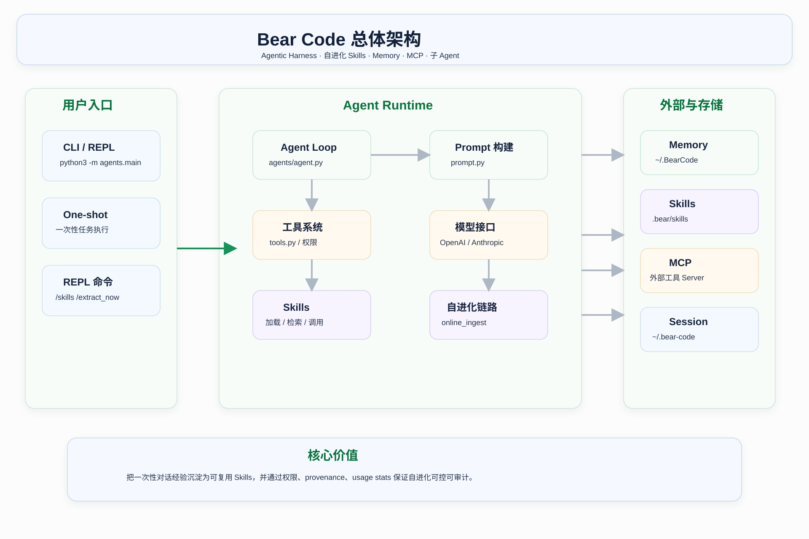

这张图可以先粗略看，不需要一开始就理解每个细节。你只需要记住四个区域：

- 用户入口：`agents/main.py` 负责 CLI、REPL、one-shot prompt。
- Agent Runtime：`agents/agent.py` 是核心，管理模型请求、工具调用、上下文、会话和后台任务。
- 能力系统：`tools.py`、`skills.py`、`memory.py`、`mcp_client.py`、`subagent.py` 提供 Agent 可使用的能力。
- 持久化目录：`.bear/skills`、`.bear/skill-evolution`、`~/.BearCode`、`~/.bear-code` 保存 Skills、审计、Memory 和 Session。

### 1.3 推荐学习路线

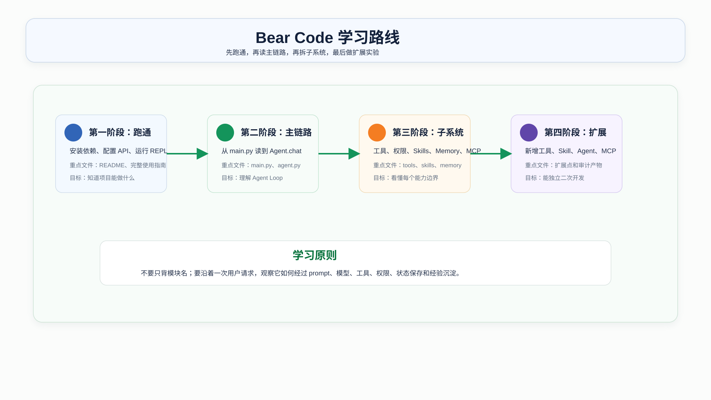

学习这个项目建议按四个阶段推进。

第一阶段：跑通项目。

你先不要急着读 `agent.py`，因为里面同时包含模型适配、工具调度、Plan Mode、Memory、Skills、自进化和压缩逻辑。先按照 `README.md` 和 `wiki/完整使用指南.md` 跑起来，知道它怎么启动、怎么配置模型、怎么进入 REPL、怎么执行一次任务。

第二阶段：读主链路。

从 `agents/main.py` 进入，顺着创建 `Agent`、调用 `Agent.chat()`、进入 `_chat_anthropic()` 或 `_chat_openai()`、执行 `_execute_tool_call()` 这条线读。第一遍只看主干，不要陷进所有异常分支。

第三阶段：拆子系统。

主链路看明白后，再分别读：

- `agents/tools.py`：工具定义和权限。
- `agents/prompt.py`：system prompt 如何构建。
- `agents/skills.py`：Skills 如何发现、检索和执行。
- `agents/online_skill_evolution.py`：在线沉淀如何做 add、merge、discard。
- `agents/skill_evolution.py`：Skill 如何落盘、版本化和审计。
- `agents/memory.py`：长期记忆如何保存和召回。
- `agents/mcp_client.py`：MCP 外部工具如何连接。
- `agents/subagent.py`：子 Agent 如何配置和创建。
- `agents/session.py`：会话如何保存和恢复。

第四阶段：做扩展实验。

只读懂代码还不够。建议至少做四个小实验：

- 新增一个只读工具。
- 新增一个项目级 Skill。
- 新增一个自定义子 Agent。
- 配置一个最小 MCP Server。

做完这四件事，你基本就掌握了项目最重要的扩展点。

## 2. 项目目录和文件职责

### 2.1 顶层目录

```text
BearCode/
├── agents/
├── .bear/
├── wiki/
├── Dockerfile
├── requirements.txt
├── README.md
├── PROJECT_INTRO.md
├── 部署.md
└── 问题排查.md
```

几个目录的含义：

- `agents/`：项目核心源码，所有 Runtime 逻辑都在这里。
- `.bear/`：项目级配置和项目级 Skills、自进化审计目录。
- `wiki/`：项目文档中心、架构图、使用指南、技术亮点和学习说明。
- `Dockerfile`：容器运行方式。
- `requirements.txt`：Python 依赖。
- `README.md`：项目整体介绍。

### 2.2 `agents/` 源码地图

```text
agents/
├── main.py                    # CLI 入口、参数解析、REPL 命令
├── agent.py                   # Agent Runtime、模型调用、工具调度、上下文压缩
├── tools.py                   # 内置工具、权限系统、文件读写、Shell 执行
├── prompt.py                  # System prompt 动态构建
├── skills.py                  # Skills 加载、检索、调用、创建和演化封装
├── online_skill_evolution.py  # 在线 Skill 候选抽取和维护决策
├── skill_evolution.py         # Skill 落盘、版本快照、审计统计
├── memory.py                  # 长期记忆系统
├── mcp_client.py              # MCP stdio JSON-RPC 客户端
├── subagent.py                # 内置和自定义子 Agent
├── session.py                 # 会话保存与恢复
├── ui.py                      # 终端 UI 输出
└── frontmatter.py             # 简单 frontmatter 解析器
```

你可以按下面的方式记：

- `main.py` 负责“用户怎么进来”。
- `agent.py` 负责“任务怎么跑起来”。
- `tools.py` 负责“模型能做哪些动作，以及能不能做”。
- `prompt.py` 负责“模型每轮看到什么系统上下文”。
- `skills.py` 和 `skill_evolution.py` 负责“可复用经验怎么加载、执行、修改、审计”。
- `memory.py` 负责“跨会话事实和偏好怎么保存、召回”。
- `mcp_client.py` 负责“外部工具怎么接进来”。
- `subagent.py` 负责“怎么创建隔离上下文的子 Agent”。
- `session.py` 负责“对话怎么保存和恢复”。

### 2.3 项目级 `.bear/`

```text
.bear/
├── skills/
└── skill-evolution/
```

`.bear/skills/` 存放项目级 Skills。项目级 Skill 只对当前项目生效，适合沉淀和这个项目相关的稳定任务方法。

`.bear/skill-evolution/` 存放自进化相关的审计文件。它不是运行缓存那么简单，而是项目“为什么演化成这样”的证据链。

常见文件：

```text
.bear/skill-evolution/usage.jsonl
.bear/skill-evolution/online_provenance.jsonl
.bear/skill-evolution/online_skill_provenance.json
.bear/skill-evolution/skill_usage_stats.json
.bear/skill-evolution/history/
.bear/skill-evolution/pruned/
```

## 3. 运行和配置

### 3.1 安装依赖

推荐使用虚拟环境：

```bash
python3 -m venv .venv
source .venv/bin/activate
pip install -r requirements.txt
```

`requirements.txt` 目前很轻：

```text
anthropic>=0.25.0
openai>=1.0.0
python-dotenv>=1.0.0
rich>=13.0.0
tqdm>=4.66.0
```

这说明项目没有引入大型 Agent 框架。它的重点是自己实现一套最小可读的 Agentic Harness，而不是把逻辑藏在外部框架里。

### 3.2 配置模型接口

项目支持两类接口：

- Anthropic-compatible。
- OpenAI-compatible。

Anthropic-compatible 示例：

```env
APIKEY=sk-your-api-key
API=https://your-host/anthropic
MODEL=claude-sonnet-4-6
```

OpenAI-compatible 示例：

```env
OPENAI_API_KEY=sk-your-api-key
OPENAI_BASE_URL=https://your-host/v1
MODEL=gpt-4o
```

项目还支持通用变量：

```env
APIKEY=sk-your-api-key
API=https://your-host/v1
```

`main.py` 中 `_resolve_api_config()` 会根据环境变量和 `--api-base` 推断协议。如果 base URL 路径里包含 `/anthropic`，就走 Anthropic-compatible；否则有 base URL 时走 OpenAI-compatible。

### 3.3 启动方式

进入 REPL：

```bash
python3 -m agents.main
```

执行一次性任务：

```bash
python3 -m agents.main "阅读 README.md 并总结项目能力"
```

进入 Plan Mode：

```bash
python3 -m agents.main --plan "分析这个模块应该如何重构"
```

自动接受编辑：

```bash
python3 -m agents.main --accept-edits
```

恢复最近会话：

```bash
python3 -m agents.main --resume
```

### 3.4 常用 REPL 命令

| 命令 | 作用 |
|------|------|
| `/clear` | 清空当前对话历史 |
| `/plan` | 切换 Plan Mode |
| `/cost` | 查看 token 和费用估算 |
| `/compact` | 手动压缩上下文 |
| `/memory` | 列出当前项目长期记忆 |
| `/skills` | 列出可用 Skills |
| `/skill-stats` | 查看 Skill 使用、反馈、演化统计 |
| `/extract_now [hint]` | 对当前 pending window 手动触发在线 Skill 抽取 |
| `/skill-feedback <skill> <rating> [note]` | 记录某个 Skill 的反馈 |
| `/skill-evolve <skill> <lesson>` | 手动演化已有 Skill |
| `/skill-create <name> \| <description> \| <when-to-use> \| <instructions>` | 手动创建 Skill |

## 4. 一次请求的完整链路

### 4.1 Agent Loop 是什么

Agent Loop 是 Coding Agent 的核心模式。普通聊天机器人通常是“用户输入 -> 模型回复”。Coding Agent 多了一层“行动”：

1. 用户输入任务。
2. Agent 构建上下文并请求模型。
3. 模型决定直接回复，或者调用工具。
4. Runtime 检查工具权限。
5. Runtime 执行工具。
6. 工具结果作为新上下文回写给模型。
7. 模型基于结果继续推理。
8. 重复上述过程直到任务完成。

Bear Code 的主链路如下：

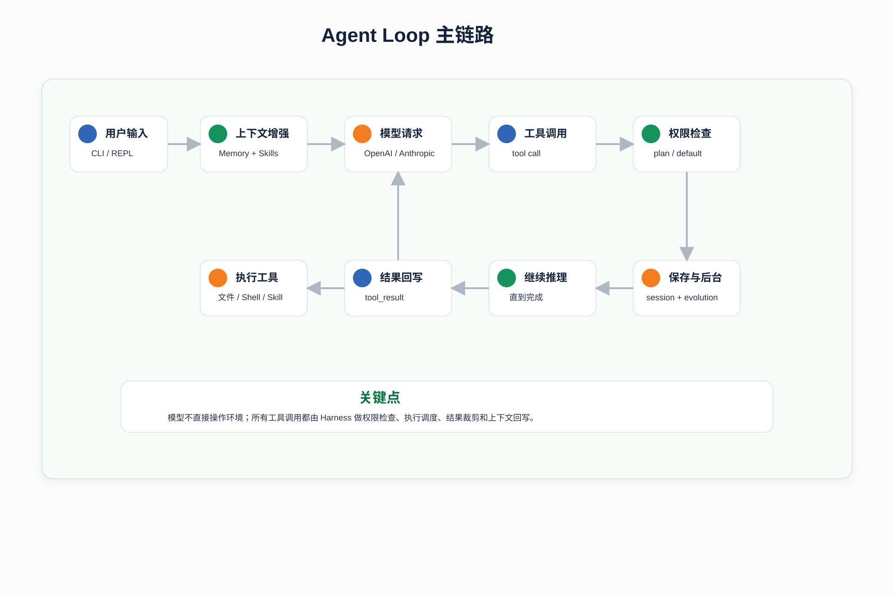

### 4.2 这个闭环为什么重要

模型本身不能直接读你的磁盘、改文件、执行测试。它只能输出文本或工具调用意图。真正触碰本地环境的是 Agent Runtime。

因此，一个 Coding Agent 的关键工程点不只是“调用模型”，而是：

- 怎样把工具定义暴露给模型。
- 怎样判断模型请求的工具是否安全。
- 怎样执行工具并收集结果。
- 怎样把结果以正确格式回写给模型。
- 怎样避免工具结果太大撑爆上下文。
- 怎样在任务结束后保存状态。
- 怎样把可复用经验沉淀下来。

Bear Code 的 `agents/agent.py` 就是实现这些逻辑的地方。

### 4.3 主链路对应源码

一次任务大致会经过这些函数：

| 阶段 | 关键函数或文件 | 说明 |
|------|----------------|------|
| CLI 解析 | `parse_args()` | 解析 prompt、权限、模型、resume 等参数 |
| 权限模式 | `_resolve_permission_mode()` | 把 CLI 参数变成 `default`、`plan` 等模式 |
| API 配置 | `_resolve_api_config()` | 判断 OpenAI-compatible 或 Anthropic-compatible |
| Agent 创建 | `Agent(...)` | 初始化工具、状态、system prompt、模型客户端 |
| 对话入口 | `Agent.chat()` | 每轮用户输入的统一入口 |
| Skill 检索 | `_augment_user_message_with_skill_context()` | 检索相关 Skills 并注入用户消息 |
| Memory 预取 | `start_memory_prefetch()` | 异步选择相关 Memory |
| 模型请求 | `_chat_anthropic()` / `_chat_openai()` | 进入具体协议的 Agent Loop |
| 工具执行 | `_execute_tool_call()` | 分发内置工具、Skill、子 Agent、MCP |
| 权限判断 | `check_permission()` | 判断 allow、deny、confirm |
| 会话保存 | `_auto_save()` | 写入 `~/.bear-code/sessions` |
| 后台沉淀 | `_run_online_skill_evolution()` | 抽取和维护 Skills |

## 5. CLI 入口：`agents/main.py`

### 5.1 `main.py` 的定位

`main.py` 不负责真正的 Agent 推理，它负责把“命令行输入”变成“Agent 可以执行的任务”。你可以把它看作外壳层。

它做的事情包括：

- 定义 CLI 参数。
- 加载 `.env`。
- 解析模型 API 配置。
- 确定权限模式。
- 创建 `Agent`。
- 如果传了 prompt，就执行 one-shot。
- 如果没传 prompt，就进入 REPL。
- 在 REPL 中处理 `/skills`、`/memory`、`/plan` 等命令。

### 5.2 权限模式从这里开始

`_resolve_permission_mode()` 把 CLI 参数转换成内部权限模式：

| CLI 参数 | 内部模式 | 含义 |
|----------|----------|------|
| `--yolo` | `bypassPermissions` | 跳过确认 |
| `--plan` | `plan` | 只读规划 |
| `--accept-edits` | `acceptEdits` | 自动接受编辑类操作 |
| `--dont-ask` | `dontAsk` | 自动拒绝需要确认的操作 |
| 无 | `default` | 默认模式，危险操作询问 |

权限模式不是显示层功能，它会一路传给 `Agent`，再在工具调用前交给 `check_permission()` 使用。

### 5.3 REPL 为什么重要

REPL 是这个项目最接近真实 Coding Agent 的使用方式。因为 Coding Agent 往往不是一次问答结束，而是多轮：

- 第一轮让 Agent 阅读项目。
- 第二轮让它修改代码。
- 第三轮根据测试失败继续修。
- 第四轮要求它记住某个偏好。
- 第五轮让它沉淀 Skill。

REPL 中的 `/extract_now`、`/skill-feedback`、`/skill-evolve` 等命令，也让你可以观察 Skills 自进化链路。

## 6. Agent Runtime：`agents/agent.py`

### 6.1 为什么 `agent.py` 是核心

`agent.py` 集中了项目最关键的运行时状态。它不是一个简单的 API wrapper，而是一个完整 Runtime：

- 管理消息历史。
- 管理模型客户端。
- 管理工具列表。
- 初始化 MCP。
- 调用模型流式接口。
- 解析文本和工具调用。
- 执行工具。
- 回写工具结果。
- 跟踪 token 和成本。
- 保存会话。
- 管理 Plan Mode。
- 管理 Memory 注入。
- 管理 Skill 检索和后台自进化。
- 管理上下文压缩。

学习 `agent.py` 时，建议先看 `Agent.chat()`，再看 `_execute_tool_call()`，最后再看 `_chat_anthropic()` 和 `_chat_openai()` 的具体协议细节。

### 6.2 `Agent.__init__()` 初始化了什么

初始化时会保存很多状态。理解这些状态，就能理解为什么 Agent 不是一个纯函数。

重要字段：

| 字段 | 作用 |
|------|------|
| `permission_mode` | 当前权限模式 |
| `model` | 使用的模型名 |
| `use_openai` | 是否走 OpenAI-compatible 协议 |
| `tools` | 当前可用工具定义 |
| `session_id` | 当前会话 id |
| `_anthropic_messages` | Anthropic 消息历史 |
| `_openai_messages` | OpenAI 消息历史 |
| `_read_file_state` | 记录已读文件和 mtime，保护编辑 |
| `_mcp_manager` | MCP 连接管理器 |
| `_already_surfaced_memories` | 本会话已注入过的 Memory |
| `_pending_skill_extraction_window` | 等待下一轮反馈的 Skill 抽取窗口 |
| `_background_skill_tasks` | 后台 Skill 相关任务 |
| `_system_prompt` | 当前 system prompt |

这些状态共同支撑了“连续多轮、可用工具、可恢复、可沉淀”的 Agent 体验。

### 6.3 `Agent.chat()` 的职责

`chat()` 是每轮用户输入的统一入口。它的主要步骤是：

1. 第一次对话时初始化 MCP。
2. 如果上一轮有 pending extraction window，把本轮用户输入作为反馈合并进去。
3. 检索与当前请求相关的 Skills。
4. 把检索结果注入用户消息。
5. 根据协议选择 `_chat_openai()` 或 `_chat_anthropic()`。
6. 等待模型和工具循环结束。
7. 收集本轮 assistant 文本。
8. 调度 Skill usage tracking。
9. 如果有上一轮窗口，调度 online skill evolution。
10. 保存新的 pending extraction window。
11. 自动保存 session。

这里最值得学习的是 pending window 设计。Bear Code 不是只看当前用户输入就立刻沉淀 Skill，而是把“上一轮用户任务 + 上一轮助手输出 + 下一轮用户反馈”组合起来判断。这样可以更准确地区分一次性内容和稳定偏好。

### 6.4 Anthropic 和 OpenAI 两条路径

项目支持两种协议，因此 `agent.py` 里有两套消息处理。

Anthropic-compatible 的特点：

- system prompt 作为 `messages.create()` 的 `system` 参数。
- 工具调用以 `tool_use` block 表示。
- 工具结果以 `tool_result` block 回写。

OpenAI-compatible 的特点：

- system prompt 是第一条 `system` message。
- 工具通过 `tools` 参数传入。
- 工具调用在 `tool_calls` 中。
- 工具结果用 `role: tool` 的消息回写。

项目用 `self.use_openai` 决定走哪条路径。学习时不需要一开始把两套协议细节都背下来，但要知道：同一个 Agent Loop，在不同模型协议下需要不同的消息格式。

### 6.5 工具调用分发

`_execute_tool_call()` 是工具执行的总入口。

分发规则：

- `enter_plan_mode` / `exit_plan_mode`：交给 Plan Mode 处理。
- `agent`：启动子 Agent。
- `skill`：执行 Skill。
- `mcp__...`：交给 MCP Manager 调用外部工具。
- 其他工具：交给 `tools.execute_tool()`。

这个设计很关键。并不是所有工具都在 `tools.py` 里直接执行，因为：

- 子 Agent 需要创建新的 `Agent` 实例。
- fork Skill 也可能创建子 Agent。
- MCP 工具需要外部连接管理。
- Skill 创建或演化成功后需要刷新 system prompt。

所以 `agent.py` 是工具调度的上层编排者，`tools.py` 是基础内置工具执行层。

## 7. Prompt 构建：`agents/prompt.py`

### 7.1 Prompt 在 Agent 中的作用

system prompt 是模型每轮推理的“运行说明书”。Bear Code 的 prompt 不只是几句身份设定，它会动态注入当前环境、项目规则、Memory、Skills、子 Agent 类型和延迟工具提示。

这也是 Coding Agent 和普通聊天机器人不同的地方：模型不是在空白上下文中回答，而是在一个包含项目状态和操作规则的上下文中工作。

### 7.2 System prompt 包含哪些信息

`build_system_prompt()` 会注入：

- 当前工作目录。
- 当前日期。
- 平台和 Shell。
- Git branch、最近提交、工作区状态。
- 从当前目录向上收集到的 `CLAUDE.md`。
- `.bear/rules/*.md` 项目规则。
- Memory 系统说明和当前 Memory 索引。
- 可用 Skills 列表。
- Skill Evolution 规则。
- 自定义子 Agent 类型。
- 延迟工具提示。

这些信息会影响模型决策。例如：

- Git status 告诉模型当前工作区是否有未提交变更。
- Memory 索引告诉模型是否存在用户偏好或项目长期上下文。
- Skills 列表告诉模型遇到某类任务时可以调用哪个 Skill。
- 权限说明告诉模型工具调用可能需要用户确认。

### 7.3 `CLAUDE.md` 和 `.bear/rules`

`prompt.py` 会从当前目录向上查找 `CLAUDE.md`，并支持 include：

```text
@./path
@~/path
@/absolute/path
```

这让项目规则可以分层组织。

`.bear/rules/*.md` 也会被加载进 prompt。它适合放当前项目内更细粒度的规则，例如：

- 代码风格。
- 测试要求。
- 安全约束。
- 输出格式。

### 7.4 学习 prompt 的重点

读 `prompt.py` 时不要只看字符串模板，要关注动态上下文从哪里来：

- Memory section 来自 `memory.build_memory_prompt_section()`。
- Skills section 来自 `skills.build_skill_descriptions()`。
- Agent section 来自 `subagent.build_agent_descriptions()`。
- Deferred tools 来自 `tools.get_deferred_tool_names()`。

这体现了 Agent Runtime 的一个核心思路：模型能力不是写死在 prompt 里，而是由当前项目状态动态生成。

## 8. 工具系统和权限控制：`agents/tools.py`

### 8.1 工具系统是什么

工具是模型和本地环境之间的接口。模型不能直接访问文件系统或执行命令，它只能请求调用某个工具，并提供参数。Runtime 决定是否允许、如何执行、怎么返回结果。

Bear Code 的内置工具包括：

| 工具 | 作用 |
|------|------|
| `read_file` | 读取文件，返回带行号的内容 |
| `write_file` | 写文件，不存在则创建，存在则覆盖 |
| `edit_file` | 用精确字符串替换编辑文件 |
| `list_files` | 按 glob 列出文件 |
| `grep_search` | 搜索文件内容 |
| `run_shell` | 执行 Shell 命令 |
| `skill` | 调用已注册 Skill |
| `skill_create` | 创建新 Skill |
| `skill_evolve` | 演化已有 Skill |
| `agent` | 启动子 Agent |
| `tool_search` | 激活延迟工具 |
| `enter_plan_mode` | 进入 Plan Mode |
| `exit_plan_mode` | 退出 Plan Mode |

### 8.2 工具调用为什么必须有权限层

如果让模型随意执行工具，会有很大风险：

- 误删文件。
- 覆盖用户未提交修改。
- 执行危险命令。
- 创建大量无用文件。
- 把一次性内容误沉淀为 Skill。
- 在 Plan Mode 中提前修改代码。

因此 Bear Code 在工具执行前统一走 `check_permission()`。

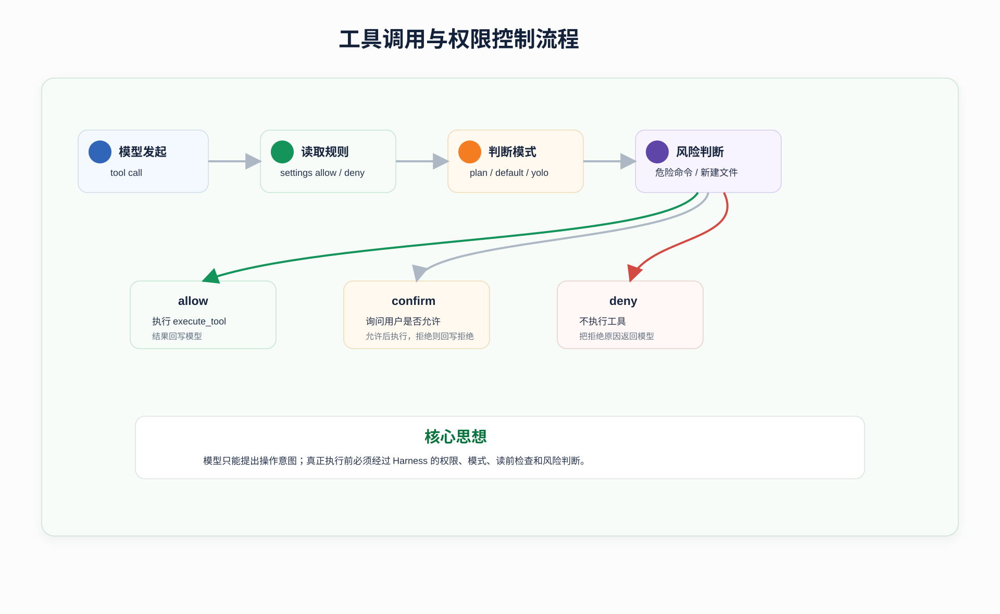

### 8.3 权限模式详解

| 模式 | 行为 |
|------|------|
| `default` | 只读工具允许，危险操作询问用户 |
| `plan` | 只允许读文件、搜索、列文件，以及写唯一计划文件 |
| `acceptEdits` | 自动允许编辑类工具 |
| `dontAsk` | 需要确认的操作自动拒绝 |
| `bypassPermissions` | 跳过确认 |

`plan` 模式是最值得重点看的，因为它体现了 Coding Agent 的安全工作流：先看、先想、先写计划，不要一上来就改文件。

### 8.4 settings 权限规则

权限规则可以写在：

```text
~/.bear/settings.json
<project>/.bear/settings.json
```

示例：

```json
{
  "permissions": {
    "allow": ["read_file", "grep_search", "run_shell(pytest*)"],
    "deny": ["run_shell(rm*)"]
  }
}
```

规则会在权限模式判断前生效：

- deny 优先于 allow。
- 没有 pattern 时匹配整个工具。
- pattern 以 `*` 结尾时做前缀匹配。
- `run_shell` 匹配 command。
- 文件工具匹配 `file_path`。

### 8.5 编辑前读取保护

Bear Code 要求模型编辑已有文件前必须先 `read_file`。实现方式是 `read_file_state`：

- `read_file` 成功后记录文件绝对路径和 mtime。
- `write_file` 或 `edit_file` 修改已有文件前检查是否读过。
- 如果读过后文件 mtime 变了，说明外部修改过，要求重新读取。

这个机制很重要。它防止模型基于过期上下文修改文件，也减少覆盖用户变更的风险。

### 8.6 `edit_file` 为什么用精确字符串替换

`edit_file` 不是按行号修改，而是用 `old_string` 和 `new_string` 做精确替换。

原因是：

- 行号容易因为上下文变化而漂移。
- 精确字符串能保证模型真的知道要替换哪一段。
- 如果匹配多次，工具会拒绝，避免误改。
- 如果只是不一样的中英文引号，项目会尝试 quote normalization。

这是一种简单但可靠的文件编辑方式。

### 8.7 延迟工具

`enter_plan_mode` 和 `exit_plan_mode` 是 deferred tools。它们不会默认出现在 active tools 里，模型需要先通过 `tool_search` 激活。

这样做的目的：

- 减少默认工具列表噪音。
- 让特殊工具按需出现。
- 保留未来继续扩展延迟工具的空间。

## 9. Plan Mode

### 9.1 Plan Mode 解决什么问题

复杂任务最怕 Agent 在没有理解代码的情况下直接修改。Plan Mode 的设计目标是：把高风险任务拆成“只读分析”和“执行修改”两个阶段。

Plan Mode 适合：

- 大范围重构。
- 多文件改动。
- 不确定影响面的 bug 修复。
- 需要用户先确认方案的任务。
- 涉及架构选择的任务。

### 9.2 Plan Mode 如何工作

进入 Plan Mode 时，Agent 会：

- 保存进入前的权限模式。
- 把当前权限切换为 `plan`。
- 生成计划文件路径：`~/.bear/plans/plan-<session>.md`。
- 在 system prompt 后追加 Plan Mode 专属说明。
- 要求模型只能读文件、搜索、列文件，并且只能写计划文件。

退出 Plan Mode 时，REPL 会展示计划审批选项。用户可以：

- 清空上下文并执行。
- 保留上下文并执行。
- 手动执行。
- 继续规划并给反馈。

### 9.3 Plan Mode 和权限系统的关系

Plan Mode 不是只靠 prompt 约束。Prompt 会告诉模型不要修改，但真正的硬约束在 `tools.py` 的 `check_permission()`。

在 `plan` 模式中：

- `read_file`、`list_files`、`grep_search` 允许。
- `run_shell` 拒绝。
- `write_file` 和 `edit_file` 通常拒绝。
- 唯一例外是允许写当前 plan 文件。
- `skill_create` 和 `skill_evolve` 也属于写操作，会被阻断。

这说明项目同时用了“模型指令约束”和“运行时权限约束”。这比只在 prompt 里写“不要改文件”可靠得多。

## 10. Skills：概念、文件格式和项目实现

### 10.1 Skills 是什么

在 Bear Code 里，Skill 是一个可复用能力说明文件，通常是一个 `SKILL.md`。它保存的不是某一次任务的输出，而是可以反复应用的方法、规则、偏好或工作流。

你可以把 Skill 理解成“给 Agent 的专业说明书”。当用户请求匹配某个 Skill 的触发条件时，Agent 可以加载这个 Skill，把其中的步骤和约束交给模型执行。

例如：

- Code Review Skill：告诉 Agent 做代码审查时要先列风险、指出文件行号、关注回归和测试缺口。
- 政府报告写作 Skill：告诉 Agent 写正式报告时要使用正式语体、结合政策背景、控制篇幅。
- 小说写作 Skill：告诉 Agent 如何保持人物设定、节奏和网文风格。

重要边界：

- Skill 不是 Memory。Memory 保存事实和偏好；Skill 保存可复用方法。
- Skill 不是一次性 prompt。一次性 prompt 用完就结束；Skill 会保存到磁盘，未来可被检索或调用。
- Skill 不应该保存密钥、账号、临时 URL、一次性参数或某个具体任务全文。

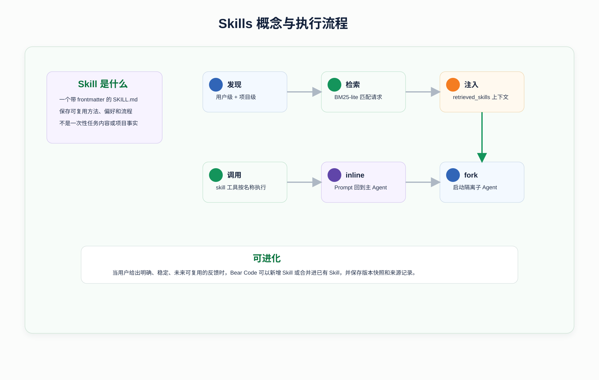

### 10.2 Skill 文件位置

Bear Code 支持两类 Skill：

```text
用户级：~/.bear/skills/<skill_name>/SKILL.md
项目级：<project>/.bear/skills/<skill_name>/SKILL.md
```

用户级 Skill 对所有项目生效，适合个人长期偏好。

项目级 Skill 只对当前项目生效，适合项目内的任务方法、文档风格、领域规则。

同名时，用户级优先。这意味着你可以用用户级 Skill 覆盖项目级同名 Skill。

### 10.3 Skill 文件结构

一个典型 Skill：

```markdown
---
name: code_review
description: Review code changes with a bug-risk-first mindset.
when-to-use: When the user asks for review or code review.
user-invocable: true
context: inline
allowed-tools: read_file,grep_search
---

# Goal

Review code changes and prioritize concrete risks.

# Workflow

1. Read the relevant code before giving findings.
2. Lead with bugs, regressions, security risks, and missing tests.
3. Cite file paths and line numbers where possible.
4. Keep summary secondary to findings.
```

frontmatter 常用字段：

| 字段 | 作用 |
|------|------|
| `name` | Skill 名称，缺省时用目录名 |
| `description` | 简短描述，会进入 Skill 列表和检索 |
| `when-to-use` / `when_to_use` | 触发条件 |
| `user-invocable` | 是否允许用户手动调用 |
| `context` | `inline` 或 `fork` |
| `allowed-tools` | fork 模式下允许的工具 |
| `version` | 版本 |
| `created-at` | 创建时间 |
| `last-evolved` | 最近演化时间 |
| `evolution-count` | 演化次数 |
| `tags` | 标签 |

### 10.4 Skill 如何加载

`discover_skills()` 会：

1. 扫描 `~/.bear/skills`。
2. 扫描当前项目 `.bear/skills`。
3. 只加载目录形式的 Skill。
4. 每个 Skill 文件必须叫 `SKILL.md`。
5. 用 `frontmatter.py` 解析 frontmatter。
6. 把结果转成 `SkillDefinition`。
7. 缓存在 `_cached_skills`。

注意：由于有缓存，运行中手动改 Skill 文件后，可能需要重启进程才会被重新扫描。

### 10.5 Skill 如何被检索

`retrieve_relevant_skills()` 使用一个轻量 BM25 风格的词面检索：

- 对用户请求分词。
- 对 Skill 的 `name`、`description`、`when_to_use` 和正文分词。
- 元数据权重更高。
- 返回 top hits。

为什么要检索？因为不能把所有 Skill 全量塞给模型。Skill 多了以后，全量注入会浪费上下文，也会干扰模型判断。所以 Bear Code 每轮只检索与当前问题最相关的几个 Skill。

### 10.6 Skill 如何执行

模型可以调用 `skill` 工具。执行时：

1. 根据 `skill_name` 找到 Skill。
2. 记录一次 Skill invocation。
3. 把正文中的 `$ARGUMENTS` 或 `${ARGUMENTS}` 替换成调用参数。
4. 把 `${CLAUDE_SKILL_DIR}` 替换成当前 Skill 目录。
5. 根据 `context` 决定 inline 或 fork。

`inline` 模式：

- Skill prompt 作为工具结果返回给主 Agent。
- 主 Agent 继续按照 Skill prompt 完成任务。
- 适合大多数写作、审查、分析类任务。

`fork` 模式：

- 创建一个子 Agent。
- 用 Skill prompt 作为子 Agent 的 system prompt。
- 子 Agent 独立执行后返回结果。
- 适合需要隔离上下文或限定工具的复杂技能。

## 11. Skills 自进化

### 11.1 自进化解决什么问题

传统 prompt 或 Skill 有一个问题：需要用户手工维护。用户每次说“以后都这样”，如果系统不能沉淀，下一次还会犯同样错误。

Bear Code 的自进化目标是：从用户明确反馈中抽取未来可复用的规则，并将其新增为 Skill 或合并进已有 Skill。

核心不是让模型随便改自己，而是建立可控闭环：

- 只从用户证据中抽取。
- 只沉淀稳定可复用规则。
- 写入前受权限控制。
- 每次变更有 provenance。
- 每次演化前保存快照。
- 记录 retrieved、relevant、used，低价值 Skill 可归档。

### 11.2 自进化架构

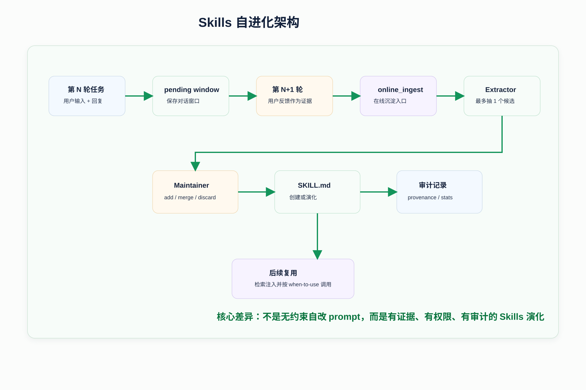

更细的演化流程可以看：

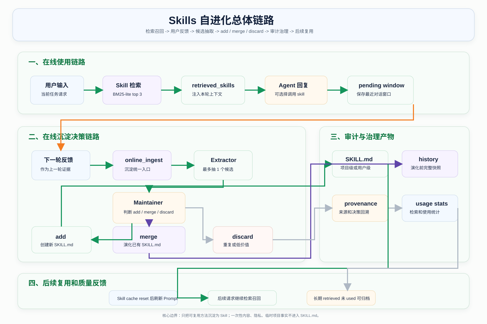

### 11.3 为什么要用 pending window

`Agent.chat()` 每轮结束后会保存 pending extraction window。下一轮用户输入会被当作上一轮的反馈合并进去。

例如：

第一轮：

```text
用户：帮我写一个政府报告
助手：输出报告
```

第二轮：

```text
用户：以后这种报告都要更正式，要结合国家政策，控制在 500 字以内
```

这时第二轮用户反馈就是非常强的 Skill 证据。它不是一次性内容，而是未来同类任务也适用的偏好。

### 11.4 Extractor 做什么

`extract_online_skill_candidate()` 会让模型从对话窗口中提取最多一个候选 Skill。

它要求输出严格 JSON，字段包括：

- `name`
- `description`
- `when_to_use`
- `instructions`
- `evidence`
- `tags`

它的规则很严格：

- 用户消息是主要证据。
- Assistant 回复只是上下文。
- 不提取 assistant 单方面猜测。
- 不沉淀一次性任务内容。
- 不沉淀密钥、隐私、URL、账号 ID、精确日期、临时参数。
- 只沉淀未来同类任务仍然有价值的工作流、输出策略、实现偏好或纠错规则。

### 11.5 Maintainer 做什么

`maintain_online_skill_candidate()` 决定候选该如何处理：

| 动作 | 含义 |
|------|------|
| `add` | 没有类似 Skill，创建新 Skill |
| `merge` | 已有类似 Skill，把新规则合并进去 |
| `discard` | 候选低价值、重复或不适合沉淀 |

它会参考：

- exact identity match。
- 已有 Skills 检索结果。
- retrieved_reference。
- 所有已有 Skill 的名称、描述、触发条件和部分正文。

如果相似度高，项目会倾向 merge 而不是 add，避免 Skill 越积越碎。

### 11.6 Skill 落盘和版本化

真正写文件的是 `skill_evolution.py`。

新增 Skill 时：

- 写入 `.bear/skills/<slug>/SKILL.md` 或用户级目录。
- 初始化 `version: 0.1.0`。
- 写入 `created-at`。
- 在 `usage.jsonl` 记录 create 事件。

演化 Skill 时：

- 先在 `history/<skill>.jsonl` 保存旧版完整快照。
- bump patch version。
- 更新 `last-evolved`。
- 更新 `evolution-count`。
- 追加或替换 Skill 正文。
- 在 `usage.jsonl` 记录 evolve 事件。

### 11.7 自进化审计文件

| 文件 | 作用 |
|------|------|
| `usage.jsonl` | create、invoke、feedback、evolve、prune 事件 |
| `online_provenance.jsonl` | 每次 online ingest 的消息窗口、决策和结果 |
| `online_skill_provenance.json` | 按 Skill 聚合来源、版本时间线和使用统计 |
| `skill_usage_stats.json` | retrieved、relevant、used 统计 |
| `history/*.jsonl` | 演化前完整快照 |
| `pruned/` | 被归档的低使用 Skill |

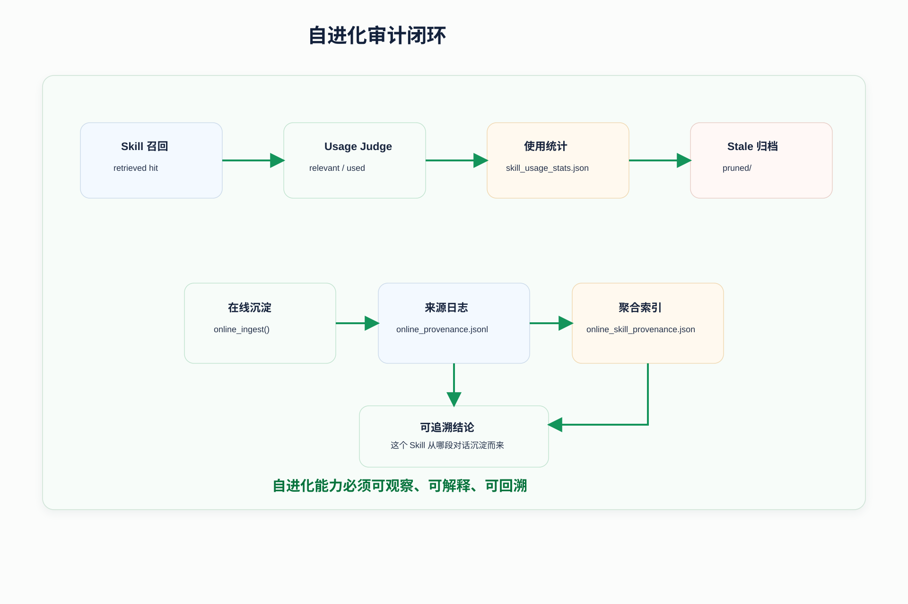

## 12. Memory 长期记忆

### 12.1 Memory 是什么

Memory 是跨会话保存的长期上下文。它适合保存：

- 用户稳定偏好。
- 用户身份或背景。
- 用户给过的反馈。
- 项目长期目标和决策。
- 外部资源指针。

它不适合保存：

- 当前代码结构。代码应该重新读。
- Git 历史。Git 应该用 git 命令查。
- 一次性任务细节。
- 临时参数。

### 12.2 Memory 和 Skill 的区别

| 类型 | 保存内容 | 举例 |
|------|----------|------|
| Memory | 事实、偏好、长期上下文 | 用户喜欢先看结论；项目目标是做 Coding Agent |
| Skill | 可复用方法、流程、规则 | 做 code review 时先列 bug 和风险 |

如果一句话描述的是“用户是谁、项目是什么、之前发生了什么”，更像 Memory。

如果一句话描述的是“以后遇到某类任务应该怎么做”，更像 Skill。

### 12.3 Memory 存储路径

Memory 按项目路径 hash 隔离：

```text
~/.BearCode/projects/<project_hash>/memory
```

这样不同项目的记忆不会串扰。

### 12.4 Memory 文件格式

```markdown
---
name: preferred review style
description: User prefers review findings before summaries.
type: feedback
---

When reviewing code, put findings first and focus on bugs, regressions, and missing tests.
```

支持类型：

| 类型 | 含义 |
|------|------|
| `user` | 用户角色、偏好、知识水平 |
| `feedback` | 用户纠错和指导 |
| `project` | 项目目标、进展、决策 |
| `reference` | 外部资源、工具、链接说明 |

### 12.5 Memory 召回流程

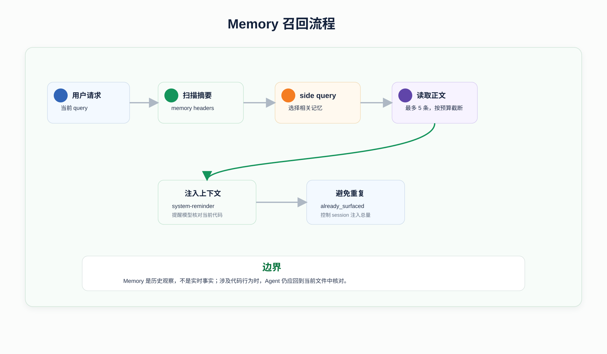

召回逻辑在 `memory.py` 中：

1. 扫描 memory 文件头，不先读所有正文。
2. 生成 memory manifest。
3. 用 side query 让模型选择最多 5 条相关 memory。
4. 读取被选中的 memory 正文。
5. 对过大的 memory 做截断。
6. 包装成 `<system-reminder>` 注入当前消息。
7. 记录本 session 已经注入过的 memory，避免重复。

### 12.6 Memory 的预算保护

项目设置了几个预算：

- 最多扫描 200 个 memory 文件。
- 单个 memory 注入最多 4096 bytes。
- 单个 session memory 注入总量最多 60 KB。

旧 memory 还会带 freshness warning，提醒模型：Memory 是历史观察，不是实时事实。如果涉及当前代码行为，应当重新读代码确认。

## 13. MCP：概念和项目实现

### 13.1 MCP 是什么

MCP 是 Model Context Protocol 的缩写。它是一种让模型应用连接外部工具、数据源或服务的协议。

可以这样理解：

- MCP Server：外部工具服务。它声明自己有哪些工具，每个工具需要什么参数，调用后返回什么结果。
- MCP Client：模型应用中的客户端。它连接 Server，发现工具，并在模型请求时调用工具。
- Bear Code：在这里扮演 MCP Client，把 MCP Server 暴露的工具包装成 Agent 可调用工具。

为什么需要 MCP？

如果没有 MCP，每接一个外部系统都要写一套专用集成。例如 GitHub 一套、数据库一套、浏览器一套、文件系统一套。MCP 的价值是提供统一协议：外部能力只要实现 MCP Server，模型应用就能用统一方式发现和调用。

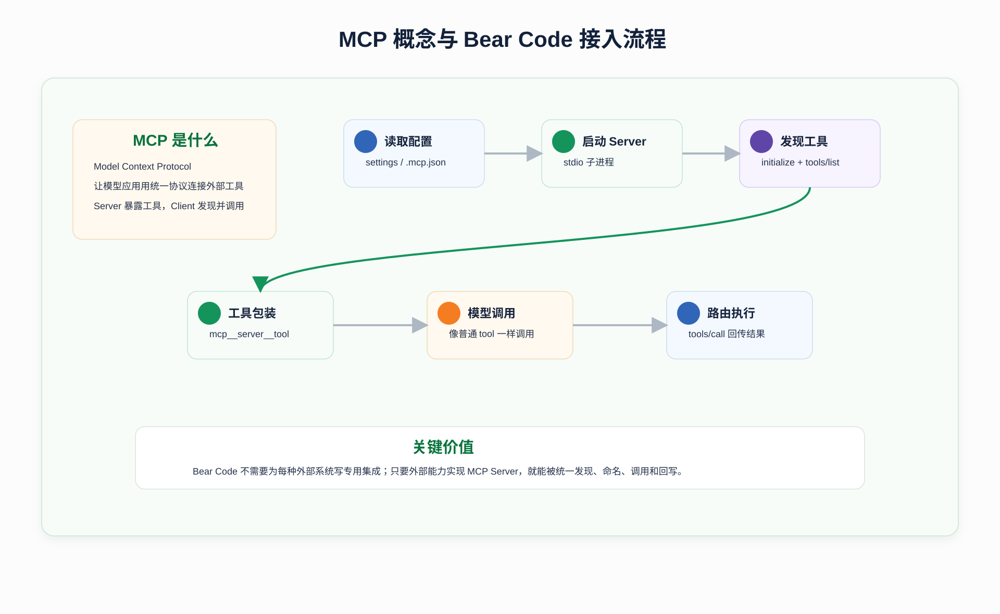

### 13.2 Bear Code 如何接入 MCP

`agents/mcp_client.py` 自己实现了一个 stdio JSON-RPC MCP 客户端，没有依赖 MCP SDK。

它做的事情：

1. 读取 MCP 配置。
2. 为每个 MCP Server 启动一个子进程。
3. 通过 stdin/stdout 发送 JSON-RPC 消息。
4. 发送 `initialize`。
5. 发送 `notifications/initialized`。
6. 调用 `tools/list` 获取工具列表。
7. 把工具包装成 Bear Code 的 tool schema。
8. 当模型调用 MCP 工具时，发送 `tools/call`。
9. 把结果转成字符串返回给模型。

### 13.3 MCP 配置来源

配置会从三个位置合并：

```text
~/.bear/settings.json
<project>/.bear/settings.json
<project>/.mcp.json
```

示例：

```json
{
  "mcpServers": {
    "example": {
      "command": "python",
      "args": ["server.py"],
      "env": {
        "TOKEN": "..."
      }
    }
  }
}
```

### 13.4 MCP 工具命名规则

Bear Code 会把 MCP 工具名包装成：

```text
mcp__<serverName>__<toolName>
```

例如：

```text
mcp__browser__navigate
mcp__github__search_repositories
```

这样做有两个好处：

- 避免和内置工具重名。
- 调用时可以根据前缀路由回正确的 MCP Server。

### 13.5 stdio JSON-RPC 如何工作

每个 MCP Server 是一个子进程：

- Bear Code 向它的 stdin 写 JSON-RPC 请求。
- Bear Code 从它的 stdout 按行读取 JSON-RPC 响应。
- 每个请求有递增 id。
- `_pending` 字典把 id 映射到 Future。
- 响应回来时，根据 id 唤醒等待中的 Future。

如果某个 MCP Server 连接失败，只会打印错误并关闭该连接，不会阻断其他 Server。

## 14. 子 Agent

### 14.1 子 Agent 是什么

子 Agent 是一个独立上下文中的 Agent。主 Agent 可以把某个独立任务交给子 Agent，让它读文件、搜索、规划或处理局部问题，然后把结果作为工具结果返回。

子 Agent 的价值：

- 隔离上下文，避免主对话被大量搜索结果污染。
- 让探索、规划、局部分析更聚焦。
- 给不同任务不同工具权限。
- 支持自定义角色。

### 14.2 内置子 Agent 类型

| 类型 | 工具权限 | 用途 |
|------|----------|------|
| `explore` | 只读 | 快速搜索和分析代码库 |
| `plan` | 只读 | 生成结构化实现计划 |
| `general` | 全工具但不能再调用 `agent` | 独立完成局部任务 |

`explore` 和 `plan` 只给 `read_file`、`list_files`、`grep_search`。这是为了保证它们不会修改项目。

`general` 不允许再调用 `agent`，是为了避免子 Agent 递归创建子 Agent，导致控制流难以管理。

### 14.3 自定义子 Agent

你可以在下面路径创建自定义 Agent：

```text
用户级：~/.bear/agents/*.md
项目级：<project>/.bear/agents/*.md
```

示例：

```markdown
---
name: api-reviewer
description: Review API contracts and compatibility risks.
allowed-tools: read_file,grep_search,list_files
---

You are an API compatibility reviewer.
Focus on breaking changes, schema mismatches, and missing tests.
Do not modify files.
```

自定义 Agent 由 `subagent.py` 中的 `_discover_custom_agents()` 加载。

## 15. 会话保存和上下文压缩

### 15.1 会话保存

会话保存在：

```text
~/.bear-code/sessions/<session_id>.json
```

保存内容包括：

- metadata：会话 id、模型、cwd、开始时间、消息数。
- anthropicMessages：Anthropic 消息历史。
- openaiMessages：OpenAI 消息历史。

`--resume` 会读取最近 session，并调用 `Agent.restore_session()` 恢复消息历史。

### 15.2 为什么要上下文压缩

模型上下文窗口有限，而 Coding Agent 很容易产生大量工具输出：

- 多次读文件。
- 大范围 grep。
- 测试输出。
- 构建日志。
- 子 Agent 返回的大段分析。

如果不压缩，后续模型请求会越来越慢，甚至超过上下文限制。

### 15.3 项目的压缩策略

| 策略 | 作用 |
|------|------|
| 预算裁剪 | token 利用率较高时截断超长工具结果 |
| stale result snip | 保留最近工具结果，旧结果替换为占位符 |
| microcompact | 长时间空闲后清理旧工具结果 |
| 大结果持久化 | 超过 30 KB 的工具结果写入 `~/.bear-code/tool-results` |
| compact conversation | 调用模型总结历史，只保留关键上下文 |

这些策略共同保证长会话可以继续推进。

## 16. 数据和存储总览

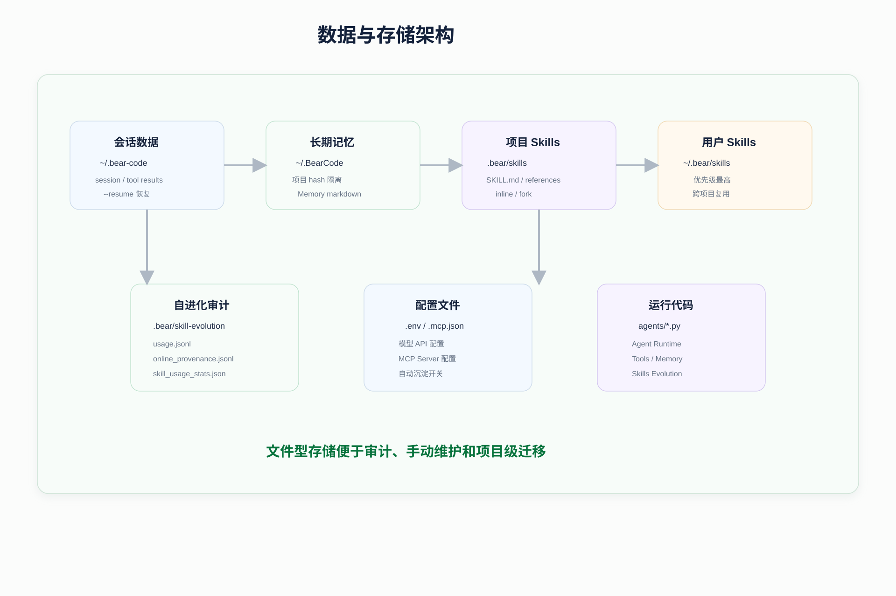

| 数据 | 路径 | 说明 |
|------|------|------|
| 项目级 Skill | `.bear/skills/<name>/SKILL.md` | 当前项目可用的 Skill |
| 用户级 Skill | `~/.bear/skills/<name>/SKILL.md` | 所有项目共享的 Skill |
| Skill 审计 | `.bear/skill-evolution/` | 创建、调用、演化、裁剪、来源记录 |
| Memory | `~/.BearCode/projects/<hash>/memory/` | 当前项目长期记忆 |
| Session | `~/.bear-code/sessions/` | 会话历史 |
| 大工具结果 | `~/.bear-code/tool-results/` | 超大工具输出 |
| Plan 文件 | `~/.bear/plans/` | Plan Mode 计划 |
| 全局设置 | `~/.bear/settings.json` | 权限、MCP 等 |
| 项目设置 | `.bear/settings.json` | 项目权限、MCP 等 |
| MCP 配置 | `.mcp.json` | MCP Server 配置 |
| 项目规则 | `.bear/rules/*.md` | 注入 system prompt 的规则 |
| 自定义子 Agent | `.bear/agents/*.md` / `~/.bear/agents/*.md` | 子 Agent 扩展 |

## 17. Docker 和部署

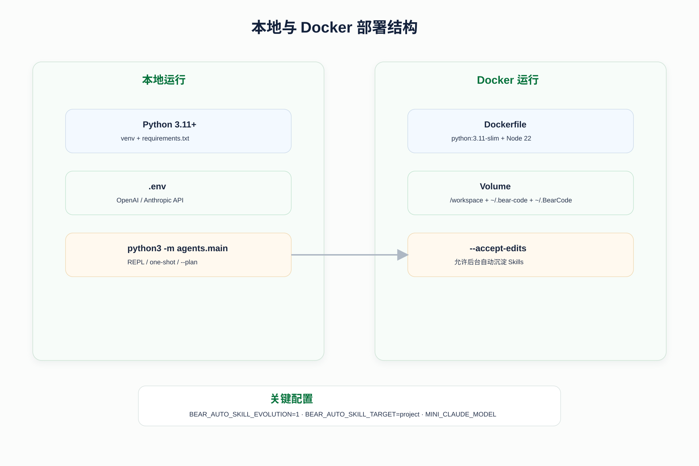

本地运行适合开发和调试，Docker 运行适合演示或隔离环境。

构建镜像：

```bash
docker build -t bear-code .
```

运行：

```bash
docker run --rm -it \
  --env-file .env \
  -v "$PWD:/workspace" \
  -v bear-code-sessions:/root/.bear-code \
  -v bear-code-memory:/root/.BearCode \
  bear-code
```

如果要允许自动沉淀 Skills：

```bash
docker run --rm -it \
  --env-file .env \
  -e BEAR_AUTO_SKILL_EVOLUTION=1 \
  -e BEAR_AUTO_SKILL_TARGET=project \
  -v "$PWD:/workspace" \
  -v bear-code-sessions:/root/.bear-code \
  -v bear-code-memory:/root/.BearCode \
  bear-code --accept-edits
```

## 18. 如何扩展项目

### 18.1 新增内置工具

步骤：

1. 在 `agents/tools.py` 的 `tool_definitions` 中添加 schema。
2. 如果是只读工具，加入 `READ_TOOLS`。
3. 如果可并发安全，加入 `CONCURRENCY_SAFE_TOOLS`。
4. 如果会修改文件或状态，加入 `EDIT_TOOLS` 或在 `check_permission()` 中单独处理。
5. 实现 `_your_tool(inp)`。
6. 在 `execute_tool()` 的 handlers 中注册。
7. 确认返回结果是字符串。
8. 对长结果使用 `_truncate_result()`。
9. 用 one-shot 或 REPL 测试模型是否能正确调用。

工具设计建议：

- 输入参数要少而明确。
- 失败时返回可读错误，不要轻易抛异常。
- 涉及写入时一定接权限系统。
- 不要让工具偷偷打印输出，工具结果应该通过返回值进入 Agent Loop。

### 18.2 新增 Skill

路径：

```text
.bear/skills/my-skill/SKILL.md
```

最小模板：

```markdown
---
name: my-skill
description: Describe what this skill does.
when-to-use: When the user asks for this kind of task.
user-invocable: true
context: inline
---

# Goal

Explain the reusable goal.

# Workflow

1. Understand the user's concrete request.
2. Apply the reusable method.
3. Produce the requested output directly.
```

写 Skill 时要注意：

- `description` 要具体，不要只写“处理任务”。
- `when-to-use` 要能区分适用场景。
- 正文写可复用流程，不写一次性任务内容。
- 如果需要隔离上下文，使用 `context: fork`。
- 如果 fork 模式要限制工具，写 `allowed-tools`。

### 18.3 新增自定义子 Agent

路径：

```text
.bear/agents/security-review.md
```

模板：

```markdown
---
name: security-review
description: Review code for security risks.
allowed-tools: read_file,grep_search,list_files
---

You are a security review agent.
Find concrete risks in the current codebase.
Report findings with file paths and reasoning.
Do not modify files.
```

适合做成子 Agent 的任务：

- 安全审查。
- API 兼容性审查。
- 大范围代码搜索。
- 只读架构分析。
- 测试覆盖缺口分析。

### 18.4 接入 MCP Server

创建 `.mcp.json`：

```json
{
  "mcpServers": {
    "example": {
      "command": "python",
      "args": ["server.py"],
      "env": {}
    }
  }
}
```

调试 MCP 时重点检查：

- command 是否能单独运行。
- server stdout 是否输出合法 JSON-RPC。
- server 是否支持 `initialize`。
- server 是否支持 `tools/list`。
- 工具 schema 是否符合 MCP 约定。
- `tools/call` 是否返回 text content。

## 19. 常见问题排查

### 19.1 模型接口不通

检查顺序：

1. `.env` 是否在当前工作目录或父目录。
2. API key 是否正确。
3. base URL 是否正确。
4. Anthropic-compatible URL 是否包含 `/anthropic`。
5. OpenAI-compatible URL 是否是 `/v1` 风格。
6. `--api-base` 是否覆盖了环境变量。
7. 当前模型名是否被服务端支持。

### 19.2 Skill 没加载

检查：

1. 文件是否叫 `SKILL.md`。
2. 是否放在目录下，而不是直接放 `.md` 文件。
3. frontmatter 是否有首尾 `---`。
4. `name` 是否和调用名称一致。
5. 是否被同名用户级 Skill 覆盖。
6. 运行中的缓存是否需要重启。

### 19.3 编辑被拒绝

常见原因：

- 当前是 Plan Mode。
- 当前是 `dontAsk`。
- settings 中有 deny 规则。
- 编辑前没有先 `read_file`。
- 文件在读取后被外部修改。
- 操作是新建文件或危险命令，需要确认。

### 19.4 在线 Skill 没自动写入

检查：

1. `BEAR_AUTO_SKILL_EVOLUTION` 是否关闭。
2. 当前是否在 Plan Mode。
3. 权限模式是否不是 `acceptEdits` 或 `bypassPermissions`。
4. 用户反馈是否足够明确、稳定、可复用。
5. Maintainer 是否判定为 discard。
6. 查看 `.bear/skill-evolution/online_provenance.jsonl`。

### 19.5 Memory 没召回

检查：

- 当前项目 memory 目录是否有合法 memory 文件。
- 用户输入是否太短。
- memory description 是否足够清楚。
- 当前 session 注入预算是否已满。
- side query 是否失败。
- 该 memory 是否已经在当前 session 注入过。

### 19.6 MCP 工具没出现

检查：

- `.mcp.json` 格式是否正确。
- server command 是否存在。
- server 是否能启动。
- stdout 是否被非 JSON 日志污染。
- 初始化是否超时。
- `tools/list` 是否返回工具。
- 工具是否被包装为 `mcp__server__tool`。

## 20. 建议的源码阅读顺序

### 20.1 第一遍只读主干

按这个顺序读：

1. `agents/main.py`
2. `Agent.__init__()`
3. `Agent.chat()`
4. `_chat_anthropic()` 或 `_chat_openai()`
5. `_execute_tool_call()`
6. `tools.check_permission()`
7. `tools.execute_tool()`

这一遍只回答一个问题：一次用户请求如何跑完。

### 20.2 第二遍看状态

重点看这些状态为什么存在：

- `permission_mode`
- `_anthropic_messages`
- `_openai_messages`
- `_read_file_state`
- `_mcp_manager`
- `_already_surfaced_memories`
- `_session_memory_bytes`
- `_pending_skill_extraction_window`
- `_last_retrieved_skill_hits`
- `_background_skill_tasks`

这一遍回答：为什么 Agent 需要记住这些东西。

### 20.3 第三遍看扩展点

重点看：

- `tool_definitions`
- `build_system_prompt()`
- `discover_skills()`
- `retrieve_relevant_skills()`
- `online_ingest()`
- `create_skill_file()`
- `evolve_skill_file()`
- `McpManager.get_tool_definitions()`
- `get_sub_agent_config()`

这一遍回答：我要加能力应该改哪里。

## 21. 学习任务清单

完成下面任务，基本可以说你真正理解了这个项目。

1. 跑通 `python3 -m agents.main "总结项目结构"`。
2. 进入 REPL，执行 `/skills`，确认项目级 Skills。
3. 阅读 `agents/main.py`，说清 one-shot 和 REPL 的区别。
4. 阅读 `Agent.chat()`，画出本轮对话结束后发生了哪些后台任务。
5. 阅读 `tools.check_permission()`，解释五种权限模式。
6. 用 Plan Mode 跑一次任务，找到生成的 plan 文件。
7. 手动创建一个项目级 Skill，并用 `/skills` 查看。
8. 用 `/skill-evolve` 演化 Skill，查看 `history` 和 `usage.jsonl`。
9. 保存一条 Memory，再提出相关问题观察是否召回。
10. 新增一个只读工具，让模型调用它。
11. 新增一个自定义子 Agent。
12. 写一个最小 MCP Server，并确认工具名被包装为 `mcp__...`。
13. 手动运行 `/extract_now`，查看 `online_provenance.jsonl`。

## 22. 最后复盘

如果只记住一条主线，请记住：

用户输入先进入 `main.py`，再交给 `Agent.chat()`。Agent 构建 system prompt、检索 Skills、预取 Memory，并调用模型。模型如果请求工具，Runtime 会先检查权限，再执行内置工具、Skill、MCP 或子 Agent，并把结果回写给模型。任务结束后，系统保存 session，并根据用户反馈和使用情况沉淀或演化 Skills。

Bear Code 最值得学习的不是某一个函数，而是这一整套闭环：

- 可运行。
- 可扩展。
- 可审计。
- 有权限边界。
- 有长期记忆。
- 有可复用 Skills。
- 有从反馈到能力沉淀的自进化链路。

理解这个闭环，你就理解了一个轻量级 Coding Agent Runtime 的核心设计。
