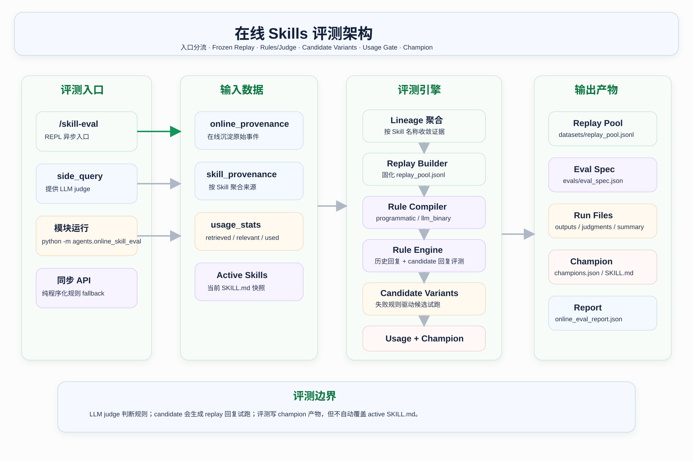
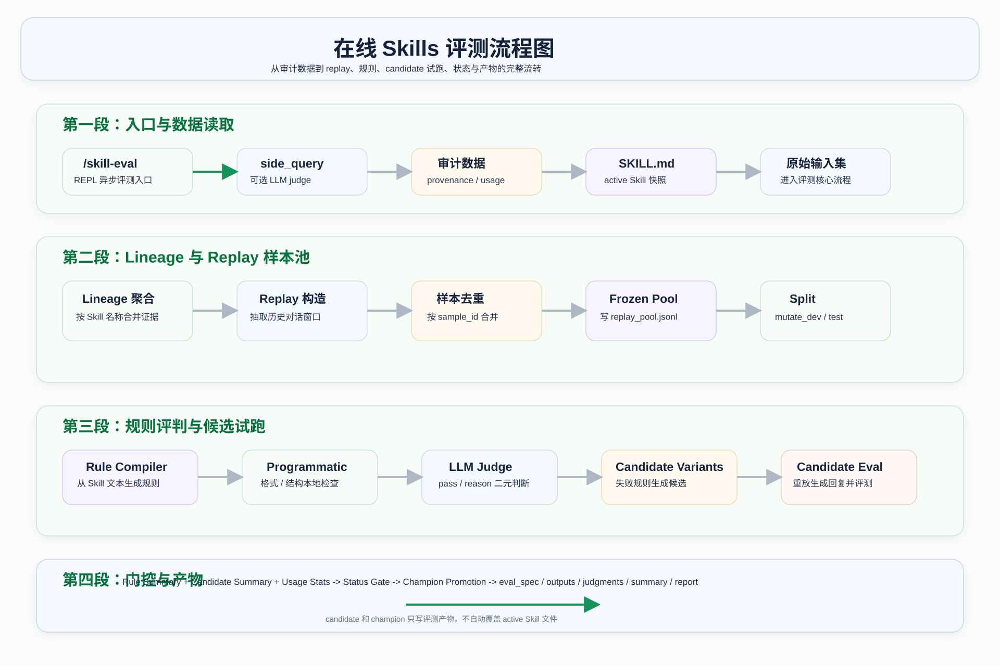

# 在线 Skills 评测实现说明

本文档说明 Bear Code 的在线 Skills 评测是怎么做的。重点解释每个阶段的名词含义、代码流程、输入输出和当前边界。

核心实现文件：

```text
agents/online_skill_eval.py
```

REPL 命令入口：

```text
/skill-eval
```

当前评测只做观察、评估和记录。它可以调用 LLM 判断某条规则是否满足，但不会让 LLM 重新生成 replay 回复，也不会自动修改、演化、删除或归档 `SKILL.md`。

## 0. 评测整体思路

在线 Skills 评测的核心思路不是直接问“这个 Skill 写得好不好”，而是看它在真实使用里有没有足够证据证明自己有用、稳定、符合要求。

它大致按下面的顺序工作：

```text
先确认有哪些 Skill 需要观察
  -> 找到这些 Skill 的真实对话来源
  -> 把历史对话整理成可复查的样本
  -> 从 Skill 文档里提取可检查的要求
  -> 检查历史回复是否满足这些要求
  -> 再看这个 Skill 后续有没有被检索、相关、实际使用
  -> 最后给出观察状态和原因
```

换句话说，当前评测更像一个“在线质量看板”。它不会马上决定某个 Skill 必须保留或删除，而是持续积累证据：

- 如果一个 Skill 没有真实对话，也没有被使用过，就只能标记为未观察到。
- 如果已经有一些使用信号，但样本太少，还不能说明稳定，就会先放在观察期。
- 如果样本数量、规则通过情况、后续使用情况都达标，才会被认为比较健康。
- 如果后续要做自动演化或自动淘汰，可以基于这份评测报告继续扩展，但当前代码还没有自动改写 Skill 文件。

后文会使用一些实现名词。可以先这样理解：

| 名词 | 直观理解 |
|------|----------|
| `replay` | 从历史真实对话里整理出来的评测样本 |
| `lineage` | 某一个 Skill 的完整观察主线 |
| `rule` | 从 Skill 文档里提取出来的检查要求 |
| `LLM judge` | 让模型判断某条回复是否满足一条规则 |
| `champion` | 当前本地记录里表现最好的健康版本 |

## 1. 总体架构

在线 Skills 评测可以理解为一条质量观察链路。它读取在线自进化留下的审计数据，把真实对话窗口整理成 replay 样本，再用从 Skill 文本编译出的规则去检查历史回复，最后结合使用统计判断 Skill 当前状态。

总体架构图：



完整流程图：



整体链路：

```text
/skill-eval 或模块运行
  -> 读取 online provenance / usage / active skills
  -> 按 Skill 名称形成 lineage
  -> 构造并固化 replay pool
  -> 从 SKILL.md 编译 programmatic / llm_binary 规则
  -> 对历史 latest_assistant 执行规则评测
  -> 合并 retrieved / relevant / used
  -> 计算 status
  -> 判断 champion promotion
  -> 写出 report 和 run artifacts
```

这里有三个核心判断：

- 这个 Skill 有没有真实在线证据。
- 这个 Skill 的历史回复是否满足自身规则。
- 这个 Skill 后续是否真的被检索、相关、使用。

## 2. 入口与运行路径

### 2.1 名词解释

`/skill-eval` 是在线 Skills 评测的 REPL 命令。

`side_query` 是 Agent 内部构造的轻量模型调用函数，用来执行 LLM judge 规则。它不是主对话回复生成器，只用于评测判断。

`同步路径` 指直接运行 `python3 -m agents.online_skill_eval` 或普通函数调用，此时没有 `side_query`，所以只执行程序化规则。

`异步路径` 指 REPL 里的 `/skill-eval`，它能拿到 Agent 的模型客户端，因此可以启用 LLM judge。

### 2.2 当前代码怎么做

REPL 中输入：

```text
/skill-eval
```

调用链路：

```text
agents/main.py
  -> agent._build_side_query(max_tokens=700)
  -> format_online_skill_eval_async(side_query=side_query)
  -> evaluate_online_skill_evolution_async(side_query=side_query)
```

直接运行模块：

```text
python3 -m agents.online_skill_eval
```

调用链路：

```text
format_online_skill_eval()
  -> evaluate_online_skill_evolution()
```

两条路径的差异：

| 路径 | 是否有 side_query | 是否编译 LLM judge 规则 | 适用场景 |
|------|-------------------|--------------------------|----------|
| REPL `/skill-eval` | 有 | 是 | 正常人工查看评测 |
| 模块同步运行 | 无 | 否 | 本地快速检查、脚本调用 |

### 2.3 无副作用调用

如果只想拿报告，不想写文件，可以调用：

```python
evaluate_online_skill_evolution(
    write_report=False,
    write_artifacts=False,
)
```

这样不会写 `online_eval_report.json`，也不会写 `online-eval/` 下的 replay、run 和 champion 产物。

## 3. 输入数据

### 3.1 名词解释

`provenance` 是来源审计记录。它回答“这个 Skill 的在线沉淀从哪段对话来，当时做了什么决策”。

`usage stats` 是使用统计。它回答“这个 Skill 后续有没有被检索出来、是否相关、是否真的被使用”。

`active Skill` 是当前能被系统加载到的 `SKILL.md`。评测规则主要从 active Skill 的文本里编译。

### 3.2 当前代码读取什么

评测读取的数据目录：

```text
.bear/skill-evolution/
```

主要输入文件：

| 文件 | 作用 |
|------|------|
| `online_provenance.jsonl` | 每次在线沉淀的原始事件，包含 action、skill、messages、decision、error |
| `online_skill_provenance.json` | 按 Skill 聚合后的在线来源索引 |
| `skill_usage_stats.json` | Skill 被检索、相关、实际使用的统计 |
| `usage.jsonl` | create、invoke、feedback、evolve、prune 等生命周期事件 |
| `history/*.jsonl` | Skill 演化前快照 |

评测还会调用：

```text
agents/skills.py::discover_skills()
```

读取当前 active Skills：

```text
~/.bear/skills/<skill>/SKILL.md
<project>/.bear/skills/<skill>/SKILL.md
```

### 3.3 输入数据进入评测后的作用

这些输入会被拆成三类用途：

- provenance 用来构造 replay 样本。
- active Skill 文本用来编译规则。
- usage stats 用来做状态门控。

## 4. Lineage 聚合

### 4.1 名词解释

`lineage` 可以理解为一条 Skill 的评测主线。

评测不能只看一个孤立文件或一次事件，而要把同一个 Skill 的来源、使用、replay、规则评测和 champion 记录串起来。这个串起来的对象就是 lineage。

当前项目没有独立 Skill ID，因此使用 Skill 名称生成 lineage id：

```text
lineage_id = "skill-" + sha1({"name": skill_name})[:16]
```

### 4.2 当前代码怎么做

评测会收集所有可能需要展示的 Skill 名称：

- active skills 中存在的 Skill。
- `online_skill_provenance.json` 中出现过的 Skill。
- `skill_usage_stats.json` 中出现过的 Skill。
- `usage.jsonl` 生命周期统计中出现过的 Skill。

然后对每个 Skill 构造一个 lineage 评测对象。

### 4.3 为什么要这样做

这样即使某个 Skill 没有在线来源，只要它当前存在，也会出现在报告里。

例如：

```text
active SKILL.md 存在
但没有 replay
也没有 usage
```

它会被标记为：

```text
unobserved
```

而不是从报告里消失。

## 5. Replay 构造

### 5.1 名词解释

`replay` 是从历史真实对话中恢复出来的评测样本。

它不是人工写的测试题，也不是重新让模型回答。它保存的是当时真实发生过的一段在线对话窗口，包括用户说了什么、assistant 回了什么、当时关联哪个 Skill。

当前评测中的 replay 主要用于回答：

```text
这个 Skill 相关的历史 assistant 回复，是否满足当前规则？
```

### 5.2 当前 replay 从哪里来

来源有两类：

```text
online_provenance.jsonl
online_skill_provenance.json 中的 sources
```

第一类是原始在线事件。

第二类是按 Skill 聚合后的来源索引。

### 5.3 Replay sample 长什么样

每条 replay sample 大致是：

```json
{
  "sample_id": "...",
  "source_type": "online_log",
  "split": "mutate_dev",
  "time": "...",
  "action": "add",
  "ok": true,
  "latest_user": "...",
  "latest_assistant": "...",
  "messages": []
}
```

字段含义：

| 字段 | 含义 |
|------|------|
| `sample_id` | replay 样本的稳定 ID，用于去重和 split |
| `source_type` | 来源类型，例如 `online_log` 或 `online_index` |
| `split` | 样本用途，当前是 `mutate_dev` 或 `promotion_test` |
| `time` | 来源事件时间 |
| `action` | 当时 online ingest 的动作 |
| `ok` | 当时动作是否成功 |
| `latest_user` | 窗口中最后一条用户消息 |
| `latest_assistant` | 窗口中最后一条 assistant 回复 |
| `messages` | 规范化后的 user / assistant 消息窗口 |

### 5.4 构造过程

构造流程：

```text
读取来源 row/source
  -> 提取 messages
  -> 只保留 user / assistant
  -> 找 latest_user
  -> 找 latest_assistant
  -> 没有用户消息则丢弃
  -> 根据 skill + messages + latest_user 生成 sample_id
  -> 写入 replay sample
```

关键规则：

- 只保留 `user` 和 `assistant` 角色。
- 没有用户消息的窗口不进入 replay。
- 同一段对话生成相同 `sample_id`，便于去重。
- 当前只评估历史 `latest_assistant`，不重新生成回复。

## 6. Frozen Replay Pool

### 6.1 名词解释

`frozen replay pool` 是固化后的 replay 样本池。

普通 replay 是本次扫描从日志里拿到的样本；frozen replay pool 是已经写到磁盘、后续评测可以继续复用和增量合并的样本集合。

它解决的问题是：

```text
如果每次评测都临时扫描日志，样本边界会变化，评测结果不容易复盘和比较。
```

### 6.2 当前产物位置

每个 lineage 会有一个 replay pool：

```text
.bear/skill-evolution/online-eval/datasets/<lineage_id>/replay_pool.jsonl
```

### 6.3 固化过程

固化流程：

```text
读取旧 replay_pool.jsonl
  -> 按 sample_id 建索引
  -> 合并本次新扫描到的 replay samples
  -> 相同 sample_id 更新内容
  -> 排序
  -> 稳定分配 split
  -> 写回 replay_pool.jsonl
```

这样 replay pool 会随着在线使用逐步积累。

### 6.4 它的作用

作用包括：

- 保留真实在线证据。
- 支持同一批样本的反复评测。
- 支持每次 run 的结果复盘。
- 为 champion 判断提供稳定基础。

## 7. Replay Split

### 7.1 名词解释

`split` 是样本用途划分。

当前有两个 split：

| split | 含义 |
|------|------|
| `mutate_dev` | 开发/观察样本，用于看当前 Skill 的一般表现 |
| `promotion_test` | 晋级门控样本，用于判断是否有资格进入 healthy/champion |

### 7.2 当前代码怎么分

split 根据 `sample_id` 稳定计算：

```text
score = int(sample_id[:8], 16) / (16**8 - 1)
```

默认比例：

```text
DEFAULT_DEV_SPLIT_RATIO = 0.75
```

也就是大约：

```text
75% mutate_dev
25% promotion_test
```

### 7.3 保底规则

如果样本数量大于等于 2，系统会保证至少有：

```text
1 个 mutate_dev
1 个 promotion_test
```

如果只有 1 个样本，它只能是 `mutate_dev`，该 Skill 会因为缺少 promotion-test 样本而保持 `incubating`。

## 8. 规则编译

### 8.1 名词解释

`规则编译` 是把 Skill 文本里的稳定要求转换成可执行评测规则。

例如 Skill 文本中写了“输出必须是 JSON”，评测系统就能编译出：

```text
json_parseable
```

再用这条规则检查 replay 里的历史 assistant 回复是否真的是合法 JSON。

### 8.2 当前规则来自哪里

规则编译入口：

```text
_compile_eval_rules(skill, include_llm_rules=False)
```

规则输入优先来自 active Skill 快照，也就是当前能被 `discover_skills()` 加载到的 `SKILL.md`：

- `name`
- `description`
- `when_to_use`
- `instructions`
- `tags`

如果某个 Skill 出现在在线来源、使用统计或生命周期统计里，但当前 active Skill 里已经找不到对应 `SKILL.md`，评测不会直接丢掉它，而是构造一个降级快照：

```text
name = skill 名称
description = lineage.description 或 lifecycle.description
when_to_use = lineage.when_to_use
instructions = ""
```

这样它仍然会进入报告，但因为正文 instructions 缺失，能编译出的规则会比 active Skill 少。

这些文本会拼成一个 corpus，然后生成两类规则：

- 程序化规则：通过关键词触发，用代码直接检查。
- LLM judge 规则：在 `/skill-eval` 这种有模型调用能力的路径下生成，用模型判断历史回复是否符合 Skill 的整体要求。

当前规则不是由 LLM 临时“发明”出来的。LLM 只负责执行 `llm_binary` 规则的判断；规则列表本身由本地代码根据 Skill 文本确定。

规则生成主流程：

```text
读取 Skill 快照
  -> 拼接 name / description / when_to_use / instructions / tags
  -> 归一化成 corpus
  -> 添加 baseline 默认规则
  -> 如果 include_llm_rules=True，添加通用 LLM 对齐规则
  -> 根据关键词添加程序化规则
  -> 根据反幻觉关键词添加 LLM 硬规则或程序化降级规则
  -> 最多保留前 8 条规则
```

### 8.3 默认规则

无论 Skill 写了什么，都会有：

| rule_id | kind | hard | 含义 |
|---------|------|------|------|
| `response_nonempty` | `programmatic` | true | 回复不能为空 |

### 8.4 Skill 文本触发规则

| rule_id | kind | hard | 触发信号 | 检查方式 |
|---------|------|------|----------|----------|
| `skill_instruction_alignment` | `llm_binary` | false | 有 LLM judge 且 Skill 有可读文本 | 由 LLM 判断回复是否符合该 Skill 的整体要求 |
| `must_cite_sources` | `programmatic` | true | `引用来源`、`cite sources` 等 | 检查 URL、Markdown 链接或来源标签 |
| `paragraph_limit` | `programmatic` | true | `不超过 N 段`、`at most N paragraph` 等 | 检查段落数量 |
| `lead_with_conclusion` | `programmatic` | false | `先给结论`、`bottom line first` 等 | 检查首段是否像结论或足够短 |
| `json_parseable` | `programmatic` | true | `JSON` 或 `结构化输出` | 尝试 `json.loads()` |
| `markdown_table` | `programmatic` | false | `表格` 或 `markdown table` | 检查 Markdown 表格结构 |
| `uncertainty_marked` | `programmatic` | false | 无 LLM judge 时出现“不要幻觉/不确定就说”等 | 检查不确定性表达 |
| `no_unfounded_claims` | `llm_binary` | true | 有 LLM judge 时出现“不要幻觉/不确定就说”等 | 由 LLM 判断是否避免无依据断言 |

规则数量上限：

```text
rules[:8]
```

### 8.5 规则生成方式汇总

当前一共有四种规则生成方式。

第一种是 baseline 默认生成。

无论 Skill 文本是什么，都会生成 `response_nonempty`。它保证评测至少能检查“历史 assistant 回复是不是空的”。这条规则不依赖关键词，也不依赖 LLM。

第二种是关键词触发的程序化规则。

系统会扫描 Skill 的 `name`、`description`、`when_to_use`、`instructions` 和 `tags`。如果文本里出现固定关键词，就生成对应规则：

| 关键词信号 | 生成规则 | 说明 |
|------------|----------|------|
| `引用来源`、`标注来源`、`cite sources` 等 | `must_cite_sources` | 要求回复里有 URL、Markdown 链接或“来源/参考”标签 |
| `不超过 N 段`、`最多 N 段`、`at most N paragraph` 等 | `paragraph_limit` | 要求回复段落数不超过限制 |
| `先给结论`、`结论在前`、`bottom line first` 等 | `lead_with_conclusion` | 要求首段像结论，或者首段足够短 |
| `JSON`、`结构化输出` | `json_parseable` | 要求回复能被 `json.loads()` 解析 |
| `表格`、`markdown table` | `markdown_table` | 要求回复包含 Markdown 表格结构 |

第三种是 `/skill-eval` 下的通用 LLM 对齐规则。

当 REPL 命令能拿到 `side_query` 时，`include_llm_rules=True`。只要 Skill 有可读文本，就会生成：

```text
skill_instruction_alignment
```

这条规则不是从某个关键词触发，而是把整个 Skill 快照整理成 `requirement_text`，让 LLM 判断历史回复是否符合 Skill 的整体要求。

第四种是反幻觉规则的分支生成。

如果 Skill 文本里出现：

```text
不要幻觉 / 不要编造 / 不确定就说 / do not hallucinate / avoid hallucination / if unsure
```

会根据当前是否启用 LLM judge 走不同分支：

| 当前条件 | 生成规则 | kind | hard | 含义 |
|----------|----------|------|------|------|
| 有 LLM judge | `no_unfounded_claims` | `llm_binary` | true | 由 LLM 判断是否避免无依据断言 |
| 没有 LLM judge | `uncertainty_marked` | `programmatic` | false | 用关键词启发式检查是否表达不确定性 |

### 8.6 当前没有的规则生成方式

当前代码没有做这些事：

- 不会让 LLM 读取 Skill 后动态生成一组新规则。
- 不会读取单独的 `eval.yaml`、`rules.json` 或测试配置文件。
- 不会从用户反馈里自动提炼评测规则。
- 不会从历史失败样本里自动归纳新规则。
- 不会为不同版本 Skill 生成不同的专属规则集。

所以目前所有规则都来自：

```text
本地代码里的固定规则模板
  + 当前 Skill 文本
  + 是否存在 side_query
```

## 9. LLM Judge 规则

### 9.1 名词解释

`LLM judge` 是把模型当裁判，而不是当回答生成器。

它的任务不是重新回答用户问题，而是判断：

```text
这条历史 assistant 回复是否满足某条评测规则？
```

### 9.2 什么时候启用

REPL `/skill-eval` 会构造：

```text
side_query = agent._build_side_query(max_tokens=700)
```

只要 `side_query` 可用：

```text
include_llm_rules = True
```

否则：

```text
include_llm_rules = False
```

### 9.3 当前支持的 LLM judge 规则

当前支持两类 LLM judge 规则。

第一类是通用对齐规则：

```text
skill_instruction_alignment
```

这条规则会把 Skill 的 `name`、`description`、`when_to_use`、`tags` 和正文 instructions 整理成一段评测要求，然后让模型判断历史 assistant 回复是否符合这个 Skill 的可观察要求。

它解决的是程序规则不擅长的问题，比如：

- 回复风格是否符合 Skill。
- 是否按 Skill 要求的工作流回答。
- 是否漏掉 Skill 明确要求的关键步骤。
- 是否答成了泛泛建议，而不是 Skill 期望的专项输出。

生成的规则大致是：

```json
{
  "rule_id": "skill_instruction_alignment",
  "kind": "llm_binary",
  "hard": false,
  "params": {
    "mode": "requirement",
    "requirement_text": "Evaluate whether the assistant response follows this Skill's observable requirements..."
  }
}
```

第二类是专项硬规则：

```text
no_unfounded_claims
```

触发条件是 Skill 文本中出现：

```text
不要幻觉 / 不要编造 / 不确定就说 / do not hallucinate / avoid hallucination / if unsure
```

生成的规则大致是：

```json
{
  "rule_id": "no_unfounded_claims",
  "kind": "llm_binary",
  "hard": true,
  "params": {
    "mode": "requirement",
    "requirement_text": "Avoid unfounded claims and state uncertainty when needed."
  }
}
```

这条规则是 `hard=true`，如果失败会计入硬失败。

注意：编译出 LLM 规则不等于一定会调用 LLM。只有这个 Skill 有历史对话样本时，评测才会把样本里的历史 assistant 回复交给 LLM judge 判断。没有样本的 Skill 会显示有 `llm_rules`，但 `llm_judgments=0`。

### 9.4 Judge 输入输出

传给 judge 的 payload：

```json
{
  "requirement": "Avoid unfounded claims and state uncertainty when needed.",
  "skill_name": "...",
  "latest_user_message": "...",
  "response": "..."
}
```

要求 judge 返回严格 JSON：

```json
{
  "pass": true,
  "reason": "short reason"
}
```

如果 judge 调用失败，会按失败结果记录，不会中断整个评测。

## 10. 规则执行

### 10.1 名词解释

`规则执行` 是把规则应用到 replay sample 的历史 assistant 回复上，得到 pass/fail 和分数。

被评测的文本是：

```text
sample.latest_assistant
```

不是重新生成的新回复。

### 10.2 Programmatic 规则怎么执行

程序化规则由本地代码直接判断：

- `nonempty`：检查回复是否为空。
- `json_parseable`：尝试 `json.loads()`。
- `mentions_sources`：检查 URL、Markdown 链接或来源标签。
- `lead_with_conclusion`：检查首段。
- `max_paragraphs`：检查段落数量。
- `markdown_table`：检查 Markdown 表格结构。
- `uncertainty_marked`：检查不确定性表达。

### 10.3 LLM Binary 规则怎么执行

`llm_binary` 规则通过：

```text
_evaluate_rule_async()
```

调用 side query。

judge 只返回：

```text
pass / reason
```

然后评测系统把它转成 outcome。

## 11. Outcome 与 Rule Summary

### 11.1 名词解释

`outcome` 是某条规则在某个 replay sample 上的一次判断结果。

`rule summary` 是把所有 outcome 汇总后的统计。

### 11.2 Outcome 长什么样

```json
{
  "sample_id": "...",
  "split": "promotion_test",
  "kind": "llm_binary",
  "rule_id": "no_unfounded_claims",
  "label": "Avoid unfounded claims",
  "hard": true,
  "passed": true,
  "score": 2.0,
  "details": {
    "reason": "..."
  }
}
```

### 11.3 计分规则

| 规则类型 | 通过得分 |
|----------|----------|
| hard rule | `2.0` |
| soft rule | `1.0` |
| 未通过 | `0.0` |

### 11.4 汇总字段

| 字段 | 含义 |
|------|------|
| `rule_count` | 规则数量 |
| `outcome_count` | 判断总数 |
| `passed_rules` | 通过判断数 |
| `total_score` | 总分 |
| `average_score` | 按 replay 样本平均后的分数 |
| `pass_rate` | 规则通过率 |
| `hard_failures` | 硬规则失败数 |
| `promotion_test_pass_rate` | promotion-test 通过率 |
| `promotion_test_hard_failures` | promotion-test 硬规则失败数 |
| `by_rule` | 按规则聚合的通过率 |
| `failures` | 最多 20 条失败详情 |
| `outcomes` | 完整判断结果，用于写 run artifacts |

## 12. Usage Gate

### 12.1 名词解释

`Usage Gate` 是使用质量门控。

规则评测只能说明历史回复是否符合规则，但不能说明 Skill 后续有没有真正被用起来。Usage Gate 用检索和使用统计补上这部分信号。

### 12.2 当前读取的字段

| 字段 | 含义 |
|------|------|
| `retrieved` | 被检索出来的次数 |
| `relevant` | 被判断为和用户请求相关的次数 |
| `used` | 被判断为 assistant 回复实际使用的次数 |

### 12.3 当前计算的比例

```text
relevance_rate = relevant / retrieved
used_rate = used / retrieved
used_when_relevant_rate = used / relevant
```

这些数据由在线主链路的 usage tracking 写入，评测只读取和汇总。

## 13. Status Gate

### 13.1 名词解释

`Status Gate` 是把 replay、规则结果和 usage stats 合并后，给每个 Skill 打状态。

状态不是单纯根据规则通过率决定的。样本数、promotion-test 数、retrieved 数、相关率、使用率都会影响状态。

### 13.2 状态含义

| 状态 | 含义 |
|------|------|
| `unobserved` | 没有 replay，也没有 usage 信号 |
| `incubating` | 有信号，但 replay、promotion-test 或 retrieved 数量不足 |
| `watch` | 数据量够了，但规则、相关率或使用率低于阈值 |
| `healthy` | replay、规则和 usage gate 都通过 |
| `pruned` | Skill 已被 stale pruning 归档 |

### 13.3 默认阈值

| 阈值 | 默认值 |
|------|--------|
| `DEFAULT_MIN_REPLAY_SAMPLES` | `2` |
| `DEFAULT_MIN_PROMOTION_TESTS` | `1` |
| `DEFAULT_MIN_RETRIEVED` | `5` |
| `DEFAULT_MIN_USED_RATE` | `0.2` |
| `DEFAULT_MIN_RELEVANCE_RATE` | `0.35` |
| `DEFAULT_MIN_RULE_PASS_RATE` | `0.8` |

### 13.4 判定顺序

```text
pruned
  -> unobserved
  -> incubating
  -> watch
  -> healthy
```

如果样本量或检索量不足，会优先进入 `incubating`。这可以避免只靠少量样本偶然通过就误判为健康。

## 14. Champion

### 14.1 名词解释

`champion` 是某条 lineage 当前本地评测记录里的已知健康版本。

它不是发布机制，也不是自动回滚机制。当前实现只是把当前 active Skill 的评测表现记录下来，作为后续比较参考。

### 14.2 当前代码怎么做

相关函数：

```text
_promotion_decision()
_load_champion()
_set_champion()
_persist_eval_artifacts()
```

当前 active Skill 被视为 candidate。

只有状态为：

```text
healthy
```

才可能晋级为 champion。

### 14.3 晋级条件

```text
candidate.status == healthy
candidate.average_score >= champion.average_score + DEFAULT_MIN_SCORE_DELTA
candidate.hard_failures <= champion.hard_failures
```

默认：

```text
DEFAULT_MIN_SCORE_DELTA = 0.01
```

### 14.4 产物位置

```text
.bear/skill-evolution/online-eval/champions.json
.bear/skill-evolution/online-eval/champions/<lineage_id>/champion.json
```

## 15. 输出产物

### 15.1 名词解释

`artifact` 是评测运行留下来的可复盘文件。

它的作用是让后续可以回答：

- 这次用的是哪些 replay 样本？
- 这次编译了哪些规则？
- 每个样本的被评测回复是什么？
- 每条规则是怎么判的？
- 这次状态和 promotion 结果是什么？

### 15.2 产物结构

```text
.bear/skill-evolution/online-eval/
  datasets/<lineage_id>/replay_pool.jsonl
  evals/<lineage_id>/eval_spec.json
  runs/<lineage_id>/<run_id>/outputs.jsonl
  runs/<lineage_id>/<run_id>/judgments.jsonl
  runs/<lineage_id>/<run_id>/summary.json
  champions.json
  champions/<lineage_id>/champion.json
```

`run_id` 格式：

```text
YYYYMMDDTHHMMSSZ-<lineage_id_suffix>
```

### 15.3 关键文件

| 文件 | 作用 |
|------|------|
| `replay_pool.jsonl` | 固化后的 replay 样本池 |
| `eval_spec.json` | 当前编译出的规则 |
| `outputs.jsonl` | 每个 replay 样本对应的历史 assistant 回复 |
| `judgments.jsonl` | 每条规则在每个样本上的判断结果 |
| `summary.json` | 本次 run 的状态、分数、promotion 和产物路径 |
| `champions.json` | 全局 champion 索引 |
| `champion.json` | 单条 lineage 的 champion 记录 |

## 16. Report

### 16.1 名词解释

`report` 是 `/skill-eval` 的总报告。

它既会写到磁盘，也会被格式化成终端摘要。

### 16.2 报告路径

```text
.bear/skill-evolution/online_eval_report.json
```

### 16.3 顶层结构

```json
{
  "generated_at": "...",
  "mode": "online_skill_lineage_eval",
  "data_dir": "...",
  "methodology": {},
  "thresholds": {},
  "aggregate": {},
  "skills": [],
  "recent_failures": [],
  "report_file": "..."
}
```

### 16.4 aggregate 字段

| 字段 | 含义 |
|------|------|
| `online_ingests` | online ingest 总次数 |
| `ok` / `ok_rate` | 成功次数和成功率 |
| `candidate_events` | 出现候选维护动作的次数 |
| `accepted_events` | 成功 add / merge 的次数 |
| `acceptance_rate` | 候选接受率 |
| `actions` | action 分布 |
| `skills` | 纳入评测的 Skill 数量 |
| `statuses` | Skill 状态分布 |
| `champion_statuses` | champion / promotion 状态分布 |
| `replay_samples` | replay 样本总数 |
| `rule_outcomes` | 规则判断总数 |
| `rule_pass_rate` | 全局规则通过率 |

### 16.5 每个 Skill 的字段

| 字段 | 含义 |
|------|------|
| `skill` | Skill 名称 |
| `lineage_id` | 评测 lineage id |
| `status` | 当前状态 |
| `reasons` | 状态原因 |
| `source_count` / `history_count` | 在线来源统计 |
| `current_version` | 当前版本 |
| `retrieved` / `relevant` / `used` | usage 统计 |
| `relevance_rate` / `used_rate` / `used_when_relevant_rate` | usage 比例 |
| `replay` | replay 数量、split、来源 |
| `eval` | 规则、通过率、失败信息 |
| `artifacts` | dataset、eval spec、run、champion、promotion 信息 |
| `file` / `skill_dir` | Skill 文件和目录 |

## 17. 终端摘要

### 17.1 名词解释

终端摘要是 `online_eval_report.json` 的压缩展示，方便在 REPL 里快速看状态。

### 17.2 输出格式

```text
Online skill eval:
  data_dir=/path/to/.bear/skill-evolution
  aggregate: ingests=8, ok_rate=100.0%, candidate_events=1, acceptance_rate=100.0%, replay_samples=1, rule_pass_rate=100.0%, llm=on, llm_rules=4, llm_judgments=1, llm_pass_rate=100.0%
  actions: none=7, add=1, merge=0, discard=0, failed=0, denied=0
  statuses: incubating=3, unobserved=1
  champion_statuses: incubating=3, unobserved=1
  skills:
    <skill>: status=incubating, replay=1 (test=0), rules=2, llm_rules=1, llm_judgments=1, rule_pass=100.0%, hard_failures=0, retrieved=2, used_rate=50.0%, champion=incubating - only 1 replay sample(s)
  report_file=/path/to/online_eval_report.json
```

如果这里显示：

```text
llm=off, llm_rules=0, llm_judgments=0
```

说明本次评测没有拿到 `side_query`，或者走的是直接模块调用路径，因此只执行程序化规则。

如果这里显示：

```text
llm=on, llm_rules>0, llm_judgments=0
```

说明 LLM judge 已经启用，也编译出了 LLM 规则，但当前没有可评测的历史对话样本。

### 17.3 排序逻辑

展示顺序：

```text
watch
  -> incubating
  -> unobserved
  -> pruned
  -> healthy
```

同状态下，replay 数量和 retrieved 数量更多的 Skill 排在前面。

### 17.4 如何读当前这段输出

你看到的这段输出：

```text
Online skill eval:
  data_dir=/Users/xiao_xiong/Desktop/code/BearCode/.bear/skill-evolution
  aggregate: ingests=8, ok_rate=100.0%, candidate_events=1, acceptance_rate=100.0%, replay_samples=1, rule_pass_rate=100.0%, llm=off, llm_rules=0, llm_judgments=0, llm_pass_rate=0.0%
  actions: none=7, add=1, merge=0, discard=0, failed=0, denied=0
  statuses: incubating=3, unobserved=1
  champion_statuses: incubating=3, unobserved=1
  skills:
    政府报告撰写-正式书面化与政策结合: status=incubating, replay=1 (test=0), rules=1, llm_rules=0, llm_judgments=0, rule_pass=100.0%, hard_failures=0, retrieved=2, used_rate=50.0%, champion=incubating - only 1 replay sample(s); only 0 promotion-test sample(s); only 2 retrieval judgment(s)
    zhangxuefeng-perspective: status=incubating, replay=0 (test=0), rules=3, llm_rules=0, llm_judgments=0, rule_pass=0.0%, hard_failures=0, retrieved=11, used_rate=0.0%, champion=incubating - only 0 replay sample(s); only 0 promotion-test sample(s)
    webnovel-writing: status=incubating, replay=0 (test=0), rules=1, llm_rules=0, llm_judgments=0, rule_pass=0.0%, hard_failures=0, retrieved=5, used_rate=0.0%, champion=incubating - only 0 replay sample(s); only 0 promotion-test sample(s)
    code_review: status=unobserved, replay=0 (test=0), rules=1, llm_rules=0, llm_judgments=0, rule_pass=0.0%, hard_failures=0, retrieved=0, used_rate=0.0%, champion=unobserved - no online replay or usage signal yet
  report_file=/Users/xiao_xiong/Desktop/code/BearCode/.bear/skill-evolution/online_eval_report.json
```

整体结论是：

```text
在线评测链路已经跑通，但当前样本和使用证据还比较少。
现在没有 Skill 达到 healthy，也没有真正形成可晋级的 champion。
```

逐段解释如下。

`data_dir` 表示评测读取和写入数据的目录：

```text
/Users/xiao_xiong/Desktop/code/BearCode/.bear/skill-evolution
```

这里面会存在线自进化日志、使用统计、评测报告和评测产物。

`aggregate` 是全局汇总：

| 字段 | 当前值 | 含义 |
|------|--------|------|
| `ingests` | `8` | 在线沉淀流程一共记录了 8 次输入事件 |
| `ok_rate` | `100.0%` | 这 8 次流程都正常完成，没有失败记录 |
| `candidate_events` | `1` | 只有 1 次事件产生了候选 Skill 或维护动作 |
| `acceptance_rate` | `100.0%` | 这 1 次候选事件被接受了 |
| `replay_samples` | `1` | 当前只整理出 1 条可用于复查的历史对话样本 |
| `rule_pass_rate` | `100.0%` | 已执行的规则判断全部通过，但样本只有 1 条，不能说明整体已经稳定 |
| `llm` | `off` | 当前这次输出没有启用 LLM judge |
| `llm_rules` | `0` | 当前没有编译出 LLM judge 规则 |
| `llm_judgments` | `0` | 当前没有执行 LLM judge 判断 |
| `llm_pass_rate` | `0.0%` | 没有 LLM 判断结果，所以通过率为 0 |

`actions` 是在线沉淀动作分布：

| 动作 | 当前值 | 含义 |
|------|--------|------|
| `none` | `7` | 7 次事件没有新增、合并或丢弃 Skill |
| `add` | `1` | 1 次事件新增了 Skill |
| `merge` | `0` | 没有合并到已有 Skill |
| `discard` | `0` | 没有丢弃候选 Skill |
| `failed` | `0` | 没有失败事件 |
| `denied` | `0` | 没有被策略拒绝的事件 |

`statuses` 是当前 Skill 的评测状态分布：

| 状态 | 当前值 | 含义 |
|------|--------|------|
| `incubating` | `3` | 3 个 Skill 已经有一些信号，但样本、测试样本或检索证据不足，还处在观察期 |
| `unobserved` | `1` | 1 个 Skill 没有在线样本，也没有使用信号 |

`champion_statuses` 是本地最佳版本记录的状态分布。当前也是：

```text
incubating=3, unobserved=1
```

这说明现在还没有任何 Skill 满足晋级为健康版本的门槛。

每个 Skill 行可以这样读：

| 字段 | 含义 |
|------|------|
| `status` | 这个 Skill 当前评测状态 |
| `replay=1 (test=0)` | 有 1 条历史对话样本，其中 0 条属于晋级测试样本 |
| `rules=1` | 从当前 `SKILL.md` 编译出了 1 条规则 |
| `llm_rules=0` | 其中 0 条是 LLM judge 规则 |
| `llm_judgments=0` | 这次实际执行了 0 次 LLM judge 判断 |
| `rule_pass=100.0%` | 已有规则判断的通过率 |
| `hard_failures=0` | 没有硬失败规则 |
| `retrieved=2` | 后续被检索判断过 2 次 |
| `used_rate=50.0%` | 被检索后实际使用比例为 50% |
| `champion=incubating` | 本地最佳版本状态仍然是观察期 |
| 行尾原因 | 为什么它还没有进入 healthy |

具体到这次输出：

- `政府报告撰写-正式书面化与政策结合` 有 1 条历史样本，规则通过率是 100%，也被检索过 2 次，使用率 50%。但它只有 1 条样本、没有晋级测试样本、检索判断也只有 2 次，所以仍然是 `incubating`。这里的 100% 只能说明这 1 条样本通过了规则，不能说明这个 Skill 已经足够稳定。
- `zhangxuefeng-perspective` 被检索过 11 次，但没有历史对话样本，使用率是 0%。它有 3 条规则，但没有样本可评，所以规则通过率显示为 0%，状态仍然是 `incubating`。
- `webnovel-writing` 被检索过 5 次，但也没有历史对话样本，使用率是 0%，因此仍然是 `incubating`。
- `code_review` 没有历史样本，也没有检索或使用信号，所以是 `unobserved`。

`report_file` 是完整 JSON 报告路径：

```text
/Users/xiao_xiong/Desktop/code/BearCode/.bear/skill-evolution/online_eval_report.json
```

如果终端摘要不够看，可以打开这个文件查看每个 Skill 的完整来源、规则结果、状态原因和产物路径。

## 18. 当前边界

### 18.1 已支持

当前已经支持：

- lineage 聚合。
- frozen replay pool。
- 稳定 replay split。
- programmatic 规则。
- LLM judge 二元规则。
- usage gate。
- status gate。
- run artifacts。
- 本地 champion 记录。

### 18.2 未支持

当前没有做：

- 不重新调用模型生成 replay 回复。
- 不生成候选 Skill 变体。
- 不做多版本 A/B 对比。
- 不读取离线会话样本。
- 不根据评测结果自动演化 Skill。
- 不根据评测结果自动归档 Skill。

### 18.3 边界总结

```text
评测可以调用 LLM 判断规则是否满足，
但不会用 LLM 生成新的 replay 回复，
也不会自动改变 Skill 文件。
```

## 19. 总结

当前在线 Skills 评测做的是：

```text
按 Skill 名称形成 lineage，
从在线 provenance 构造并固化 replay pool，
从当前 SKILL.md 编译 programmatic 和可选 llm_binary 规则，
评估历史 latest_assistant 是否满足规则，
合并 retrieved / relevant / used 统计，
根据 replay、规则、usage gate 判断状态，
写出 report、eval spec、run artifacts 和 champion 记录。
```
